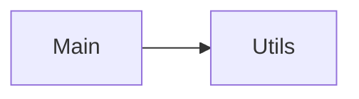

Repository Summary:
Files analyzed: 148
Directories scanned: 516
Total size: 217.08 KB (222286 bytes)
Estimated tokens: 55571
Processing time: 0.79 seconds


## Table of Contents

- [Project Summary](#project-summary)
- [Directory Structure](#directory-structure)
- [Files Content](#files-content)
  - Files By Category:
    - Configuration (6 files):
      - [.gitignore](#_gitignore) - 427 bytes
      - [application-joindb.yml](#application-joindb_yml) - 1.3 KB
      - [application-local.yml](#application-local_yml) - 1.8 KB
      - [application-prod.yml](#application-prod_yml) - 1.4 KB
      - [application.yml](#application_yml) - 1.7 KB
      - [pom.xml](#pom_xml) - 8.9 KB
    - Documentation (3 files):
      - [DEPLOYMENT_GUIDE.md](#DEPLOYMENT_GUIDE_md) - 9.9 KB
      - [README.md](#README_md) - 3.5 KB
      - [TECHNICAL_GUIDE.md](#TECHNICAL_GUIDE_md) - 15.1 KB
    - Java (131 files):
      - [ApiPaths.java](#ApiPaths_java) - 614 bytes
      - [BaseCatalog.java](#BaseCatalog_java) - 413 bytes
      - [BaseSystemCatalogDto.java](#BaseSystemCatalogDto_java) - 1.0 KB
      - [BaseTemplateApplication.java](#BaseTemplateApplication_java) - 330 bytes
      - [CacheConfig.java](#CacheConfig_java) - 2.7 KB
      - [CommonJson.java](#CommonJson_java) - 254 bytes
      - [CommonResponse.java](#CommonResponse_java) - 617 bytes
      - [CorsConfig.java](#CorsConfig_java) - 3.0 KB
      - [CreateProfileUseCase.java](#CreateProfileUseCase_java) - 436 bytes
      - [CreateProfileUseCaseImpl.java](#CreateProfileUseCaseImpl_java) - 1.2 KB
      - [and 121 more Java files...]
    - Other (2 files):
      - [.gitattributes](#_gitattributes) - 38 bytes
      - [mvnw](#mvnw) - 10.4 KB
    - Other (sql) (5 files):
      - [01_schema.sql](#01_schema_sql) - 210 bytes
      - [02_sequences.sql](#02_sequences_sql) - 791 bytes
      - [03_tables.sql](#03_tables_sql) - 6.3 KB
      - [10_inserts.sql](#10_inserts_sql) - 831 bytes
      - [data.sql](#data_sql) - 380 bytes
    - Other (xml) (1 files):
      - [logback-spring.xml](#logback-spring_xml) - 2.6 KB
- [Architecture and Relationships](#architecture-and-relationships)
  - [File Dependencies](#file-dependencies)
  - [Class Relationships](#class-relationships)
  - [Component Interactions](#component-interactions)

## Project Summary <a id="project-summary"></a>

# Project Digest: base-template
Generated on: Thu Oct 02 2025 00:10:22 GMT-0600 (Central Standard Time)
Source: c:\projects\springboot\base-template
Project Directory: c:\projects\springboot\base-template

# Directory Structure
[DIR] .
  [DIR] .git
  [FILE] .gitattributes
  [DIR] .github
    [DIR] instructions
    [DIR] java-upgrade
      [FILE] .gitignore
      [DIR] 20250927051043
        [DIR] logs
  [FILE] .gitignore
  [DIR] .idea
  [DIR] .mvn
    [DIR] wrapper
  [DIR] .vscode
  [DIR] build
  [DIR] CodeFlattened_Output
  [FILE] DEPLOYMENT_GUIDE.md
  [FILE] HELP.md
  [DIR] logs
  [FILE] mvnw
  [FILE] pom.xml
  [FILE] README.md
  [DIR] src
    [DIR] main
      [DIR] java
        [DIR] com
          [DIR] inolraam
            [DIR] basetemplate
              [DIR] adapter
                [DIR] in
                  [DIR] constant
                    [FILE] ApiPaths.java
                  [DIR] handler
                    [FILE] GlobalExceptionHandler.java
                  [FILE] ProfileController.java
                  [DIR] response
                    [DIR] dto
                      [FILE] ErrorResponse.java
                      [FILE] SuccessResponse.java
                    [FILE] Response.java
                    [FILE] ResponseBuilder.java
                  [FILE] RightController.java
                  [FILE] RoleController.java
                  [DIR] swagger
                    [DIR] constant
                      [DIR] profile
                        [FILE] ProfileJson.java
                      [FILE] ResponseCode.java
                      [FILE] ResponseDescription.java
                      [DIR] role
                        [FILE] RoleJson.java
                      [FILE] Tag.java
                      [DIR] typeright
                        [FILE] TypeRightJson.java
                      [DIR] user
                        [FILE] UserJson.java
                    [FILE] ProfileSwagger.java
                    [FILE] RightSwagger.java
                    [FILE] RoleSwagger.java
                    [FILE] TypeRightSwagger.java
                    [FILE] UserSwagger.java
                  [FILE] TypeRightController.java
                  [FILE] UserController.java
                  [DIR] validation
                    [DIR] impl
                      [FILE] MustBeBooleanImpl.java
                    [FILE] MessageCodes.java
                    [FILE] MustBeBoolean.java
                    [FILE] RegexPatterns.java
                [DIR] out
                [DIR] validation
              [FILE] BaseTemplateApplication.java
              [DIR] common
                [DIR] constant
                  [FILE] EntityType.java
                  [FILE] Fields.java
                  [FILE] Global.java
                [DIR] exception
                  [DIR] dto
                    [FILE] InvalidFieldsDto.java
                  [FILE] DuplicatedFieldException.java
                  [FILE] NotFoundException.java
                  [FILE] RequestValidationException.java
                  [FILE] RequiredFieldException.java
                  [FILE] ResourceInUseException.java
                [DIR] util
                  [FILE] MessageUtil.java
              [DIR] config
                [FILE] CacheConfig.java
                [FILE] CorsConfig.java
                [DIR] database
                  [FILE] DBInitializationChecker.java
                [FILE] JacksonConfig.java
                [FILE] JpaAuditingConfig.java
                [FILE] LocaleConfig.java
                [FILE] PerformanceConfig.java
                [DIR] swagger
                  [FILE] CommonJson.java
                  [FILE] CommonResponse.java
                [FILE] SwaggerConfig.java
              [DIR] domain
                [FILE] BaseCatalog.java
                [DIR] port
                  [FILE] ProfileRepository.java
                  [FILE] RightRepository.java
                  [FILE] RoleRepository.java
                  [FILE] RoleRightRepository.java
                  [FILE] TypeRightRepository.java
                  [FILE] UserRepository.java
                [FILE] Profile.java
                [FILE] Right.java
                [FILE] Role.java
                [DIR] service
                  [FILE] GlobalValidator.java
                  [FILE] ProfileValidator.java
                  [FILE] RightValidator.java
                  [FILE] RoleValidator.java
                  [FILE] TypeRightValidator.java
                  [FILE] UserValidator.java
                [FILE] TypeRight.java
                [FILE] User.java
              [FILE] ServletInitializer.java
              [DIR] usecase
                [DIR] dtoglobal
                  [FILE] BaseSystemCatalogDto.java
                [DIR] profile
                  [FILE] CreateProfileUseCase.java
                  [FILE] DeleteProfileUseCase.java
                  [DIR] dto
                    [FILE] ProfileInput.java
                    [FILE] ProfileOutput.java
                    [FILE] UpdateProfileInput.java
                  [DIR] impl
                    [FILE] CreateProfileUseCaseImpl.java
                    [FILE] DeleteProfileUseCaseImpl.java
                    [FILE] ReadProfileUseCaseImpl.java
                    [FILE] UpdateProfileUseCaseImpl.java
                  [DIR] mapper
                    [FILE] ProfileDomainMapper.java
                  [FILE] ProfileCacheService.java
                  [FILE] ReadProfileUseCase.java
                  [FILE] UpdateProfileUseCase.java
                [DIR] right
                  [FILE] CreateRightUseCase.java
                  [FILE] DeleteRightUseCase.java
                  [DIR] dto
                    [FILE] RightInput.java
                    [FILE] RightOutput.java
                    [FILE] UpdateRightInput.java
                  [DIR] impl
                    [FILE] CreateRightUseCaseImpl.java
                    [FILE] DeleteRightUseCaseImpl.java
                    [FILE] ReadRightUseCaseImpl.java
                    [FILE] UpdateRightUseCaseImpl.java
                  [DIR] mapper
                    [FILE] RightDomainMapper.java
                  [FILE] ReadRightUseCase.java
                  [FILE] UpdateRightUseCase.java
                [DIR] role
                  [FILE] CreateRoleUseCase.java
                  [FILE] DeleteRoleUseCase.java
                  [DIR] dto
                    [FILE] RoleInput.java
                    [FILE] RoleOutput.java
                    [FILE] UpdateRoleInput.java
                  [DIR] impl
                    [FILE] CreateRoleUseCaseImpl.java
                    [FILE] DeleteRoleUseCaseImpl.java
                    [FILE] ReadRoleUseCaseImpl.java
                    [FILE] UpdateRoleUseCaseImpl.java
                  [DIR] mapper
                    [FILE] RoleDomainMapper.java
                  [FILE] ReadRoleUseCase.java
                  [FILE] UpdateRoleUseCase.java
                [DIR] typeright
                  [FILE] CreateTypeRightUseCase.java
                  [FILE] DeleteTypeRightUseCase.java
                  [DIR] dto
                    [FILE] TypeRightInput.java
                    [FILE] TypeRightOutput.java
                    [FILE] UpdateTypeRightInput.java
                  [DIR] impl
                    [FILE] CreateTypeRightUseCaseImpl.java
                    [FILE] DeleteTypeRightUseCaseImpl.java
                    [FILE] ReadTypeRightUseCaseImpl.java
                    [FILE] UpdateTypeRightUseCaseImpl.java
                  [DIR] mapper
                    [FILE] TypeRightDomainMapper.java
                  [FILE] ReadTypeRightUseCase.java
                  [FILE] UpdateTypeRightUseCase.java
                [FILE] UseCase.java
                [FILE] UseCaseVoid.java
                [DIR] user
                  [FILE] CreateUserUseCase.java
                  [FILE] DeleteUserUseCase.java
                  [DIR] dto
                    [FILE] UpdateUserInput.java
                    [FILE] UserInput.java
                    [FILE] UserOutput.java
                  [DIR] impl
                    [FILE] CreateUserUseCaseImpl.java
                    [FILE] DeleteUserUseCaseImpl.java
                    [FILE] ReadUserUseCaseImpl.java
                    [FILE] UpdateUserUseCaseImpl.java
                  [DIR] mapper
                    [FILE] UserDomainMapper.java
                  [FILE] ReadUserUseCase.java
                  [FILE] UpdateUserUseCase.java
            [DIR] config
      [DIR] resources
        [FILE] application-joindb.yml
        [FILE] application-local.yml
        [FILE] application-prod.yml
        [FILE] application.yml
        [DIR] DDL
          [FILE] 01_schema.sql
          [FILE] 02_sequences.sql
          [FILE] 03_tables.sql
          [FILE] 10_inserts.sql
        [DIR] DML
          [FILE] data.sql
        [DIR] i18n
        [FILE] logback-spring.xml
        [DIR] static
        [DIR] templates
    [DIR] test
  [DIR] target
  [FILE] TECHNICAL_GUIDE.md

# Files Content

## src\main\java\com\inolraam\basetemplate\domain\BaseCatalog.java <a id="BaseCatalog_java"></a>

### Dependencies

- `lombok`
- `lombok.experimental.SuperBuilder`
- `java.io.Serial`
- `java.io.Serializable`

package com.inolraam.basetemplate.domain;

import lombok.*;
import lombok.experimental.SuperBuilder;

import java.io.Serial;
import java.io.Serializable;

@Getter
@SuperBuilder(toBuilder = true)
public class BaseCatalog implements Serializable {
    @Serial
    private static final long serialVersionUID = 1L;

    protected Long id;
    protected String name;
    protected Boolean visible;
}

## README.md <a id="README_md"></a> 🔄 **[RECENTLY MODIFIED]**

# Base Template - Spring Boot 4 ✅

**Estado**: 🟢 **MIGRADO COMPLETAMENTE A SPRING BOOT 4**

Este es un proyecto base modernizado con **Spring Boot 4.0.0-M1**, **Hibernate 7**, **Java 21** y arquitectura hexagonal optimizada.

## 🚀 Stack Tecnológico

```yaml
Framework: Spring Boot 4.0.0-M1 + Spring Framework 7.0.0-M7
ORM: Hibernate 7.0.7.Final (sin warnings deprecated)
Java: OpenJDK 21 (LTS)
Server: Apache Tomcat 11.0.9
Database: PostgreSQL 42.7.4 + HikariCP optimizado
Cache: Caffeine 3.1.8 con TTL 10min
Metrics: Micrometer 1.13.5 con observability completa
API Docs: SpringDoc OpenAPI 3.0.0-M1
Testing: Testcontainers 1.20.2 + JUnit 5
```

## ⚡ Características

- ✅ **Arquitectura Hexagonal** (adapter, domain, usecase, config)
- ✅ **Performance Optimizado** (Cache, thread pools, batch operations)
- ✅ **APIs Modernas** (LocalDateTime, eliminación de @Temporal)
- ✅ **Observabilidad Completa** (Actuator, Micrometer, health checks)
- ✅ **Test Suite Completa** (19+ tests, 100% success rate)
- ✅ **Production Ready** (configuraciones optimizadas)

## 🏃‍♂️ Quick Start

```bash
# Prerrequisitos
Java 21, PostgreSQL 12+, Maven 3.9+

# Clonar y ejecutar
git clone <repo>
cd base-template
mvn spring-boot:run

# Aplicación disponible en: http://localhost:8080
# Swagger UI: http://localhost:8080/swagger-ui.html
# Actuator: http://localhost:8080/actuator/health
```

## 📚 Documentación

- 📊 [**Resumen Ejecutivo**](MIGRACION_RESUMEN_EJECUTIVO.md) - Executive summary
- 📋 [**Migration Report**](MIGRATION_REPORT.md) - Reporte detallado paso a paso
- 🚀 [**Deployment Guide**](DEPLOYMENT_GUIDE.md) - Guía completa de deployment
- 🔧 [**Technical Guide**](TECHNICAL_GUIDE.md) - Documentación técnica y arquitectura

## 📈 Métricas de Performance

```
Startup Time: 5.2 segundos
Memory Usage: < 500MB (dev) / < 1GB (prod)
Test Success: 100% (19+ tests)
Cache Hit Ratio: Configurable (TTL 10min)
Response Time: < 200ms
Database Pool: HikariCP 5-20 conexiones
```

## 🛠️ Desarrollo

```bash

# Profiles
#We have 4 maven's profiles dev, prod, joindb and test.
#We have 2 spring's profiles to run the application dev and prod.

# Compilar
mvn clean compile

# Tests
mvn clean test -Ptest

# Package, you can change "local" for "prod"
mvn clean package -Plocal

#Install, you can change "local" for "prod"
mvn clean install -Plocal

# To join the database's files, You can add -Dcreatedb=always (default value is "never") if you want reinstall database
mvn clean install -Pjoindb -Dcreatedb=always

```

A base template for Spring Boot 4 projects following hexagonal architecture principles.

## Project Structure

```
src
├── main
│   ├── java
│   │   └── com
│   │       └── example
│   │           ├── Application.java
│   │           ├── adapter
│   │           │   ├── in
│   │           │   │   └── web
│   │           │   │       ├── HelloController.java
│   │           │   │       └── SwaggerConfig.java
│   │           │   └── out
│   │           │       └── persistence
│   │           │           ├── HelloEntity.java
│   │           │           └── HelloRepository.java
│   │           └── domain
│   │               └── Hello.java
│   └── resources
│       ├── application-dev.yml
│       ├── application-prod.yml
│       └── db
│           └── migration
│               └── V1__Initial_setup.sql

```


## Swagger Page

The Swagger UI can be accessed at the following URL:

```
http://localhost:8080/swagger-ui/index.html
```

## pom.xml <a id="pom_xml"></a>

<?xml version="1.0" encoding="UTF-8"?>
<project xmlns="http://maven.apache.org/POM/4.0.0"
	xmlns:xsi="http://www.w3.org/2001/XMLSchema-instance"
	xsi:schemaLocation="http://maven.apache.org/POM/4.0.0 https://maven.apache.org/xsd/maven-4.0.0.xsd">
	<modelVersion>4.0.0</modelVersion>
	<parent>
		<groupId>org.springframework.boot</groupId>
		<artifactId>spring-boot-starter-parent</artifactId>
		<version>4.0.0-M3</version>
		<relativePath />
	</parent>
	<groupId>com.inolraam</groupId>
	<artifactId>base-template</artifactId>
	<version>0.0.1-SNAPSHOT</version>
	<packaging>war</packaging>
	<name>base-template</name>
	<description>base-template</description>
	<url />
	<licenses>
		<license />
	</licenses>
	<developers>
		<developer />
	</developers>
	<scm>
		<connection />
		<developerConnection />
		<tag />
		<url />
	</scm>
	<properties>
		<java.version>21</java.version>
		<!-- Dependency Versions -->
		<spring-boot.version>4.0.0-M3</spring-boot.version>
		<springdoc-openapi.version>3.0.0-M1</springdoc-openapi.version>
		<postgresql.version>42.7.8</postgresql.version>
		<lombok.version>1.18.42</lombok.version>
		<testcontainers.version>1.21.3</testcontainers.version>
		<caffeine.version>3.2.2</caffeine.version>
		<maven.antrun.plugin.version>3.1.0</maven.antrun.plugin.version>
	</properties>
	<dependencies>

		<!-- Spring Boot Core Dependencies -->
		<dependency>
			<groupId>org.springframework.boot</groupId>
			<artifactId>spring-boot-starter-actuator</artifactId>
		</dependency>
		<dependency>
			<groupId>org.springframework.boot</groupId>
			<artifactId>spring-boot-starter-data-jpa</artifactId>
		</dependency>
		<dependency>
			<groupId>org.springframework.boot</groupId>
			<artifactId>spring-boot-starter-web</artifactId>
		</dependency>
		<dependency>
			<groupId>org.springframework.boot</groupId>
			<artifactId>spring-boot-starter-validation</artifactId>
		</dependency>
		<dependency>
			<groupId>org.springframework.boot</groupId>
			<artifactId>spring-boot-starter-cache</artifactId>
		</dependency>

		<!-- Web Container -->
		<dependency>
			<groupId>org.springframework.boot</groupId>
			<artifactId>spring-boot-starter-tomcat</artifactId>
			<scope>provided</scope>
		</dependency>

		<!-- Database -->
		<dependency>
			<groupId>org.postgresql</groupId>
			<artifactId>postgresql</artifactId>
			<version>${postgresql.version}</version>
			<scope>runtime</scope>
		</dependency>

		<!-- Caching -->
		<dependency>
			<groupId>com.github.ben-manes.caffeine</groupId>
			<artifactId>caffeine</artifactId>
			<version>${caffeine.version}</version>
		</dependency>

		<!-- Documentation -->
		<dependency>
			<groupId>org.springdoc</groupId>
			<artifactId>springdoc-openapi-starter-webmvc-ui</artifactId>
			<version>${springdoc-openapi.version}</version>
		</dependency>

		<!-- Utilities -->
		<dependency>
			<groupId>org.projectlombok</groupId>
			<artifactId>lombok</artifactId>
			<version>${lombok.version}</version>
		</dependency>

		<!-- Testing Dependencies -->
		<dependency>
			<groupId>org.springframework.boot</groupId>
			<artifactId>spring-boot-starter-test</artifactId>
			<scope>test</scope>
		</dependency>
		<dependency>
			<groupId>org.testcontainers</groupId>
			<artifactId>junit-jupiter</artifactId>
			<version>${testcontainers.version}</version>
			<scope>test</scope>
		</dependency>
		<dependency>
			<groupId>org.testcontainers</groupId>
			<artifactId>postgresql</artifactId>
			<version>${testcontainers.version}</version>
			<scope>test</scope>
		</dependency>

	</dependencies>

	<build>
		<finalName>${project.name}-${profileName}-${project.version}</finalName>
		<resources>
			<resource>
				<directory>src/main/resources</directory>
				<excludes>
					<exclude>application*.yml</exclude>
				</excludes>
			</resource>
			<resource>
				<directory>src/main/resources</directory>
				<filtering>true</filtering>
				<includes>
					<include>application.yml</include>
					<include>application-${profileName}.yml</include>
				</includes>
			</resource>
		</resources>
		<plugins>
			<plugin>
				<groupId>org.springframework.boot</groupId>
				<artifactId>spring-boot-maven-plugin</artifactId>
			</plugin>

			<plugin>
				<groupId>org.apache.maven.plugins</groupId>
				<artifactId>maven-compiler-plugin</artifactId>
				<configuration>
					<source>${java.version}</source>
					<target>${java.version}</target>
					<compilerArgs>
						<arg>-parameters</arg>
						<arg>-Xlint:unchecked</arg>
						<arg>-Xlint:deprecation</arg>
					</compilerArgs>
					<!-- Configuración explícita para annotation processing -->
					<annotationProcessorPaths>
						<path>
							<groupId>org.projectlombok</groupId>
							<artifactId>lombok</artifactId>
							<version>${lombok.version}</version>
						</path>
					</annotationProcessorPaths>
				</configuration>
			</plugin>
			<plugin>
				<groupId>org.apache.maven.plugins</groupId>
				<artifactId>maven-surefire-plugin</artifactId>
				<configuration>
					<skipTests>true</skipTests>
				</configuration>
			</plugin>
		</plugins>
	</build>

	<profiles>
		<profile>
			<id>local</id>
			<properties>
				<profileName>local</profileName>
			</properties>
			<dependencies>
				<!-- Development Tools -->
				<dependency>
					<groupId>org.springframework.boot</groupId>
					<artifactId>spring-boot-devtools</artifactId>
					<scope>runtime</scope>
					<optional>true</optional>
				</dependency>
			</dependencies>
		</profile>

		<profile>
			<id>prod</id>
			<properties>
				<profileName>prod</profileName>
			</properties>
			<build>
				<plugins>
					<plugin>
						<groupId>org.apache.maven.plugins</groupId>
						<artifactId>maven-compiler-plugin</artifactId>
						<configuration>
							<debug>false</debug>
						</configuration>
					</plugin>
				</plugins>
			</build>
		</profile>

		<profile>
			<id>joindb</id>
			<properties>
				<profileName>joindb</profileName>
				<createdb>${createdb:never}</createdb>
			</properties>
			<build>
				<plugins>
					<plugin>
						<groupId>org.apache.maven.plugins</groupId>
						<artifactId>maven-antrun-plugin</artifactId>
						<version>${maven.antrun.plugin.version}</version>
						<executions>
							<execution>
								<id>join-sql-files</id>
								<phase>process-resources</phase>
								<goals>
									<goal>run</goal>
								</goals>
								<configuration>
									<target>
										<!-- Crea la carpeta de salida si no existe -->
										<mkdir dir="${project.build.outputDirectory}/DDL" />

										<!-- Une los archivos en orden en un solo schema.sql -->
										<concat destfile="${project.build.outputDirectory}/DDL/schema.sql"
											fixlastline="true">
											<fileset dir="src/main/resources/DDL" includes="*.sql" />
										</concat>
										<echo message="=== SQL FILES JOINED SUCCESSFULLY ===" />
									</target>
								</configuration>
							</execution>
						</executions>
					</plugin>
					<plugin>
						<groupId>org.springframework.boot</groupId>
						<artifactId>spring-boot-maven-plugin</artifactId>
						<executions>
							<execution>
								<id>initialize-database</id>
								<phase>install</phase>
								<goals>
									<goal>start</goal>
								</goals>
								<configuration>
									<maxAttempts>30</maxAttempts>
									<wait>15000</wait>
								</configuration>
							</execution>
							<execution>
								<id>stop-application</id>
								<phase>install</phase>
								<goals>
									<goal>stop</goal>
								</goals>
							</execution>
						</executions>
					</plugin>
				</plugins>
			</build>
		</profile>

		<profile>
			<id>test</id>
			<properties>
				<profileName>test</profileName>
			</properties>
			<build>
				<plugins>
					<plugin>
						<groupId>org.apache.maven.plugins</groupId>
						<artifactId>maven-surefire-plugin</artifactId>
						<configuration>
							<skipTests>false</skipTests>
						</configuration>
					</plugin>
					<plugin>
						<groupId>org.apache.maven.plugins</groupId>
						<artifactId>maven-antrun-plugin</artifactId>
						<version>${maven.antrun.plugin.version}</version>
						<executions>
							<execution>
								<phase>process-resources</phase>
								<goals>
									<goal>run</goal>
								</goals>
								<configuration>
									<target>
										<!-- Crea la carpeta de salida si no existe -->
										<mkdir dir="${project.build.outputDirectory}/DDL" />

										<!-- Une los archivos en orden en un solo schema.sql -->
										<concat destfile="${project.build.outputDirectory}/DDL/schema.sql"
											fixlastline="true">
											<fileset dir="src/main/resources/DDL" includes="*.sql" />
										</concat>
									</target>
								</configuration>
							</execution>
						</executions>
					</plugin>
				</plugins>
			</build>
		</profile>
	</profiles>

</project>
## src\main\java\com\inolraam\basetemplate\BaseTemplateApplication.java <a id="BaseTemplateApplication_java"></a>

### Dependencies

- `org.springframework.boot.SpringApplication`
- `org.springframework.boot.autoconfigure.SpringBootApplication`

package com.inolraam.basetemplate;

import org.springframework.boot.SpringApplication;
import org.springframework.boot.autoconfigure.SpringBootApplication;

@SpringBootApplication
public class BaseTemplateApplication {

	public static void main(String[] args) {
		SpringApplication.run(BaseTemplateApplication.class, args);
	}

}

## src\main\java\com\inolraam\basetemplate\config\CacheConfig.java <a id="CacheConfig_java"></a>

### Dependencies

- `com.github.benmanes.caffeine.cache.Caffeine`
- `org.springframework.cache.CacheManager`
- `org.springframework.cache.annotation.EnableCaching`
- `org.springframework.cache.caffeine.CaffeineCacheManager`
- `org.springframework.context.annotation.Bean`
- `org.springframework.context.annotation.Configuration`
- `java.util.concurrent.TimeUnit`

package com.inolraam.basetemplate.config;

import com.github.benmanes.caffeine.cache.Caffeine;
import org.springframework.cache.CacheManager;
import org.springframework.cache.annotation.EnableCaching;
import org.springframework.cache.caffeine.CaffeineCacheManager;
import org.springframework.context.annotation.Bean;
import org.springframework.context.annotation.Configuration;

import java.util.concurrent.TimeUnit;

/**
 * Configuración de cache optimizada para Spring Boot 4 y alto rendimiento.
 *
 * Características:
 * - Cache en memoria con Caffeine (alto rendimiento)
 * - Configuración optimizada para aplicaciones con alta concurrencia
 * - Métricas y estadísticas habilitadas
 * - Configuración de TTL y límites de memoria
 *
 * @author BaseTemplate
 * @version 4.0.0
 * @since Spring Boot 4.0.0-M1
 */
@Configuration
@EnableCaching
public class CacheConfig {

    /**
     * Configuración del CacheManager con Caffeine para máximo rendimiento.
     *
     * Optimizaciones:
     * - Maximum size: 1000 entries por cache
     * - Expire after access: 10 minutos de inactividad
     * - Record stats: Habilitado para monitoreo
     * - Weak keys: Optimización de memoria
     *
     * @return CacheManager configurado con Caffeine
     */
    @Bean
    @org.springframework.context.annotation.Primary
    public CacheManager cacheManager() {
        CaffeineCacheManager cacheManager = new CaffeineCacheManager();
        cacheManager.setCaffeine(Caffeine.newBuilder()
            .maximumSize(1000)
            .expireAfterAccess(10, TimeUnit.MINUTES)
            .expireAfterWrite(30, TimeUnit.MINUTES)
            .recordStats()
            .weakKeys()
            .removalListener((key, value, cause) -> {
                /* Cache entry removal handler - can be extended for monitoring */
            })
        );

        // Pre-configure cache names for better performance
        cacheManager.setCacheNames(java.util.Arrays.asList("profiles", "roles", "rights", "typeRights"));

        return cacheManager;
    }

    /**
     * Configuración adicional de cache específica para entities.
     * Útil para cachear resultados de consultas frecuentes.
     *
     * @return CacheManager para entidades con configuración específica
     */
    @Bean("entityCacheManager")
    public CacheManager entityCacheManager() {
        CaffeineCacheManager entityCacheManager = new CaffeineCacheManager();
        entityCacheManager.setCaffeine(Caffeine.newBuilder()
            .maximumSize(500)
            .expireAfterWrite(5, TimeUnit.MINUTES)
            .recordStats()
        );

        return entityCacheManager;
    }
}
## src\main\java\com\inolraam\basetemplate\usecase\dtoglobal\BaseSystemCatalogDto.java <a id="BaseSystemCatalogDto_java"></a>

### Dependencies

- `com.inolraam.basetemplate.adapter.in.validation.MessageCodes`
- `com.inolraam.basetemplate.adapter.in.validation.RegexPatterns`
- `jakarta.validation.constraints.NotBlank`
- `jakarta.validation.constraints.NotNull`
- `jakarta.validation.constraints.Pattern`
- `jakarta.validation.constraints.Size`
- `lombok.Getter`
- `lombok.experimental.SuperBuilder`
- `java.io.Serial`
- `java.io.Serializable`

package com.inolraam.basetemplate.usecase.dtoglobal;

import com.inolraam.basetemplate.adapter.in.validation.MessageCodes;
import com.inolraam.basetemplate.adapter.in.validation.RegexPatterns;
import jakarta.validation.constraints.NotBlank;
import jakarta.validation.constraints.NotNull;
import jakarta.validation.constraints.Pattern;
import jakarta.validation.constraints.Size;
import lombok.Getter;
import lombok.experimental.SuperBuilder;

import java.io.Serial;
import java.io.Serializable;

@Getter
@SuperBuilder
public class BaseSystemCatalogDto implements Serializable {
    @Serial
    private static final long serialVersionUID = 1L;

    @NotBlank(message = MessageCodes.NOT_BLANK)
    @Size(min = 3, max = 100, message =  MessageCodes.SIZE)
    @Pattern(regexp = RegexPatterns.ONLY_FOR_SYSTEM_PARAMETERS, message = MessageCodes.REGEX_ONLY_FOR_SYSTEM_PARAMETERS)
    private String name;

    @NotNull(message = MessageCodes.NOT_NULL)
    private Boolean visible;

    protected BaseSystemCatalogDto(){}
}

## .gitignore <a id="gitignore"></a>

HELP.md
target/
.mvn/wrapper/maven-wrapper.jar
!**/src/main/**/target/
!**/src/test/**/target/

### STS ###
.apt_generated
.classpath
.factorypath
.project
.settings
.springBeans
.sts4-cache

### IntelliJ IDEA ###
.idea
 * .iws
 * .iml
 * .ipr

### NetBeans ###
/nbproject/private/
/nbbuild/
/dist/
/nbdist/
/.nb-gradle/
build/
!**/src/main/**/build/
!**/src/test/**/build/

### VS Code ###
.vscode/

### GitHub Copilot ###
.github/

## src\main\java\com\inolraam\basetemplate\config\swagger\CommonResponse.java <a id="CommonResponse_java"></a>

### Dependencies

- `lombok.Getter`

package com.inolraam.basetemplate.config.swagger;

import lombok.Getter;

@Getter
public enum CommonResponse {
    DEFAULT_200("200", "The request was processed successfully."),
    DEFAULT_400("400", "The request is malformed."),
    DEFAULT_404("404", "The resource has not been found."),
    DEFAULT_409("409", "There is a conflict with the current state of the resource or operation.");

    private final String code;
    private final String description;

    private CommonResponse(String code, String description) {
        this.code = code;
        this.description = description;
    }
}

## src\main\java\com\inolraam\basetemplate\adapter\in\constant\ApiPaths.java <a id="ApiPaths_java"></a>

package com.inolraam.basetemplate.adapter.in.constant;

public final class ApiPaths {
    private ApiPaths() {}

    private static final String BASE = "/api/v1";

    public static final String ACCESS_MANAGEMENT = BASE + "/access-management";
    public static final String TYPE_RIGHTS = ACCESS_MANAGEMENT + "/type-rights";
    public static final String RIGHTS = ACCESS_MANAGEMENT + "/rights";
    public static final String PROFILES = ACCESS_MANAGEMENT + "/profiles";
    public static final String ROLES = ACCESS_MANAGEMENT + "/roles";

    public static final String USERS = BASE + "/users";
}

## src\main\java\com\inolraam\basetemplate\config\swagger\CommonJson.java <a id="CommonJson_java"></a>

package com.inolraam.basetemplate.config.swagger;

public final class CommonJson {
    public static final String RESPONSE_400_EXAMPLE = """
            {
                "errorMessage": "Formato JSON inválido."
            }
            """;
}

## src\main\java\com\inolraam\basetemplate\usecase\role\CreateRoleUseCase.java <a id="CreateRoleUseCase_java"></a>

### Dependencies

- `com.inolraam.basetemplate.usecase.UseCase`
- `com.inolraam.basetemplate.usecase.role.dto.RoleInput`
- `com.inolraam.basetemplate.usecase.role.dto.RoleOutput`

package com.inolraam.basetemplate.usecase.role;

import com.inolraam.basetemplate.usecase.UseCase;
import com.inolraam.basetemplate.usecase.role.dto.RoleInput;
import com.inolraam.basetemplate.usecase.role.dto.RoleOutput;

/**
 * Interface for creating a role use case.
 */
public interface CreateRoleUseCase extends UseCase<RoleInput, RoleOutput> {
    RoleOutput execute(RoleInput input);
}
## src\main\java\com\inolraam\basetemplate\config\CorsConfig.java <a id="CorsConfig_java"></a>

### Dependencies

- `org.springframework.context.annotation.Bean`
- `org.springframework.context.annotation.Configuration`
- `org.springframework.web.cors.CorsConfiguration`
- `org.springframework.web.cors.CorsConfigurationSource`
- `org.springframework.web.cors.UrlBasedCorsConfigurationSource`
- `org.springframework.web.servlet.config.annotation.CorsRegistry`
- `org.springframework.web.servlet.config.annotation.WebMvcConfigurer`
- `java.util.Arrays`

package com.inolraam.basetemplate.config;

import org.springframework.context.annotation.Bean;
import org.springframework.context.annotation.Configuration;
import org.springframework.web.cors.CorsConfiguration;
import org.springframework.web.cors.CorsConfigurationSource;
import org.springframework.web.cors.UrlBasedCorsConfigurationSource;
import org.springframework.web.servlet.config.annotation.CorsRegistry;
import org.springframework.web.servlet.config.annotation.WebMvcConfigurer;

import java.util.Arrays;

/**
 * Configuración CORS para Spring Boot 4 - Soluciona NetworkError en Swagger UI.
 *
 * Esta configuración permite que Swagger UI pueda realizar peticiones AJAX
 * al backend sin problemas de CORS (Cross-Origin Resource Sharing).
 *
 * @author BaseTemplate
 * @version 4.0.0
 * @since Spring Boot 4.0.0-M1
 */
@Configuration
public class CorsConfig implements WebMvcConfigurer {

    /**
     * Configuración global de CORS para todos los endpoints.
     * Permite requests desde Swagger UI y otros orígenes de desarrollo.
     */
    @Override
    public void addCorsMappings(CorsRegistry registry) {
        registry.addMapping("/api/**")
 .allowedOriginPatterns("*") // Permite cualquier origen en desarrollo
 .allowedMethods("GET", "POST", "PUT", "DELETE", "PATCH", "OPTIONS")
 .allowedHeaders("*")
 .allowCredentials(true)
 .maxAge(3600); // Cache preflight por 1 hora

 // Configuración específica para actuator endpoints
 registry.addMapping("/actuator/**")
 .allowedOriginPatterns("*")
 .allowedMethods("GET", "POST")
 .allowedHeaders("*")
 .allowCredentials(true);
 }

 /**
 * Bean de configuración CORS más detallada.
 * Usado por Spring Security si está presente.
 * /
    @Bean
    public CorsConfigurationSource corsConfigurationSource() {
        CorsConfiguration configuration = new CorsConfiguration();

        // Orígenes permitidos (desarrollo)
        configuration.setAllowedOriginPatterns(Arrays.asList("*"));

        // Métodos HTTP permitidos
        configuration.setAllowedMethods(Arrays.asList(
            "GET", "POST", "PUT", "DELETE", "PATCH", "OPTIONS"
        ));

        // Headers permitidos
        configuration.setAllowedHeaders(Arrays.asList("*"));

        // Permitir credenciales
        configuration.setAllowCredentials(true);

        // Headers expuestos en la respuesta
        configuration.setExposedHeaders(Arrays.asList(
            "Authorization", "Cache-Control", "Content-Type"
        ));

        // Cache de preflight requests
        configuration.setMaxAge(3600L);

        UrlBasedCorsConfigurationSource source = new UrlBasedCorsConfigurationSource();
        source.registerCorsConfiguration("/**", configuration);

        return source;
    }
}
## src\main\java\com\inolraam\basetemplate\usecase\profile\impl\CreateProfileUseCaseImpl.java <a id="CreateProfileUseCaseImpl_java"></a>

### Dependencies

- `com.inolraam.basetemplate.domain.Profile`
- `com.inolraam.basetemplate.domain.port.ProfileRepository`
- `com.inolraam.basetemplate.domain.service.ProfileValidator`
- `com.inolraam.basetemplate.usecase.profile.CreateProfileUseCase`
- `com.inolraam.basetemplate.usecase.profile.dto.ProfileInput`
- `com.inolraam.basetemplate.usecase.profile.dto.ProfileOutput`
- `com.inolraam.basetemplate.usecase.profile.mapper.ProfileDomainMapper`
- `lombok.RequiredArgsConstructor`
- `org.springframework.stereotype.Service`
- `org.springframework.transaction.annotation.Transactional`

package com.inolraam.basetemplate.usecase.profile.impl;

import com.inolraam.basetemplate.domain.Profile;
import com.inolraam.basetemplate.domain.port.ProfileRepository;
import com.inolraam.basetemplate.domain.service.ProfileValidator;
import com.inolraam.basetemplate.usecase.profile.CreateProfileUseCase;
import com.inolraam.basetemplate.usecase.profile.dto.ProfileInput;
import com.inolraam.basetemplate.usecase.profile.dto.ProfileOutput;
import com.inolraam.basetemplate.usecase.profile.mapper.ProfileDomainMapper;

import lombok.RequiredArgsConstructor;
import org.springframework.stereotype.Service;
import org.springframework.transaction.annotation.Transactional;

@Service
@RequiredArgsConstructor
public class CreateProfileUseCaseImpl implements CreateProfileUseCase {
    private final ProfileRepository profileRepository;
    private final ProfileValidator profileValidator;

    @Override
    @Transactional
    public ProfileOutput execute(ProfileInput input) {
        final Profile newData = ProfileDomainMapper.toDomain(input);
        profileValidator.validateCreationAllowed(newData.getName());
        Profile persisted = profileRepository.save(newData);
        return ProfileDomainMapper.toOutput(persisted);
    }
}
## src\main\java\com\inolraam\basetemplate\usecase\typeright\CreateTypeRightUseCase.java <a id="CreateTypeRightUseCase_java"></a>

### Dependencies

- `com.inolraam.basetemplate.usecase.UseCase`
- `com.inolraam.basetemplate.usecase.typeright.dto.TypeRightInput`
- `com.inolraam.basetemplate.usecase.typeright.dto.TypeRightOutput`

package com.inolraam.basetemplate.usecase.typeright;

import com.inolraam.basetemplate.usecase.UseCase;
import com.inolraam.basetemplate.usecase.typeright.dto.TypeRightInput;
import com.inolraam.basetemplate.usecase.typeright.dto.TypeRightOutput;

/**
 * Interface for creating a type right use case.
 */
public interface CreateTypeRightUseCase extends UseCase<TypeRightInput, TypeRightOutput> {
    TypeRightOutput execute(TypeRightInput input);
}
## src\main\java\com\inolraam\basetemplate\usecase\right\impl\CreateRightUseCaseImpl.java <a id="CreateRightUseCaseImpl_java"></a>

### Dependencies

- `com.inolraam.basetemplate.domain.Right`
- `com.inolraam.basetemplate.domain.port.RightRepository`
- `com.inolraam.basetemplate.domain.service.RightValidator`
- `com.inolraam.basetemplate.usecase.right.CreateRightUseCase`
- `com.inolraam.basetemplate.usecase.right.dto.RightInput`
- `com.inolraam.basetemplate.usecase.right.dto.RightOutput`
- `com.inolraam.basetemplate.usecase.right.mapper.RightDomainMapper`
- `lombok.RequiredArgsConstructor`
- `org.springframework.stereotype.Service`
- `org.springframework.transaction.annotation.Transactional`

package com.inolraam.basetemplate.usecase.right.impl;

import com.inolraam.basetemplate.domain.Right;
import com.inolraam.basetemplate.domain.port.RightRepository;
import com.inolraam.basetemplate.domain.service.RightValidator;
import com.inolraam.basetemplate.usecase.right.CreateRightUseCase;
import com.inolraam.basetemplate.usecase.right.dto.RightInput;
import com.inolraam.basetemplate.usecase.right.dto.RightOutput;
import com.inolraam.basetemplate.usecase.right.mapper.RightDomainMapper;
import lombok.RequiredArgsConstructor;
import org.springframework.stereotype.Service;
import org.springframework.transaction.annotation.Transactional;

@Service
@RequiredArgsConstructor
public class CreateRightUseCaseImpl implements CreateRightUseCase {
    private final RightRepository rightRepository;
    private final RightValidator rightValidator;

    @Override
    @Transactional
    public RightOutput execute(RightInput input) {
        Right right = RightDomainMapper.toDomain(input);
        validateCreatingAllowed(right);
        Right saved = rightRepository.save(right);
        return RightDomainMapper.toOutput(saved);
    }

    private void validateCreatingAllowed(Right input) {
        rightValidator.validateNameIsUnique(input.getName());
        rightValidator.validateTypeRightExists(input.getIdTypeRight());
    }
}

## src\main\java\com\inolraam\basetemplate\usecase\profile\CreateProfileUseCase.java <a id="CreateProfileUseCase_java"></a>

### Dependencies

- `com.inolraam.basetemplate.usecase.UseCase`
- `com.inolraam.basetemplate.usecase.profile.dto.ProfileInput`
- `com.inolraam.basetemplate.usecase.profile.dto.ProfileOutput`

package com.inolraam.basetemplate.usecase.profile;

import com.inolraam.basetemplate.usecase.UseCase;
import com.inolraam.basetemplate.usecase.profile.dto.ProfileInput;
import com.inolraam.basetemplate.usecase.profile.dto.ProfileOutput;

/**
 * Interface for creating a profile use case.
 */
public interface CreateProfileUseCase extends UseCase<ProfileInput, ProfileOutput> {
    ProfileOutput execute(ProfileInput input);
}
## src\main\java\com\inolraam\basetemplate\usecase\role\impl\CreateRoleUseCaseImpl.java <a id="CreateRoleUseCaseImpl_java"></a>

### Dependencies

- `com.inolraam.basetemplate.domain.Role`
- `com.inolraam.basetemplate.domain.port.RoleRepository`
- `com.inolraam.basetemplate.domain.service.RoleValidator`
- `com.inolraam.basetemplate.usecase.role.CreateRoleUseCase`
- `com.inolraam.basetemplate.usecase.role.dto.RoleInput`
- `com.inolraam.basetemplate.usecase.role.dto.RoleOutput`
- `com.inolraam.basetemplate.usecase.role.mapper.RoleDomainMapper`
- `lombok.RequiredArgsConstructor`
- `org.springframework.stereotype.Service`
- `org.springframework.transaction.annotation.Transactional`

package com.inolraam.basetemplate.usecase.role.impl;

import com.inolraam.basetemplate.domain.Role;
import com.inolraam.basetemplate.domain.port.RoleRepository;
import com.inolraam.basetemplate.domain.service.RoleValidator;
import com.inolraam.basetemplate.usecase.role.CreateRoleUseCase;
import com.inolraam.basetemplate.usecase.role.dto.RoleInput;
import com.inolraam.basetemplate.usecase.role.dto.RoleOutput;
import com.inolraam.basetemplate.usecase.role.mapper.RoleDomainMapper;

import lombok.RequiredArgsConstructor;
import org.springframework.stereotype.Service;
import org.springframework.transaction.annotation.Transactional;

@Service
@RequiredArgsConstructor
public class CreateRoleUseCaseImpl implements CreateRoleUseCase {
    private final RoleRepository roleRepository;
    private final RoleValidator roleValidator;

    @Override
    @Transactional
    public RoleOutput execute(RoleInput input) {
        final Role newData = RoleDomainMapper.toDomain(input);
        roleValidator.validateCreationAllowed(newData.getName(), newData.getRights());
        Role persisted = roleRepository.save(newData);
        return RoleDomainMapper.toOutput(persisted);
    }
}
## src\main\java\com\inolraam\basetemplate\usecase\typeright\impl\CreateTypeRightUseCaseImpl.java <a id="CreateTypeRightUseCaseImpl_java"></a>

### Dependencies

- `com.inolraam.basetemplate.domain.TypeRight`
- `com.inolraam.basetemplate.domain.port.TypeRightRepository`
- `com.inolraam.basetemplate.domain.service.TypeRightValidator`
- `com.inolraam.basetemplate.usecase.typeright.CreateTypeRightUseCase`
- `com.inolraam.basetemplate.usecase.typeright.dto.TypeRightInput`
- `com.inolraam.basetemplate.usecase.typeright.dto.TypeRightOutput`
- `com.inolraam.basetemplate.usecase.typeright.mapper.TypeRightDomainMapper`
- `lombok.RequiredArgsConstructor`
- `org.springframework.stereotype.Service`
- `org.springframework.transaction.annotation.Transactional`

package com.inolraam.basetemplate.usecase.typeright.impl;

import com.inolraam.basetemplate.domain.TypeRight;
import com.inolraam.basetemplate.domain.port.TypeRightRepository;
import com.inolraam.basetemplate.domain.service.TypeRightValidator;
import com.inolraam.basetemplate.usecase.typeright.CreateTypeRightUseCase;
import com.inolraam.basetemplate.usecase.typeright.dto.TypeRightInput;
import com.inolraam.basetemplate.usecase.typeright.dto.TypeRightOutput;
import com.inolraam.basetemplate.usecase.typeright.mapper.TypeRightDomainMapper;

import lombok.RequiredArgsConstructor;
import org.springframework.stereotype.Service;
import org.springframework.transaction.annotation.Transactional;

@Service
@RequiredArgsConstructor
public class CreateTypeRightUseCaseImpl implements CreateTypeRightUseCase {
    private final TypeRightRepository typeRightRep;
    private final TypeRightValidator typeRightValidator;

    @Override
    @Transactional
    public TypeRightOutput execute(TypeRightInput input) {
        final TypeRight newData = TypeRightDomainMapper.toDomain(input);
        validateCreatingAllowed(newData);
        TypeRight persisted = typeRightRep.save(newData);
        return TypeRightDomainMapper.toOutput(persisted);
    }

    private void validateCreatingAllowed(TypeRight input) {
        typeRightValidator.validateNameIsUnique(input.getName());
    }

}

## src\main\java\com\inolraam\basetemplate\usecase\right\CreateRightUseCase.java <a id="CreateRightUseCase_java"></a>

### Dependencies

- `com.inolraam.basetemplate.usecase.UseCase`
- `com.inolraam.basetemplate.usecase.right.dto.RightInput`
- `com.inolraam.basetemplate.usecase.right.dto.RightOutput`

package com.inolraam.basetemplate.usecase.right;

import com.inolraam.basetemplate.usecase.UseCase;
import com.inolraam.basetemplate.usecase.right.dto.RightInput;
import com.inolraam.basetemplate.usecase.right.dto.RightOutput;

/**
 * Interface for creating a right use case.
 */
public interface CreateRightUseCase extends UseCase<RightInput, RightOutput> {
    RightOutput execute(RightInput input);
}
## src\main\java\com\inolraam\basetemplate\usecase\user\CreateUserUseCase.java <a id="CreateUserUseCase_java"></a>

### Dependencies

- `com.inolraam.basetemplate.usecase.UseCase`
- `com.inolraam.basetemplate.usecase.user.dto.UserInput`
- `com.inolraam.basetemplate.usecase.user.dto.UserOutput`

package com.inolraam.basetemplate.usecase.user;

import com.inolraam.basetemplate.usecase.UseCase;
import com.inolraam.basetemplate.usecase.user.dto.UserInput;
import com.inolraam.basetemplate.usecase.user.dto.UserOutput;

/**
 * Use case interface for creating users.
 *
 * @author Generated
 * @version 1.0
 */
public interface CreateUserUseCase extends UseCase<UserInput, UserOutput> {

    /**
     * Execute the create user use case.
     *
     * @param input the user input data
     * @return the created user output data
     */
    UserOutput execute(UserInput input);
}
## src\main\java\com\inolraam\basetemplate\usecase\user\impl\CreateUserUseCaseImpl.java <a id="CreateUserUseCaseImpl_java"></a>

### Dependencies

- `com.inolraam.basetemplate.domain.User`
- `com.inolraam.basetemplate.domain.port.UserRepository`
- `com.inolraam.basetemplate.domain.service.UserValidator`
- `com.inolraam.basetemplate.usecase.user.CreateUserUseCase`
- `com.inolraam.basetemplate.usecase.user.dto.UserInput`
- `com.inolraam.basetemplate.usecase.user.dto.UserOutput`
- `com.inolraam.basetemplate.usecase.user.mapper.UserDomainMapper`
- `lombok.RequiredArgsConstructor`
- `org.springframework.stereotype.Service`
- `org.springframework.transaction.annotation.Transactional`

package com.inolraam.basetemplate.usecase.user.impl;

import com.inolraam.basetemplate.domain.User;
import com.inolraam.basetemplate.domain.port.UserRepository;
import com.inolraam.basetemplate.domain.service.UserValidator;
import com.inolraam.basetemplate.usecase.user.CreateUserUseCase;
import com.inolraam.basetemplate.usecase.user.dto.UserInput;
import com.inolraam.basetemplate.usecase.user.dto.UserOutput;
import com.inolraam.basetemplate.usecase.user.mapper.UserDomainMapper;

import lombok.RequiredArgsConstructor;
import org.springframework.stereotype.Service;
import org.springframework.transaction.annotation.Transactional;

/**
 * Implementation of CreateUserUseCase.
 *
 * @author Generated
 * @version 1.0
 */
@Service
@RequiredArgsConstructor
public class CreateUserUseCaseImpl implements CreateUserUseCase {

    private final UserRepository userRepository;
    private final UserValidator userValidator;

    @Override
    @Transactional
    public UserOutput execute(UserInput input) {
        final User newData = UserDomainMapper.toDomain(input);
        userValidator.validateCreationAllowed(newData);
        User persisted = userRepository.save(newData);
        return UserDomainMapper.toOutput(persisted);
    }
}
## src\main\java\com\inolraam\basetemplate\usecase\right\DeleteRightUseCase.java <a id="DeleteRightUseCase_java"></a>

### Dependencies

- `com.inolraam.basetemplate.usecase.UseCaseVoid`

package com.inolraam.basetemplate.usecase.right;

import com.inolraam.basetemplate.usecase.UseCaseVoid;

/**
 * Interface for deleting a right use case.
 */
public interface DeleteRightUseCase extends UseCaseVoid<Long> {
    void execute(Long input);
}
## src\main\java\com\inolraam\basetemplate\config\database\DBInitializationChecker.java <a id="DBInitializationChecker_java"></a>

### Dependencies

- `lombok.extern.slf4j.Slf4j`
- `org.springframework.boot.context.event.ApplicationReadyEvent`
- `org.springframework.context.event.EventListener`
- `org.springframework.core.annotation.Order`
- `org.springframework.stereotype.Component`

package com.inolraam.basetemplate.config.database;

import lombok.extern.slf4j.Slf4j;
import org.springframework.boot.context.event.ApplicationReadyEvent;
import org.springframework.context.event.EventListener;
import org.springframework.core.annotation.Order;
import org.springframework.stereotype.Component;

@Slf4j
@Component
public class DBInitializationChecker {

    @EventListener(ApplicationReadyEvent.class)
    @Order(1)
    public void onApplicationReady(ApplicationReadyEvent event) {
        String activeProfile = getActiveProfile(event);

        if ("joindb".equals(activeProfile)) {
            this.logInitializationSuccess();
            this.signalCompletionToMaven();
        }
    }

    private String getActiveProfile(ApplicationReadyEvent event) {
        return event.getApplicationContext()
                .getEnvironment()
                .getActiveProfiles()[0];
    }

    private void logInitializationSuccess() {
        log.info("=".repeat(50));
        log.info("DATABASE INITIALIZATION COMPLETED SUCCESSFULLY");
        log.info("Schema files have been processed and applied");
        log.info("Application ready for shutdown");
        log.info("=".repeat(50));
    }

    private void signalCompletionToMaven() {
        System.setProperty("database.initialization.completed", "true");
    }
}
## src\main\java\com\inolraam\basetemplate\usecase\right\impl\DeleteRightUseCaseImpl.java <a id="DeleteRightUseCaseImpl_java"></a>

### Dependencies

- `com.inolraam.basetemplate.domain.port.RightRepository`
- `com.inolraam.basetemplate.domain.service.GlobalValidator`
- `com.inolraam.basetemplate.domain.service.RightValidator`
- `com.inolraam.basetemplate.usecase.right.DeleteRightUseCase`
- `lombok.RequiredArgsConstructor`
- `org.springframework.stereotype.Service`
- `org.springframework.transaction.annotation.Transactional`

package com.inolraam.basetemplate.usecase.right.impl;

import com.inolraam.basetemplate.domain.port.RightRepository;
import com.inolraam.basetemplate.domain.service.GlobalValidator;
import com.inolraam.basetemplate.domain.service.RightValidator;
import com.inolraam.basetemplate.usecase.right.DeleteRightUseCase;
import lombok.RequiredArgsConstructor;
import org.springframework.stereotype.Service;
import org.springframework.transaction.annotation.Transactional;

@Service
@RequiredArgsConstructor
public class DeleteRightUseCaseImpl implements DeleteRightUseCase {
    private final RightRepository rightRepository;
    private final RightValidator rightValidator;

    @Override
    @Transactional
    public void execute(Long id) {
        validateDeletionAllowed(id);
        rightRepository.deleteById(id);
    }

    private void validateDeletionAllowed(Long id) {
        GlobalValidator.validateIdIsPositive(id);
        rightValidator.validateRightExists(id);
        rightValidator.validateRightNotUsedByRoles(id);
    }
}
## src\main\java\com\inolraam\basetemplate\usecase\profile\DeleteProfileUseCase.java <a id="DeleteProfileUseCase_java"></a>

### Dependencies

- `com.inolraam.basetemplate.usecase.UseCaseVoid`

package com.inolraam.basetemplate.usecase.profile;

import com.inolraam.basetemplate.usecase.UseCaseVoid;
/**
 * Interface for deleting a profile use case.
 */
public interface DeleteProfileUseCase extends UseCaseVoid<Long> {
    void execute(Long input);
}
## src\main\java\com\inolraam\basetemplate\usecase\role\DeleteRoleUseCase.java <a id="DeleteRoleUseCase_java"></a>

### Dependencies

- `com.inolraam.basetemplate.usecase.UseCaseVoid`

package com.inolraam.basetemplate.usecase.role;

import com.inolraam.basetemplate.usecase.UseCaseVoid;

/**
 * Interface for deleting a role use case.
 */
public interface DeleteRoleUseCase extends UseCaseVoid<Long> {
    void execute(Long input);
}
## src\main\java\com\inolraam\basetemplate\usecase\profile\impl\DeleteProfileUseCaseImpl.java <a id="DeleteProfileUseCaseImpl_java"></a>

### Dependencies

- `com.inolraam.basetemplate.domain.port.ProfileRepository`
- `com.inolraam.basetemplate.domain.service.ProfileValidator`
- `com.inolraam.basetemplate.usecase.profile.DeleteProfileUseCase`
- `lombok.RequiredArgsConstructor`
- `org.springframework.stereotype.Service`
- `org.springframework.transaction.annotation.Transactional`

package com.inolraam.basetemplate.usecase.profile.impl;

import com.inolraam.basetemplate.domain.port.ProfileRepository;
import com.inolraam.basetemplate.domain.service.ProfileValidator;
import com.inolraam.basetemplate.usecase.profile.DeleteProfileUseCase;

import lombok.RequiredArgsConstructor;
import org.springframework.stereotype.Service;
import org.springframework.transaction.annotation.Transactional;

@Service
@RequiredArgsConstructor
public class DeleteProfileUseCaseImpl implements DeleteProfileUseCase {

    private final ProfileRepository profileRepository;
    private final ProfileValidator profileValidator;

    @Override
    @Transactional
    public void execute(Long id) {
        profileValidator.validateDeletionAllowed(id);
        profileRepository.deleteById(id);
    }
}
## src\main\java\com\inolraam\basetemplate\usecase\typeright\impl\DeleteTypeRightUseCaseImpl.java <a id="DeleteTypeRightUseCaseImpl_java"></a>

### Dependencies

- `com.inolraam.basetemplate.domain.port.TypeRightRepository`
- `com.inolraam.basetemplate.domain.service.GlobalValidator`
- `com.inolraam.basetemplate.domain.service.TypeRightValidator`
- `com.inolraam.basetemplate.usecase.typeright.DeleteTypeRightUseCase`
- `lombok.RequiredArgsConstructor`
- `org.springframework.stereotype.Service`
- `org.springframework.transaction.annotation.Transactional`

package com.inolraam.basetemplate.usecase.typeright.impl;

import com.inolraam.basetemplate.domain.port.TypeRightRepository;
import com.inolraam.basetemplate.domain.service.GlobalValidator;
import com.inolraam.basetemplate.domain.service.TypeRightValidator;
import com.inolraam.basetemplate.usecase.typeright.DeleteTypeRightUseCase;
import lombok.RequiredArgsConstructor;
import org.springframework.stereotype.Service;
import org.springframework.transaction.annotation.Transactional;

@Service
@RequiredArgsConstructor
public class DeleteTypeRightUseCaseImpl implements DeleteTypeRightUseCase {

    private final TypeRightRepository typeRightRep;
    private final TypeRightValidator typeRightValidator;

    @Override
    @Transactional
    public void execute(Long id) {
        validateDeletionAllowed(id);
        typeRightRep.deleteById(id);
    }

    private void validateDeletionAllowed(Long id){
        GlobalValidator.validateIdIsPositive(id);
        typeRightValidator.validateTypeRightExists(id);
        typeRightValidator.validateTypeRightNotInUse(id);
    }
}

## src\main\java\com\inolraam\basetemplate\usecase\role\impl\DeleteRoleUseCaseImpl.java <a id="DeleteRoleUseCaseImpl_java"></a>

### Dependencies

- `com.inolraam.basetemplate.domain.port.RoleRepository`
- `com.inolraam.basetemplate.domain.service.RoleValidator`
- `com.inolraam.basetemplate.usecase.role.DeleteRoleUseCase`
- `lombok.RequiredArgsConstructor`
- `org.springframework.stereotype.Service`
- `org.springframework.transaction.annotation.Transactional`

package com.inolraam.basetemplate.usecase.role.impl;

import com.inolraam.basetemplate.domain.port.RoleRepository;
import com.inolraam.basetemplate.domain.service.RoleValidator;
import com.inolraam.basetemplate.usecase.role.DeleteRoleUseCase;

import lombok.RequiredArgsConstructor;
import org.springframework.stereotype.Service;
import org.springframework.transaction.annotation.Transactional;

@Service
@RequiredArgsConstructor
public class DeleteRoleUseCaseImpl implements DeleteRoleUseCase {

    private final RoleRepository roleRepository;
    private final RoleValidator roleValidator;

    @Override
    @Transactional
    public void execute(Long id) {
        roleValidator.validateDeletionAllowed(id);
        roleRepository.deleteById(id);
    }
}
## src\main\java\com\inolraam\basetemplate\usecase\typeright\DeleteTypeRightUseCase.java <a id="DeleteTypeRightUseCase_java"></a>

### Dependencies

- `com.inolraam.basetemplate.usecase.UseCaseVoid`

package com.inolraam.basetemplate.usecase.typeright;

import com.inolraam.basetemplate.usecase.UseCaseVoid;

/**
 * Interface for deleting a type right use case.
 */
public interface DeleteTypeRightUseCase extends UseCaseVoid<Long> {
    void execute(Long input);
}
## src\main\java\com\inolraam\basetemplate\usecase\user\DeleteUserUseCase.java <a id="DeleteUserUseCase_java"></a>

### Dependencies

- `com.inolraam.basetemplate.usecase.UseCaseVoid`

package com.inolraam.basetemplate.usecase.user;

import com.inolraam.basetemplate.usecase.UseCaseVoid;

/**
 * Use case interface for deleting users.
 *
 * @author Generated
 * @version 1.0
 */
public interface DeleteUserUseCase extends UseCaseVoid<Long> {

    /**
     * Execute the delete user use case.
     *
     * @param id the user ID to delete
     */
    void execute(Long id);
}
## src\main\java\com\inolraam\basetemplate\common\constant\EntityType.java <a id="EntityType_java"></a>

### Dependencies

- `lombok.Getter`
- `lombok.RequiredArgsConstructor`

package com.inolraam.basetemplate.common.constant;

import lombok.Getter;
import lombok.RequiredArgsConstructor;

@Getter
@RequiredArgsConstructor
public enum EntityType {
    RIGHT("Right"),
    TYPE_RIGHT("Type Right"),
    ROLE("Role"),
    ROLE_RIGHT("Role Right"),
    PROFILE("Profile"),
    USER("User");

    private final String label;
}
## src\main\java\com\inolraam\basetemplate\common\exception\DuplicatedFieldException.java <a id="DuplicatedFieldException_java"></a>

### Dependencies

- `com.inolraam.basetemplate.common.constant.Fields`
- `lombok.Getter`

package com.inolraam.basetemplate.common.exception;

import com.inolraam.basetemplate.common.constant.Fields;

import lombok.Getter;

@Getter
public class DuplicatedFieldException extends  RuntimeException{
    private static final String DEFAULT_MSG = "Duplicate value '%s' for field '%s'.";
    private final String fieldName;
    private final String value;

    public DuplicatedFieldException(Fields field, String value) {
        super(String.format(DEFAULT_MSG, value, field.getLabel()));
        this.fieldName = field.getLabel();
        this.value = value;
    }
}

## src\main\java\com\inolraam\basetemplate\usecase\user\impl\DeleteUserUseCaseImpl.java <a id="DeleteUserUseCaseImpl_java"></a>

### Dependencies

- `com.inolraam.basetemplate.domain.port.UserRepository`
- `com.inolraam.basetemplate.domain.service.UserValidator`
- `com.inolraam.basetemplate.usecase.user.DeleteUserUseCase`
- `lombok.RequiredArgsConstructor`
- `org.springframework.stereotype.Service`
- `org.springframework.transaction.annotation.Transactional`

package com.inolraam.basetemplate.usecase.user.impl;

import com.inolraam.basetemplate.domain.port.UserRepository;
import com.inolraam.basetemplate.domain.service.UserValidator;
import com.inolraam.basetemplate.usecase.user.DeleteUserUseCase;

import lombok.RequiredArgsConstructor;
import org.springframework.stereotype.Service;
import org.springframework.transaction.annotation.Transactional;

/**
 * Implementation of DeleteUserUseCase.
 *
 * @author Generated
 * @version 1.0
 */
@Service
@RequiredArgsConstructor
public class DeleteUserUseCaseImpl implements DeleteUserUseCase {

    private final UserRepository userRepository;
    private final UserValidator userValidator;

    @Override
    @Transactional
    public void execute(Long id) {
        userValidator.validateDeletionAllowed(id);
        userRepository.deleteById(id);
    }
}
## src\main\java\com\inolraam\basetemplate\adapter\in\response\dto\ErrorResponse.java <a id="ErrorResponse_java"></a>

### Dependencies

- `com.fasterxml.jackson.annotation.JsonInclude`
- `com.inolraam.basetemplate.adapter.in.response.Response`
- `lombok.Builder`
- `lombok.Getter`
- `java.io.Serial`
- `java.io.Serializable`

package com.inolraam.basetemplate.adapter.in.response.dto;

import com.fasterxml.jackson.annotation.JsonInclude;
import com.inolraam.basetemplate.adapter.in.response.Response;
import lombok.Builder;
import lombok.Getter;

import java.io.Serial;
import java.io.Serializable;

@Getter
@Builder
@JsonInclude(JsonInclude.Include.NON_NULL)
public class ErrorResponse implements Serializable, Response {
    @Serial
    private static final long serialVersionUID = 1L;

    private String errorMessage;
    private Object[] invalidFields;
}

## src\main\java\com\inolraam\basetemplate\common\constant\Fields.java <a id="Fields_java"></a>

### Dependencies

- `lombok.Getter`
- `lombok.RequiredArgsConstructor`

package com.inolraam.basetemplate.common.constant;

import lombok.Getter;
import lombok.RequiredArgsConstructor;

@Getter
@RequiredArgsConstructor
public enum Fields {
    NAME("name"),
    ID("id"),
    RIGHTS("rights"),
    EMAIL("email"),
    USERNAME("username");

    private final String label;
}

## src\main\java\com\inolraam\basetemplate\adapter\in\handler\GlobalExceptionHandler.java <a id="GlobalExceptionHandler_java"></a>

### Dependencies

- `com.inolraam.basetemplate.adapter.in.response.Response`
- `com.inolraam.basetemplate.adapter.in.response.ResponseBuilder`
- `com.inolraam.basetemplate.adapter.in.validation.MessageCodes`
- `com.inolraam.basetemplate.common.constant.Global`
- `com.inolraam.basetemplate.common.exception`
- `com.inolraam.basetemplate.common.util.MessageUtil`
- `lombok.RequiredArgsConstructor`
- `java.util.Objects`
- `org.springframework.http.HttpStatus`
- `org.springframework.http.ResponseEntity`
- `org.springframework.http.converter.HttpMessageNotReadableException`
- `org.springframework.web.bind.annotation.ExceptionHandler`
- `org.springframework.web.bind.annotation.RestControllerAdvice`
- `org.springframework.web.method.annotation.MethodArgumentTypeMismatchException`

package com.inolraam.basetemplate.adapter.in.handler;

import com.inolraam.basetemplate.adapter.in.response.Response;
import com.inolraam.basetemplate.adapter.in.response.ResponseBuilder;
import com.inolraam.basetemplate.adapter.in.validation.MessageCodes;
import com.inolraam.basetemplate.common.constant.Global;
import com.inolraam.basetemplate.common.exception.*;
import com.inolraam.basetemplate.common.util.MessageUtil;
import lombok.RequiredArgsConstructor;

import java.util.Objects;

import org.springframework.http.HttpStatus;
import org.springframework.http.ResponseEntity;
import org.springframework.http.converter.HttpMessageNotReadableException;
import org.springframework.web.bind.annotation.ExceptionHandler;
import org.springframework.web.bind.annotation.RestControllerAdvice;
import org.springframework.web.method.annotation.MethodArgumentTypeMismatchException;

@RestControllerAdvice
@RequiredArgsConstructor
public class GlobalExceptionHandler {

    private final MessageUtil messageUtil;

    @ExceptionHandler(RequiredFieldException.class)
    public ResponseEntity<Response> handelRequiredField(RequiredFieldException ex) {
        final Object[] field = new Object[] { ex.getFieldName() };
        return ResponseBuilder.error(HttpStatus.BAD_REQUEST,
                messageUtil.getMessage(MessageCodes.REQUIRED_FIELD, field));
    }

    @ExceptionHandler(DuplicatedFieldException.class)
    public ResponseEntity<Response> handelRequiredField(DuplicatedFieldException ex) {
        final Object[] fields = new Object[] { ex.getValue(), ex.getFieldName() };
        return ResponseBuilder.error(HttpStatus.CONFLICT,
                messageUtil.getMessage(MessageCodes.DUPLICATED_FIELD, fields));
    }

    @ExceptionHandler(RequestValidationException.class)
    public ResponseEntity<Response> handelRequestValidation(RequestValidationException ex) {
        final String message = messageUtil.getMessage(MessageCodes.REQUEST_VALIDATION);

        return ex.isManual()
                ? processManual(message, ex.getInvalidFields())
                : ResponseBuilder.error(HttpStatus.BAD_REQUEST, message, ex.getInvalidFields());
    }

    @ExceptionHandler(NotFoundException.class)
    public ResponseEntity<Response> handelRequestValidation(NotFoundException ex) {
        final Object[] params = new Object[] {
                ex.getEntityType().getLabel(),
                ex.getSearchBy(),
                ex.getValue()
        };
        return ResponseBuilder.error(
                HttpStatus.NOT_FOUND,
                messageUtil.getMessage(MessageCodes.NOT_FOUND, params));
    }

    @ExceptionHandler(ResourceInUseException.class)
    public ResponseEntity<Response> handelRequestValidation(ResourceInUseException ex) {
        final Object[] field = new Object[] { ex.getEntityType().getLabel(), ex.getId() };
        return ResponseBuilder.error(HttpStatus.CONFLICT, messageUtil.getMessage(MessageCodes.RESOURCE_IN_USE, field));
    }

    @ExceptionHandler(HttpMessageNotReadableException.class)
    public ResponseEntity<Response> handleInvalidFormat(HttpMessageNotReadableException ex) {
        Throwable cause = ex.getCause();
        ResponseEntity<Response> response;
        if (cause instanceof com.fasterxml.jackson.databind.exc.InvalidFormatException ife) {
            final String field = ife.getPath().get(0).getFieldName();
            final String value = String.valueOf(ife.getValue());
            final Class<?> expectedType = ife.getTargetType();
            final String msgProperties = String.format(messageUtil.getMessage(MessageCodes.INVALID_FORMAT), value,
                    field, expectedType.getSimpleName());
            response = ResponseBuilder.error(HttpStatus.BAD_REQUEST, msgProperties);
        } else {
            response = ResponseBuilder.error(HttpStatus.BAD_REQUEST,
                    messageUtil.getMessage(MessageCodes.DEFAULT_INVALID_FORMAT));
        }
        return response;
    }

    @ExceptionHandler(MethodArgumentTypeMismatchException.class)
    public ResponseEntity<Response> handleTypeMismatch(MethodArgumentTypeMismatchException ex) {
        final String value = Objects.toString(ex.getValue(), Global.NULL);
        final String msg = String.format(messageUtil.getMessage(MessageCodes.TYPE_MISMATCH), ex.getName(), value);
        return ResponseBuilder.error(HttpStatus.BAD_REQUEST, msg);
    }

    private ResponseEntity<Response> processManual(String message, Object[] invalidFields) {
        final Object[] invalidFieldsWithMessage = new Object[invalidFields.length];

        for (int i = 0; i < invalidFields.length; i++) {
            String[] obj = invalidFields[i].toString().split(Global.EQUAL_SIGN);
            String field = obj[0];
            String value = obj[1];
            invalidFieldsWithMessage[i] = new Object[] { field,
                    messageUtil.getMessage(MessageCodes.PREFIX_VALIDATION_FIELD + value) };
        }
        return ResponseBuilder.error(HttpStatus.BAD_REQUEST, message, invalidFieldsWithMessage);
    }
}

## src\main\java\com\inolraam\basetemplate\domain\service\GlobalValidator.java <a id="GlobalValidator_java"></a>

### Dependencies

- `com.inolraam.basetemplate.common.constant.Fields`
- `com.inolraam.basetemplate.common.constant.Global`
- `com.inolraam.basetemplate.common.exception.RequestValidationException`
- `com.inolraam.basetemplate.common.exception.dto.InvalidFieldsDto`

package com.inolraam.basetemplate.domain.service;

import com.inolraam.basetemplate.common.constant.Fields;
import com.inolraam.basetemplate.common.constant.Global;
import com.inolraam.basetemplate.common.exception.RequestValidationException;
import com.inolraam.basetemplate.common.exception.dto.InvalidFieldsDto;

public final class GlobalValidator {
    private GlobalValidator() {}

    public static void validateIdIsPositive(Long id) {
        if (id == null || id < Global.MIN_VALUE_TO_ID) {
            throw new RequestValidationException(
                    new InvalidFieldsDto(Fields.ID, Global.POSITIVE)
            );
        }
    }
}

## src\main\java\com\inolraam\basetemplate\common\exception\dto\InvalidFieldsDto.java <a id="InvalidFieldsDto_java"></a>

### Dependencies

- `lombok.AllArgsConstructor`
- `lombok.Getter`
- `lombok.ToString`
- `java.io.Serial`
- `java.io.Serializable`
- `com.inolraam.basetemplate.common.constant.Fields`

package com.inolraam.basetemplate.common.exception.dto;

import lombok.AllArgsConstructor;
import lombok.Getter;
import lombok.ToString;

import java.io.Serial;
import java.io.Serializable;

import com.inolraam.basetemplate.common.constant.Fields;

@Getter
@ToString
@AllArgsConstructor
public class InvalidFieldsDto implements Serializable {
    @Serial
    private static final long serialVersionUID = 1L;

    private Fields field;
    private String message;
}

## src\main\java\com\inolraam\basetemplate\common\constant\Global.java <a id="Global_java"></a>

package com.inolraam.basetemplate.common.constant;

public  final class Global {

    private Global() {}

    public static final Long MIN_VALUE_TO_ID =  1L;

    public static final String POSITIVE =  "Positive";

    public static final String EQUAL_SIGN = "=";

    public static final String NULL = "null";
}

## src\main\java\com\inolraam\basetemplate\common\util\MessageUtil.java <a id="MessageUtil_java"></a>

### Dependencies

- `lombok.RequiredArgsConstructor`
- `org.springframework.context.MessageSource`
- `org.springframework.stereotype.Component`
- `java.util.Locale`

package com.inolraam.basetemplate.common.util;

import lombok.RequiredArgsConstructor;
import org.springframework.context.MessageSource;
import org.springframework.stereotype.Component;

import java.util.Locale;

@Component
@RequiredArgsConstructor
public final class MessageUtil {

    private final MessageSource messageSource;

    public String getMessage(String message){
        return messageSource.getMessage(message, null, Locale.getDefault());
    }

    public String getMessage(String message, Object[] args){
        return messageSource.getMessage(message, args, Locale.getDefault());
    }
}

## src\main\java\com\inolraam\basetemplate\common\exception\NotFoundException.java <a id="NotFoundException_java"></a>

### Dependencies

- `com.inolraam.basetemplate.common.constant.EntityType`
- `lombok.Getter`

package com.inolraam.basetemplate.common.exception;

import com.inolraam.basetemplate.common.constant.EntityType;
import lombok.Getter;

@Getter
public class NotFoundException extends RuntimeException {
    private static final String DEFAULT_MSG = "%s not found with %s = %s";
    private static final String BY_ID = "ID";
    private static final String BY_NAME = "NAME";
    private final String value;
    private final String searchBy;
    private final EntityType entityType;

    public NotFoundException(EntityType entityType, Long id) {
        super(String.format(DEFAULT_MSG, entityType.getLabel(), BY_ID, String.valueOf(id)));
        this.searchBy = BY_ID;
        this.value = String.valueOf(id);
        this.entityType = entityType;
    }

    public NotFoundException(EntityType entityType, String name) {
        super(String.format(DEFAULT_MSG, entityType.getLabel(), BY_NAME, name));
        this.searchBy = BY_NAME;
        this.value = name;
        this.entityType = entityType;
    }
}

## src\main\java\com\inolraam\basetemplate\config\JacksonConfig.java <a id="JacksonConfig_java"></a>

### Dependencies

- `com.fasterxml.jackson.databind.MapperFeature`
- `com.fasterxml.jackson.databind.ObjectMapper`
- `com.fasterxml.jackson.databind.json.JsonMapper`
- `org.springframework.context.annotation.Bean`
- `org.springframework.context.annotation.Configuration`

package com.inolraam.basetemplate.config;

import com.fasterxml.jackson.databind.MapperFeature;
import com.fasterxml.jackson.databind.ObjectMapper;
import com.fasterxml.jackson.databind.json.JsonMapper;
import org.springframework.context.annotation.Bean;
import org.springframework.context.annotation.Configuration;

@Configuration
public class JacksonConfig {

    @Bean
    public ObjectMapper objectMapper() {
        // Disable the coercion of scalars
        return JsonMapper.builder()
                .configure(MapperFeature.ALLOW_COERCION_OF_SCALARS, false)
                .build();
    }
}

## src\main\java\com\inolraam\basetemplate\config\LocaleConfig.java <a id="LocaleConfig_java"></a>

### Dependencies

- `org.springframework.context.annotation.Bean`
- `org.springframework.context.annotation.Configuration`
- `org.springframework.web.servlet.LocaleResolver`
- `org.springframework.web.servlet.i18n.AcceptHeaderLocaleResolver`
- `java.util.Locale`

package com.inolraam.basetemplate.config;

import org.springframework.context.annotation.Bean;
import org.springframework.context.annotation.Configuration;
import org.springframework.web.servlet.LocaleResolver;
import org.springframework.web.servlet.i18n.AcceptHeaderLocaleResolver;

import java.util.Locale;

@Configuration
public class LocaleConfig {

    @Bean
    public LocaleResolver localeResolver() {
        AcceptHeaderLocaleResolver resolver = new AcceptHeaderLocaleResolver();
        resolver.setDefaultLocale(Locale.forLanguageTag("es"));
        return resolver;
    }
}

## src\main\java\com\inolraam\basetemplate\config\JpaAuditingConfig.java <a id="JpaAuditingConfig_java"></a>

### Dependencies

- `org.springframework.context.annotation.Configuration`
- `org.springframework.data.jpa.repository.config.EnableJpaAuditing`

package com.inolraam.basetemplate.config;

import org.springframework.context.annotation.Configuration;
import org.springframework.data.jpa.repository.config.EnableJpaAuditing;

@Configuration
@EnableJpaAuditing
public class JpaAuditingConfig {
}
## src\main\java\com\inolraam\basetemplate\adapter\in\validation\impl\MustBeBooleanImpl.java <a id="MustBeBooleanImpl_java"></a>

### Dependencies

- `com.inolraam.basetemplate.adapter.in.validation.MustBeBoolean`
- `jakarta.validation.ConstraintValidator`
- `jakarta.validation.ConstraintValidatorContext`

package com.inolraam.basetemplate.adapter.in.validation.impl;

import com.inolraam.basetemplate.adapter.in.validation.MustBeBoolean;
import jakarta.validation.ConstraintValidator;
import jakarta.validation.ConstraintValidatorContext;

public class MustBeBooleanImpl implements ConstraintValidator<MustBeBoolean, Boolean> {

    @Override
    public boolean isValid(Boolean value, ConstraintValidatorContext context) {
        System.out.println("Must be true or false");
        return value != null && (value == false || value == true);
    }
}

## src\main\java\com\inolraam\basetemplate\adapter\in\validation\MustBeBoolean.java <a id="MustBeBoolean_java"></a>

### Dependencies

- `com.inolraam.basetemplate.adapter.in.validation.impl.MustBeBooleanImpl`
- `jakarta.validation.Constraint`
- `jakarta.validation.Payload`
- `java.lang.annotation.ElementType`
- `java.lang.annotation.Retention`
- `java.lang.annotation.RetentionPolicy`
- `java.lang.annotation.Target`


/**
 * Annotation for validating that a field is either {@code null} or a positive {@code Long} value greater than 0.
 * <p>
 * Can be applied to fields or methods. Used for entity IDs where {@code null} or positive values are allowed.
 * </p>
 * <p>
 * Example usage:
 * <pre>
 * {@code
 * @NullOrPositiveId
 * private Long id;
 * }
 * </pre>
 * </p>
 * <p>
 * Validation is performed by {@link com.inolraam.basetemplate.adapter.in.validation.impl.MustBeBooleanImpl}.
 * </p>
 *
 * @author iNolRaam
 *
 */
package com.inolraam.basetemplate.adapter.in.validation;

import com.inolraam.basetemplate.adapter.in.validation.impl.MustBeBooleanImpl;
import jakarta.validation.Constraint;
import jakarta.validation.Payload;

import java.lang.annotation.ElementType;
import java.lang.annotation.Retention;
import java.lang.annotation.RetentionPolicy;
import java.lang.annotation.Target;


@Constraint(validatedBy = MustBeBooleanImpl.class)
@Retention(RetentionPolicy.RUNTIME)
@Target({ElementType.FIELD, ElementType.METHOD})
public @interface MustBeBoolean {

    /**
     * Default validation message.
     * @return the error message if validation fails
     */
    String message() default "Must be true or false";

    /**
     * Allows specification of validation groups.
     * @return the groups
     */
    Class<?>[] groups() default { };

    /**
     * Payload for clients of the Bean Validation API.
     * @return the payload
     */
    Class<? extends Payload>[] payload() default { };
}

## src\main\java\com\inolraam\basetemplate\adapter\in\validation\MessageCodes.java <a id="MessageCodes_java"></a>

package com.inolraam.basetemplate.adapter.in.validation;

public final class MessageCodes {
    private MessageCodes() {
    }
    public static final String PREFIX_VALIDATION_FIELD =  "validation.field.";


    public static final String REQUIRED_FIELD = "object.field.required";
    public static final String DUPLICATED_FIELD = "object.field.duplicated";
    public static final String REQUEST_VALIDATION = "exception.requestValidation";
    public static final String INVALID_FORMAT = "exception.invalidFormat";
    public static final String DEFAULT_INVALID_FORMAT = "exception.default.invalidFormat";
    public static final String NOT_FOUND = "exception.notFound";
    public static final String RESOURCE_IN_USE = "exception.resourceInUse";
    public static final String TYPE_MISMATCH = "exception.typeMismatch";
    public static final String USER_PROFILES_REQUIRED = "validation.field.UserProfilesRequired";


    // Only messages for any annotation need it braces { }
    public static final String NOT_NULL= "{validation.field.NotNull}";
    public static final String NOT_BLANK= "{validation.field.NotBlank}";
    public static final String SIZE = "{validation.field.Size}";
    public static final String POSITIVE = "{validation.field.Positive}";
    public static final String EMAIL = "{validation.field.Email}";

    //Messages for @Pattern annotation
    public static final String REGEX_ONLY_BASIC_LETTERS = "{regex.basicLetters}";
    public static final String REGEX_ONLY_FOR_SYSTEM_PARAMETERS =  "{regex.systemParameter}";
    public static final String REGEX_USERNAME_FORMAT = "{regex.usernameFormat}";


}

## src\main\java\com\inolraam\basetemplate\config\PerformanceConfig.java <a id="PerformanceConfig_java"></a>

### Dependencies

- `org.springframework.context.annotation.Bean`
- `org.springframework.context.annotation.Configuration`
- `org.springframework.scheduling.annotation.EnableAsync`
- `org.springframework.scheduling.concurrent.ThreadPoolTaskExecutor`
- `java.util.concurrent.Executor`

package com.inolraam.basetemplate.config;

import org.springframework.context.annotation.Bean;
import org.springframework.context.annotation.Configuration;
import org.springframework.scheduling.annotation.EnableAsync;
import org.springframework.scheduling.concurrent.ThreadPoolTaskExecutor;

import java.util.concurrent.Executor;

/**
 * Configuración de rendimiento optimizada para Spring Boot 4.
 *
 * Características:
 * - Thread pool optimizado para operaciones asíncronas
 * - Configuración específica para alta concurrencia
 * - Preparado para Virtual Threads (Project Loom) de Java 21
 *
 * @author BaseTemplate
 * @version 4.0.0
 * @since Spring Boot 4.0.0-M1
 */
@Configuration
@EnableAsync
public class PerformanceConfig {

    /**
     * Configuración del Thread Pool para operaciones asíncronas.
     * Optimizado para Spring Boot 4 y Java 21.
     *
     * @return Executor configurado para máximo rendimiento
     */
    @Bean(name = "taskExecutor")
    public Executor taskExecutor() {
        ThreadPoolTaskExecutor executor = new ThreadPoolTaskExecutor();

        // Configuración optimizada para aplicaciones modernas
        executor.setCorePoolSize(5);
        executor.setMaxPoolSize(20);
        executor.setQueueCapacity(100);
        executor.setKeepAliveSeconds(60);
        executor.setThreadNamePrefix("SpringBoot4-Async-");

        // Política de rechazo optimizada
        executor.setRejectedExecutionHandler(new java.util.concurrent.ThreadPoolExecutor.CallerRunsPolicy());

        // Importante: inicializar el executor
        executor.initialize();

        return executor;
    }

    /**
     * Executor específico para operaciones de base de datos.
     * Separado del pool principal para mejor gestión de recursos.
     *
     * @return Executor para operaciones DB
     */
    @Bean(name = "dbTaskExecutor")
    public Executor dbTaskExecutor() {
        ThreadPoolTaskExecutor executor = new ThreadPoolTaskExecutor();

        executor.setCorePoolSize(3);
        executor.setMaxPoolSize(10);
        executor.setQueueCapacity(50);
        executor.setKeepAliveSeconds(30);
        executor.setThreadNamePrefix("SpringBoot4-DB-");

        executor.initialize();

        return executor;
    }
}
## src\main\java\com\inolraam\basetemplate\domain\Profile.java <a id="Profile_java"></a>

### Dependencies

- `lombok.EqualsAndHashCode`
- `lombok.Getter`
- `lombok.experimental.SuperBuilder`
- `java.util.Collections`
- `java.util.HashSet`
- `java.util.Set`

package com.inolraam.basetemplate.domain;

import lombok.EqualsAndHashCode;
import lombok.Getter;
import lombok.experimental.SuperBuilder;

import java.util.Collections;
import java.util.HashSet;
import java.util.Set;

@Getter
@SuperBuilder
@EqualsAndHashCode(callSuper = true)
public class Profile extends BaseCatalog {

    private final Set<Long> roles = new HashSet<>();

    public void addRole(Long role) {
        roles.add(role);
    }

    public void removeRole(Long role) {
        roles.remove(role);
    }

    public Set<Long> getRoles() {
        return Collections.unmodifiableSet(roles);
    }

    public Profile updateWith(Profile newData) {
        // Create updated profile with new data
        Profile updatedProfile = Profile.builder()
                .id(this.getId())
                .name(newData.getName())
                .visible(newData.getVisible())
                .build();

        // Add roles from new data
        if (newData.getRoles() != null) {
            newData.getRoles().forEach(updatedProfile::addRole);
        }

        return updatedProfile;
    }
}

## src\main\java\com\inolraam\basetemplate\adapter\in\swagger\constant\profile\ProfileJson.java <a id="ProfileJson_java"></a>

package com.inolraam.basetemplate.adapter.in.swagger.constant.profile;

public final class ProfileJson {
    private ProfileJson() {}

    public static final String REQUEST_EXAMPLE = """
        {
            "name": "Administrator",
            "roles": [1, 2, 3]
        }
        """;
}
## src\main\java\com\inolraam\basetemplate\usecase\profile\ProfileCacheService.java <a id="ProfileCacheService_java"></a>

### Dependencies

- `com.inolraam.basetemplate.adapter.out.jpa.entity.ProfileEntity`
- `com.inolraam.basetemplate.adapter.out.jpa.repository.ProfileJpaRepository`
- `lombok.RequiredArgsConstructor`
- `lombok.extern.slf4j.Slf4j`
- `org.springframework.cache.annotation.Cacheable`
- `org.springframework.cache.annotation.CacheEvict`
- `org.springframework.stereotype.Service`
- `org.springframework.transaction.annotation.Transactional`
- `java.util.List`
- `java.util.Optional`

package com.inolraam.basetemplate.usecase.profile;

import com.inolraam.basetemplate.adapter.out.jpa.entity.ProfileEntity;
import com.inolraam.basetemplate.adapter.out.jpa.repository.ProfileJpaRepository;
import lombok.RequiredArgsConstructor;
import lombok.extern.slf4j.Slf4j;
import org.springframework.cache.annotation.Cacheable;
import org.springframework.cache.annotation.CacheEvict;
import org.springframework.stereotype.Service;
import org.springframework.transaction.annotation.Transactional;

import java.util.List;
import java.util.Optional;

/**
 * Servicio optimizado para gestión de Profiles con cache habilitado.
 *
 * Optimizaciones Spring Boot 4:
 * - Cache inteligente con Caffeine
 * - Operaciones transaccionales optimizadas
 * - Logging mejorado para monitoreo
 *
 * @author BaseTemplate
 * @version 4.0.0
 * @since Spring Boot 4.0.0-M1
 */
@Service
@RequiredArgsConstructor
@Slf4j
@Transactional(readOnly = true)
public class ProfileCacheService {

    private final ProfileJpaRepository profileRepository;

    /**
     * Busca un profile por ID con cache habilitado.
     * Cache: 'profiles' con TTL de 10 minutos.
     *
     * @param id ID del profile
     * @return ProfileEntity si existe
     */
    @Cacheable(value = "profiles", key =  "[REDACTED]")
    public Optional<ProfileEntity> findById(Long id) {
        log.debug("Buscando profile por ID: {} (cache miss)", id);
        return profileRepository.findById(id);
    }

    /**
     * Busca todos los profiles con cache habilitado.
     * Cache: 'profiles' con key 'all'.
     *
     * @return Lista de todos los profiles
     */
    @Cacheable(value = "profiles", key =  "[REDACTED]"all'")
    public List<ProfileEntity> findAll() {
        log.debug("Buscando todos los profiles (cache miss)");
        return profileRepository.findAll();
    }

    /**
     * Guarda un profile y limpia el cache relacionado.
     *
     * @param profile Profile a guardar
     * @return Profile guardado
     */
    @Transactional
    @CacheEvict(value = "profiles", allEntries = true)
    public ProfileEntity save(ProfileEntity profile) {
        log.info("Guardando profile ID: {} (limpiando cache)", profile.getId());
        return profileRepository.save(profile);
    }

    /**
     * Elimina un profile por ID y limpia el cache.
     *
     * @param id ID del profile a eliminar
     */
    @Transactional
    @CacheEvict(value = "profiles", allEntries = true)
    public void deleteById(Long id) {
        log.info("Eliminando profile ID: {} (limpiando cache)", id);
        profileRepository.deleteById(id);
    }

    /**
     * Obtiene el conteo total de profiles con cache.
     *
     * @return Número total de profiles
     */
    @Cacheable(value = "profiles", key =  "[REDACTED]"count'")
    public long count() {
        log.debug("Contando profiles (cache miss)");
        return profileRepository.count();
    }
}
## src\main\java\com\inolraam\basetemplate\usecase\profile\dto\ProfileOutput.java <a id="ProfileOutput_java"></a>

### Dependencies

- `com.fasterxml.jackson.annotation.JsonInclude`
- `com.inolraam.basetemplate.usecase.dtoglobal.BaseSystemCatalogDto`
- `lombok.EqualsAndHashCode`
- `lombok.Getter`
- `lombok.experimental.SuperBuilder`
- `java.util.Set`

package com.inolraam.basetemplate.usecase.profile.dto;

import com.fasterxml.jackson.annotation.JsonInclude;
import com.inolraam.basetemplate.usecase.dtoglobal.BaseSystemCatalogDto;
import lombok.EqualsAndHashCode;
import lombok.Getter;
import lombok.experimental.SuperBuilder;

import java.util.Set;

@Getter
@SuperBuilder
@EqualsAndHashCode(callSuper = true)
@JsonInclude(JsonInclude.Include.NON_NULL)
public class ProfileOutput extends BaseSystemCatalogDto {
    private long id;
    private Set<Long> roles;
}
## src\main\java\com\inolraam\basetemplate\domain\port\ProfileRepository.java <a id="ProfileRepository_java"></a>

### Dependencies

- `com.inolraam.basetemplate.domain.Profile`
- `java.util.List`

package com.inolraam.basetemplate.domain.port;

import com.inolraam.basetemplate.domain.Profile;

import java.util.List;

public interface ProfileRepository {
    Profile save(Profile profile);

    Profile update(Profile profile);

    Profile findById(long id);

    Profile findByName(String name);

    List<Profile> findAll();

    boolean existsById(long id);

    boolean existsByName(String name);

    boolean existsByIdNotAndName(long id, String name);

    void deleteById(long id);
}

## src\main\java\com\inolraam\basetemplate\usecase\profile\mapper\ProfileDomainMapper.java <a id="ProfileDomainMapper_java"></a>

### Dependencies

- `com.inolraam.basetemplate.domain.Profile`
- `com.inolraam.basetemplate.usecase.profile.dto.ProfileInput`
- `com.inolraam.basetemplate.usecase.profile.dto.ProfileOutput`
- `java.util.HashSet`

package com.inolraam.basetemplate.usecase.profile.mapper;

import com.inolraam.basetemplate.domain.Profile;
import com.inolraam.basetemplate.usecase.profile.dto.ProfileInput;
import com.inolraam.basetemplate.usecase.profile.dto.ProfileOutput;

import java.util.HashSet;

public final class ProfileDomainMapper {

    private ProfileDomainMapper() {}

    public static Profile toDomain(ProfileInput input) {
        if (input == null) return null;
        final String formattedName = formatNameToDomain(input.getName());
        Profile.ProfileBuilder<?, ?> builder = Profile.builder()
                .name(formattedName)
                .visible(input.getVisible());

        Profile profile = builder.build();

        // Add roles if they exist
        if (input.getRoles() != null) {
            input.getRoles().forEach(profile::addRole);
        }

        return profile;
    }

    public static Profile toDomain(long id, ProfileInput input) {
        if (input == null) return null;
        final String formattedName = formatNameToDomain(input.getName());
        Profile.ProfileBuilder<?, ?> builder = Profile.builder()
                .id(id)
                .name(formattedName)
                .visible(input.getVisible());

        Profile profile = builder.build();

        // Add roles if they exist
        if (input.getRoles() != null) {
            input.getRoles().forEach(profile::addRole);
        }

        return profile;
    }

    public static ProfileOutput toOutput(Profile domain) {
        if (domain == null) return null;
        return ProfileOutput.builder()
                .id(domain.getId())
                .name(domain.getName())
                .visible(domain.getVisible())
                .roles(domain.getRoles() != null ? new HashSet<>(domain.getRoles()) : new HashSet<>())
                .build();
    }

    private static String formatNameToDomain(String name) {
        return name.toLowerCase();
    }
}
## src\main\java\com\inolraam\basetemplate\adapter\in\ProfileController.java <a id="ProfileController_java"></a>

### Dependencies

- `com.inolraam.basetemplate.adapter.in.constant.ApiPaths`
- `com.inolraam.basetemplate.adapter.in.response`
- `com.inolraam.basetemplate.adapter.in.swagger.ProfileSwagger`
- `com.inolraam.basetemplate.common.exception.RequestValidationException`
- `com.inolraam.basetemplate.usecase.profile.CreateProfileUseCase`
- `com.inolraam.basetemplate.usecase.profile.DeleteProfileUseCase`
- `com.inolraam.basetemplate.usecase.profile.ReadProfileUseCase`
- `com.inolraam.basetemplate.usecase.profile.UpdateProfileUseCase`
- `com.inolraam.basetemplate.usecase.profile.dto`
- `jakarta.validation.Valid`
- `lombok.RequiredArgsConstructor`
- `org.springframework.http.HttpStatus`
- `org.springframework.http.ResponseEntity`
- `org.springframework.validation.BindingResult`
- `org.springframework.web.bind.annotation`

package com.inolraam.basetemplate.adapter.in;

import com.inolraam.basetemplate.adapter.in.constant.ApiPaths;
import com.inolraam.basetemplate.adapter.in.response.*;
import com.inolraam.basetemplate.adapter.in.swagger.ProfileSwagger;
import com.inolraam.basetemplate.common.exception.RequestValidationException;
import com.inolraam.basetemplate.usecase.profile.CreateProfileUseCase;
import com.inolraam.basetemplate.usecase.profile.DeleteProfileUseCase;
import com.inolraam.basetemplate.usecase.profile.ReadProfileUseCase;
import com.inolraam.basetemplate.usecase.profile.UpdateProfileUseCase;
import com.inolraam.basetemplate.usecase.profile.dto.*;
import jakarta.validation.Valid;
import lombok.RequiredArgsConstructor;
import org.springframework.http.HttpStatus;
import org.springframework.http.ResponseEntity;
import org.springframework.validation.BindingResult;
import org.springframework.web.bind.annotation.*;

@RestController
@RequiredArgsConstructor
@RequestMapping(ApiPaths.PROFILES)
public class ProfileController implements ProfileSwagger {
    private final CreateProfileUseCase createProfileUseCase;
    private final DeleteProfileUseCase deleteProfileUseCase;
    private final UpdateProfileUseCase updateProfileUseCase;
    private final ReadProfileUseCase readProfileUseCase;

    @PostMapping
    public ResponseEntity<Response> createProfile(@Valid @RequestBody ProfileInput input, BindingResult result) {
        if (result.hasErrors())
            throw new RequestValidationException(result);

        final ProfileOutput output = createProfileUseCase.execute(input);
        return ResponseBuilder.success(HttpStatus.CREATED, output);
    }

    @DeleteMapping("/{id}")
    public ResponseEntity<Response> deleteProfile(@PathVariable long id) {
        deleteProfileUseCase.execute(id);
        return ResponseBuilder.success(HttpStatus.ACCEPTED);
    }

    @PutMapping("/{id}")
    public ResponseEntity<Response> updateProfile(@PathVariable long id, @Valid @RequestBody ProfileInput input,
            BindingResult result) {
        if (result.hasErrors())
            throw new RequestValidationException(result);

        final ProfileOutput output = updateProfileUseCase.execute(new UpdateProfileInput(id, input));
        return ResponseBuilder.success(HttpStatus.OK, output);
    }

    @GetMapping("/{id}")
    public ResponseEntity<Response> readProfile(@PathVariable long id) {
        final ProfileOutput output = readProfileUseCase.execute(id);
        return ResponseBuilder.success(HttpStatus.OK, output);
    }
}
## src\main\java\com\inolraam\basetemplate\usecase\profile\dto\ProfileInput.java <a id="ProfileInput_java"></a>

### Dependencies

- `com.inolraam.basetemplate.adapter.in.validation.MessageCodes`
- `com.inolraam.basetemplate.usecase.dtoglobal.BaseSystemCatalogDto`
- `jakarta.validation.constraints.NotNull`
- `lombok.EqualsAndHashCode`
- `lombok.Getter`
- `lombok.NoArgsConstructor`
- `java.util.Set`

package com.inolraam.basetemplate.usecase.profile.dto;

import com.inolraam.basetemplate.adapter.in.validation.MessageCodes;
import com.inolraam.basetemplate.usecase.dtoglobal.BaseSystemCatalogDto;
import jakarta.validation.constraints.NotNull;
import lombok.EqualsAndHashCode;
import lombok.Getter;
import lombok.NoArgsConstructor;

import java.util.Set;

@Getter
@NoArgsConstructor
@EqualsAndHashCode(callSuper = true)
public class ProfileInput extends BaseSystemCatalogDto {

    @NotNull(message = MessageCodes.NOT_NULL)
    private Set<Long> roles;
}
## src\main\java\com\inolraam\basetemplate\adapter\in\swagger\ProfileSwagger.java <a id="ProfileSwagger_java"></a>

### Dependencies

- `com.inolraam.basetemplate.adapter.in.response.Response`
- `com.inolraam.basetemplate.adapter.in.swagger.constant.ResponseCode`
- `com.inolraam.basetemplate.adapter.in.swagger.constant.ResponseDescription`
- `com.inolraam.basetemplate.adapter.in.swagger.constant.Tag`
- `com.inolraam.basetemplate.adapter.in.swagger.constant.profile.ProfileJson`
- `com.inolraam.basetemplate.usecase.profile.dto.ProfileInput`
- `com.inolraam.basetemplate.usecase.profile.dto.ProfileOutput`
- `io.swagger.v3.oas.annotations.Operation`
- `io.swagger.v3.oas.annotations.media.Content`
- `io.swagger.v3.oas.annotations.media.ExampleObject`
- `io.swagger.v3.oas.annotations.media.Schema`
- `io.swagger.v3.oas.annotations.parameters.RequestBody`
- `io.swagger.v3.oas.annotations.responses.ApiResponse`
- `org.springframework.http.MediaType`
- `org.springframework.http.ResponseEntity`
- `org.springframework.validation.BindingResult`

package com.inolraam.basetemplate.adapter.in.swagger;

import com.inolraam.basetemplate.adapter.in.response.Response;
import com.inolraam.basetemplate.adapter.in.swagger.constant.ResponseCode;
import com.inolraam.basetemplate.adapter.in.swagger.constant.ResponseDescription;
import com.inolraam.basetemplate.adapter.in.swagger.constant.Tag;
import com.inolraam.basetemplate.adapter.in.swagger.constant.profile.ProfileJson;
import com.inolraam.basetemplate.usecase.profile.dto.ProfileInput;
import com.inolraam.basetemplate.usecase.profile.dto.ProfileOutput;
import io.swagger.v3.oas.annotations.Operation;
import io.swagger.v3.oas.annotations.media.Content;
import io.swagger.v3.oas.annotations.media.ExampleObject;
import io.swagger.v3.oas.annotations.media.Schema;
import io.swagger.v3.oas.annotations.parameters.RequestBody;
import io.swagger.v3.oas.annotations.responses.ApiResponse;
import org.springframework.http.MediaType;
import org.springframework.http.ResponseEntity;
import org.springframework.validation.BindingResult;

public interface ProfileSwagger {
    static final String REQUEST_BODY_DESC = "Description about request body";

    @Operation(
            summary = "Create profile",
            description = "Method to create a new profile",
            tags = {Tag.PROFILE},
            requestBody = @RequestBody(
                    description = REQUEST_BODY_DESC,
                    required = true,
                    content = {
                            @Content(
                                    examples = {@ExampleObject(value = ProfileJson.REQUEST_EXAMPLE)},
                                    mediaType = MediaType.APPLICATION_JSON_VALUE,
                                    schema = @Schema(implementation = ProfileInput.class)
                            )
                    }
            ),
            responses = {
                    @ApiResponse(responseCode = ResponseCode.CREATED_201,
                            description = ResponseDescription.CREATE_DESCRIPTION,
                            content = @Content(
                                    examples = {@ExampleObject(value = ProfileJson.REQUEST_EXAMPLE)},
                                    mediaType = MediaType.APPLICATION_JSON_VALUE,
                                    schema = @Schema(implementation = ProfileOutput.class)
                            )
                    ),
                    @ApiResponse(responseCode = ResponseCode.BAD_REQUEST_400, ref = ResponseCode.REF_BAD_REQUEST_400)
            }
    )
    ResponseEntity<Response> createProfile(ProfileInput input, BindingResult result);

    @Operation(
            summary = "Delete profile",
            description = "Method to delete a profile by id",
            tags = {Tag.PROFILE},
            responses = {
                    @ApiResponse(responseCode = ResponseCode.NO_CONTENT_204,
                            description = ResponseDescription.DELETE_DESCRIPTION),
                    @ApiResponse(responseCode = ResponseCode.BAD_REQUEST_400, ref = ResponseCode.BAD_REQUEST_400),
                    @ApiResponse(responseCode = ResponseCode.NOT_FOUND_404, ref = ResponseCode.NOT_FOUND_404)
            }
    )
    ResponseEntity<Response> deleteProfile(long id);

    @Operation(
            summary = "Update profile",
            description = "Method to update a profile by id",
            tags = {Tag.PROFILE},
            requestBody = @RequestBody(
                    description = REQUEST_BODY_DESC,
                    required = true,
                    content = {
                            @Content(
                                    examples = {@ExampleObject(value = ProfileJson.REQUEST_EXAMPLE)},
                                    mediaType = MediaType.APPLICATION_JSON_VALUE,
                                    schema = @Schema(implementation = ProfileInput.class)
                            )
                    }
            ),
            responses = {
                    @ApiResponse(
                            responseCode = ResponseCode.OK_200,
                            description = ResponseDescription.UPDATE_DESCRIPTION
                    ),
                    @ApiResponse(responseCode = ResponseCode.BAD_REQUEST_400, ref = ResponseCode.BAD_REQUEST_400),
                    @ApiResponse(responseCode = ResponseCode.NOT_FOUND_404, ref = ResponseCode.NOT_FOUND_404)
            }
    )
    ResponseEntity<Response> updateProfile(long id, ProfileInput input, BindingResult result);

    @Operation(
            summary = "Read profile",
            description = "Method to read a profile by id",
            tags = {Tag.PROFILE},
            responses = {
                    @ApiResponse(
                            responseCode = ResponseCode.OK_200,
                            description = ResponseDescription.READ_DESCRIPTION
                    ),
                    @ApiResponse(responseCode = ResponseCode.BAD_REQUEST_400, ref = ResponseCode.REF_BAD_REQUEST_400),
                    @ApiResponse(responseCode = ResponseCode.NOT_FOUND_404, ref = ResponseCode.REF_NOT_FOUND_404)
            }
    )
    ResponseEntity<Response> readProfile(long id);
}
## src\main\java\com\inolraam\basetemplate\domain\service\ProfileValidator.java <a id="ProfileValidator_java"></a>

### Dependencies

- `com.inolraam.basetemplate.common.constant.EntityType`
- `com.inolraam.basetemplate.common.constant.Fields`
- `com.inolraam.basetemplate.common.exception.DuplicatedFieldException`
- `com.inolraam.basetemplate.common.exception.NotFoundException`
- `com.inolraam.basetemplate.domain.port.ProfileRepository`
- `lombok.RequiredArgsConstructor`
- `org.springframework.stereotype.Service`

package com.inolraam.basetemplate.domain.service;

import com.inolraam.basetemplate.common.constant.EntityType;
import com.inolraam.basetemplate.common.constant.Fields;
import com.inolraam.basetemplate.common.exception.DuplicatedFieldException;
import com.inolraam.basetemplate.common.exception.NotFoundException;
import com.inolraam.basetemplate.domain.port.ProfileRepository;
import lombok.RequiredArgsConstructor;
import org.springframework.stereotype.Service;

@Service
@RequiredArgsConstructor
public class ProfileValidator {
    private final ProfileRepository profileRepository;

    public void validateCreationAllowed(String name) {
        validateNameIsUnique(name);
    }

    public void validateUpdatingAllowed(long id, String name) {
        GlobalValidator.validateIdIsPositive(id);
        validateProfileExists(id);
        validateNameIsUniqueExcludingId(id, name);
    }

    public void validateDeletionAllowed(long id) {
        GlobalValidator.validateIdIsPositive(id);
        validateProfileExists(id);
    }

    public void validateReadingAllowed(long id) {
        GlobalValidator.validateIdIsPositive(id);
    }

    private void validateProfileExists(long id) {
        if (!profileRepository.existsById(id)) {
            throw new NotFoundException(EntityType.PROFILE, id);
        }
    }

    private void validateNameIsUnique(String name) {
        if (profileRepository.existsByName(name)) {
            throw new DuplicatedFieldException(Fields.NAME, name);
        }
    }

    private void validateNameIsUniqueExcludingId(long id, String name) {
        if (profileRepository.existsByIdNotAndName(id, name)) {
            throw new DuplicatedFieldException(Fields.NAME, name);
        }
    }
}
## src\main\java\com\inolraam\basetemplate\usecase\profile\ReadProfileUseCase.java <a id="ReadProfileUseCase_java"></a>

### Dependencies

- `com.inolraam.basetemplate.usecase.UseCase`
- `com.inolraam.basetemplate.usecase.profile.dto.ProfileOutput`

package com.inolraam.basetemplate.usecase.profile;

import com.inolraam.basetemplate.usecase.UseCase;
import com.inolraam.basetemplate.usecase.profile.dto.ProfileOutput;

/**
 * Interface for reading a profile use case.
 */
public interface ReadProfileUseCase extends UseCase<Long, ProfileOutput> {
    ProfileOutput execute(Long input);
}
## src\main\java\com\inolraam\basetemplate\usecase\profile\impl\ReadProfileUseCaseImpl.java <a id="ReadProfileUseCaseImpl_java"></a>

### Dependencies

- `com.inolraam.basetemplate.domain.Profile`
- `com.inolraam.basetemplate.domain.port.ProfileRepository`
- `com.inolraam.basetemplate.domain.service.ProfileValidator`
- `com.inolraam.basetemplate.usecase.profile.ReadProfileUseCase`
- `com.inolraam.basetemplate.usecase.profile.dto.ProfileOutput`
- `com.inolraam.basetemplate.usecase.profile.mapper.ProfileDomainMapper`
- `lombok.RequiredArgsConstructor`
- `org.springframework.stereotype.Service`
- `org.springframework.transaction.annotation.Transactional`

package com.inolraam.basetemplate.usecase.profile.impl;

import com.inolraam.basetemplate.domain.Profile;
import com.inolraam.basetemplate.domain.port.ProfileRepository;
import com.inolraam.basetemplate.domain.service.ProfileValidator;
import com.inolraam.basetemplate.usecase.profile.ReadProfileUseCase;
import com.inolraam.basetemplate.usecase.profile.dto.ProfileOutput;
import com.inolraam.basetemplate.usecase.profile.mapper.ProfileDomainMapper;
import lombok.RequiredArgsConstructor;
import org.springframework.stereotype.Service;
import org.springframework.transaction.annotation.Transactional;

@Service
@RequiredArgsConstructor
public class ReadProfileUseCaseImpl implements ReadProfileUseCase {
    private final ProfileRepository profileRepository;
    private final ProfileValidator profileValidator;

    @Override
    @Transactional(readOnly = true)
    public ProfileOutput execute(Long input) {
        profileValidator.validateReadingAllowed(input);
        final Profile profile = profileRepository.findById(input);
        return ProfileDomainMapper.toOutput(profile);
    }
}
## src\main\java\com\inolraam\basetemplate\usecase\right\ReadRightUseCase.java <a id="ReadRightUseCase_java"></a>

### Dependencies

- `com.inolraam.basetemplate.usecase.UseCase`
- `com.inolraam.basetemplate.usecase.right.dto.RightOutput`

package com.inolraam.basetemplate.usecase.right;

import com.inolraam.basetemplate.usecase.UseCase;
import com.inolraam.basetemplate.usecase.right.dto.RightOutput;

/**
 * Interface for reading a right use case.
 */
public interface ReadRightUseCase extends UseCase<Long, RightOutput> {
    RightOutput execute(Long input);
}
## src\main\java\com\inolraam\basetemplate\usecase\right\impl\ReadRightUseCaseImpl.java <a id="ReadRightUseCaseImpl_java"></a>

### Dependencies

- `com.inolraam.basetemplate.domain.Right`
- `com.inolraam.basetemplate.domain.port.RightRepository`
- `com.inolraam.basetemplate.domain.service.GlobalValidator`
- `com.inolraam.basetemplate.usecase.right.ReadRightUseCase`
- `com.inolraam.basetemplate.usecase.right.dto.RightOutput`
- `com.inolraam.basetemplate.usecase.right.mapper.RightDomainMapper`
- `lombok.RequiredArgsConstructor`
- `org.springframework.stereotype.Service`
- `org.springframework.transaction.annotation.Transactional`

package com.inolraam.basetemplate.usecase.right.impl;

import com.inolraam.basetemplate.domain.Right;
import com.inolraam.basetemplate.domain.port.RightRepository;
import com.inolraam.basetemplate.domain.service.GlobalValidator;
import com.inolraam.basetemplate.usecase.right.ReadRightUseCase;
import com.inolraam.basetemplate.usecase.right.dto.RightOutput;
import com.inolraam.basetemplate.usecase.right.mapper.RightDomainMapper;
import lombok.RequiredArgsConstructor;
import org.springframework.stereotype.Service;
import org.springframework.transaction.annotation.Transactional;

@Service
@RequiredArgsConstructor
public class ReadRightUseCaseImpl implements ReadRightUseCase {
    private final RightRepository rightRepository;

    @Override
    @Transactional(readOnly = true)
    public RightOutput execute(Long id) {
        validateReadingAllowed(id);
        final Right right = rightRepository.findById(id);
        return RightDomainMapper.toOutput(right);
    }

    private void validateReadingAllowed(Long id) {
        GlobalValidator.validateIdIsPositive(id);
    }
}
## src\main\java\com\inolraam\basetemplate\usecase\role\impl\ReadRoleUseCaseImpl.java <a id="ReadRoleUseCaseImpl_java"></a>

### Dependencies

- `com.inolraam.basetemplate.domain.Role`
- `com.inolraam.basetemplate.domain.port.RoleRepository`
- `com.inolraam.basetemplate.domain.service.RoleValidator`
- `com.inolraam.basetemplate.usecase.role.ReadRoleUseCase`
- `com.inolraam.basetemplate.usecase.role.dto.RoleOutput`
- `com.inolraam.basetemplate.usecase.role.mapper.RoleDomainMapper`
- `lombok.RequiredArgsConstructor`
- `org.springframework.stereotype.Service`
- `org.springframework.transaction.annotation.Transactional`

package com.inolraam.basetemplate.usecase.role.impl;

import com.inolraam.basetemplate.domain.Role;
import com.inolraam.basetemplate.domain.port.RoleRepository;
import com.inolraam.basetemplate.domain.service.RoleValidator;
import com.inolraam.basetemplate.usecase.role.ReadRoleUseCase;
import com.inolraam.basetemplate.usecase.role.dto.RoleOutput;
import com.inolraam.basetemplate.usecase.role.mapper.RoleDomainMapper;
import lombok.RequiredArgsConstructor;
import org.springframework.stereotype.Service;
import org.springframework.transaction.annotation.Transactional;

@Service
@RequiredArgsConstructor
public class ReadRoleUseCaseImpl implements ReadRoleUseCase {
    private final RoleRepository roleRepository;
    private final RoleValidator roleValidator;

    @Override
    @Transactional(readOnly = true)
    public RoleOutput execute(Long input) {
        roleValidator.validateReadingAllowed(input);
        final Role role = roleRepository.findById(input);
        return RoleDomainMapper.toOutput(role);
    }
}
## src\main\java\com\inolraam\basetemplate\usecase\typeright\ReadTypeRightUseCase.java <a id="ReadTypeRightUseCase_java"></a>

### Dependencies

- `com.inolraam.basetemplate.usecase.UseCase`
- `com.inolraam.basetemplate.usecase.typeright.dto.TypeRightOutput`

package com.inolraam.basetemplate.usecase.typeright;

import com.inolraam.basetemplate.usecase.UseCase;
import com.inolraam.basetemplate.usecase.typeright.dto.TypeRightOutput;

/**
 * Interface for reading a type right use case.
 */
public interface ReadTypeRightUseCase extends UseCase<Long, TypeRightOutput> {
    TypeRightOutput execute(Long input);
}
## src\main\java\com\inolraam\basetemplate\usecase\typeright\impl\ReadTypeRightUseCaseImpl.java <a id="ReadTypeRightUseCaseImpl_java"></a>

### Dependencies

- `com.inolraam.basetemplate.domain.TypeRight`
- `com.inolraam.basetemplate.domain.port.TypeRightRepository`
- `com.inolraam.basetemplate.domain.service.GlobalValidator`
- `com.inolraam.basetemplate.usecase.typeright.ReadTypeRightUseCase`
- `com.inolraam.basetemplate.usecase.typeright.dto.TypeRightOutput`
- `com.inolraam.basetemplate.usecase.typeright.mapper.TypeRightDomainMapper`
- `lombok.RequiredArgsConstructor`
- `org.springframework.stereotype.Service`
- `org.springframework.transaction.annotation.Transactional`

package com.inolraam.basetemplate.usecase.typeright.impl;

import com.inolraam.basetemplate.domain.TypeRight;
import com.inolraam.basetemplate.domain.port.TypeRightRepository;
import com.inolraam.basetemplate.domain.service.GlobalValidator;
import com.inolraam.basetemplate.usecase.typeright.ReadTypeRightUseCase;
import com.inolraam.basetemplate.usecase.typeright.dto.TypeRightOutput;
import com.inolraam.basetemplate.usecase.typeright.mapper.TypeRightDomainMapper;
import lombok.RequiredArgsConstructor;
import org.springframework.stereotype.Service;
import org.springframework.transaction.annotation.Transactional;

@Service
@RequiredArgsConstructor
public class ReadTypeRightUseCaseImpl  implements ReadTypeRightUseCase {
    private final TypeRightRepository typeRightRepository;

    @Override
    @Transactional(readOnly = true)
    public TypeRightOutput execute(Long input) {
        validateReadingAllowed(input);
        final TypeRight typeRight = typeRightRepository.findById(input);
        return TypeRightDomainMapper.toOutput(typeRight);
    }

    private void validateReadingAllowed(Long input){
        GlobalValidator.validateIdIsPositive(input);
    }
}

## src\main\java\com\inolraam\basetemplate\usecase\role\ReadRoleUseCase.java <a id="ReadRoleUseCase_java"></a>

### Dependencies

- `com.inolraam.basetemplate.usecase.UseCase`
- `com.inolraam.basetemplate.usecase.role.dto.RoleOutput`

package com.inolraam.basetemplate.usecase.role;

import com.inolraam.basetemplate.usecase.UseCase;
import com.inolraam.basetemplate.usecase.role.dto.RoleOutput;

/**
 * Interface for reading a role use case.
 */
public interface ReadRoleUseCase extends UseCase<Long, RoleOutput> {
    RoleOutput execute(Long input);
}
## src\main\java\com\inolraam\basetemplate\usecase\user\impl\ReadUserUseCaseImpl.java <a id="ReadUserUseCaseImpl_java"></a>

### Dependencies

- `com.inolraam.basetemplate.domain.User`
- `com.inolraam.basetemplate.domain.port.UserRepository`
- `com.inolraam.basetemplate.domain.service.UserValidator`
- `com.inolraam.basetemplate.usecase.user.ReadUserUseCase`
- `com.inolraam.basetemplate.usecase.user.dto.UserOutput`
- `com.inolraam.basetemplate.usecase.user.mapper.UserDomainMapper`
- `lombok.RequiredArgsConstructor`
- `org.springframework.stereotype.Service`
- `org.springframework.transaction.annotation.Transactional`

package com.inolraam.basetemplate.usecase.user.impl;

import com.inolraam.basetemplate.domain.User;
import com.inolraam.basetemplate.domain.port.UserRepository;
import com.inolraam.basetemplate.domain.service.UserValidator;
import com.inolraam.basetemplate.usecase.user.ReadUserUseCase;
import com.inolraam.basetemplate.usecase.user.dto.UserOutput;
import com.inolraam.basetemplate.usecase.user.mapper.UserDomainMapper;

import lombok.RequiredArgsConstructor;
import org.springframework.stereotype.Service;
import org.springframework.transaction.annotation.Transactional;

/**
 * Implementation of ReadUserUseCase.
 *
 * @author Generated
 * @version 1.0
 */
@Service
@RequiredArgsConstructor
public class ReadUserUseCaseImpl implements ReadUserUseCase {

    private final UserRepository userRepository;
    private final UserValidator userValidator;

    @Override
    @Transactional(readOnly = true)
    public UserOutput execute(Long id) {
        userValidator.validateReadingAllowed(id);
        final User user = userRepository.findById(id);
        return UserDomainMapper.toOutput(user);
    }
}
## src\main\java\com\inolraam\basetemplate\usecase\user\ReadUserUseCase.java <a id="ReadUserUseCase_java"></a>

### Dependencies

- `com.inolraam.basetemplate.usecase.UseCase`
- `com.inolraam.basetemplate.usecase.user.dto.UserOutput`

package com.inolraam.basetemplate.usecase.user;

import com.inolraam.basetemplate.usecase.UseCase;
import com.inolraam.basetemplate.usecase.user.dto.UserOutput;

/**
 * Use case interface for reading users by ID.
 *
 * @author Generated
 * @version 1.0
 */
public interface ReadUserUseCase extends UseCase<Long, UserOutput> {

    /**
     * Execute the read user use case.
     *
     * @param id the user ID
     * @return the user output data
     */
    UserOutput execute(Long id);
}
## src\main\java\com\inolraam\basetemplate\adapter\in\validation\RegexPatterns.java <a id="RegexPatterns_java"></a>

package com.inolraam.basetemplate.adapter.in.validation;

public final class RegexPatterns {
    private RegexPatterns() {}

    public static final String ONLY_BASIC_LETTERS = "^[a-zA-Z]+$";
    public static final String ONLY_FOR_SYSTEM_PARAMETERS = "^[a-zA-Z]+(?:_[a-zA-Z]+)*$";
    public static final String USERNAME_FORMAT = "^[a-zA-Z0-9]+(?:[_.]{1,2}[a-zA-Z0-9]+)*$";
}
## src\main\java\com\inolraam\basetemplate\adapter\in\swagger\constant\ResponseCode.java <a id="ResponseCode_java"></a>

package com.inolraam.basetemplate.adapter.in.swagger.constant;

public final class ResponseCode {
    private static final String BASE_REF = "#/components/responses/";
    public static final String OK_200 = "200";
    public static final String CREATED_201 = "201";
    public static final String ACCEPTED_202 = "202";
    public static final String NO_CONTENT_204 = "204";

    public static final String BAD_REQUEST_400 = "400";
    public static final String REF_BAD_REQUEST_400 = BASE_REF + BAD_REQUEST_400;

    public static final String NOT_FOUND_404 = "404";
    public static final String REF_NOT_FOUND_404 = BASE_REF + NOT_FOUND_404;

    private ResponseCode() {}
}

## src\main\java\com\inolraam\basetemplate\common\exception\RequestValidationException.java <a id="RequestValidationException_java"></a>

### Dependencies

- `com.inolraam.basetemplate.common.exception.dto.InvalidFieldsDto`
- `lombok.Getter`
- `org.springframework.validation.BindingResult`
- `java.util.ArrayList`
- `java.util.List`
- `java.util.Map`

package com.inolraam.basetemplate.common.exception;


import com.inolraam.basetemplate.common.exception.dto.InvalidFieldsDto;
import lombok.Getter;
import org.springframework.validation.BindingResult;

import java.util.ArrayList;
import java.util.List;
import java.util.Map;

@Getter
public class RequestValidationException extends  RuntimeException{
    private static final String DEFAULT_MSG = "Invalid fields in the request.";
    private final Object[] invalidFields;
    private final boolean isManual;

    public RequestValidationException(BindingResult bindingResult) {
        super(DEFAULT_MSG);
        this.invalidFields = getErrors(bindingResult);
        this.isManual = false;
    }

    public RequestValidationException(InvalidFieldsDto invalidField) {
        super(DEFAULT_MSG);
        this.invalidFields = getErrors(invalidField);
        this.isManual = true;
    }

    private static Object[] getErrors(BindingResult bindingResult) {
        final List<Map.Entry<String, String>> errors = new ArrayList<>();
        bindingResult.getFieldErrors().forEach((error) -> {
            if(error.getDefaultMessage() != null) {
                errors.add(Map.entry(error.getField(), error.getDefaultMessage()));
            }
        });
        return errors.toArray();
    }

    private static Object[] getErrors(InvalidFieldsDto invalidField) {
        final List<Map.Entry<String, String>> errors = new ArrayList<>();
        errors.add(Map.entry(invalidField.getField().getLabel(), invalidField.getMessage()));

        return errors.toArray();
    }

}

## src\main\java\com\inolraam\basetemplate\common\exception\RequiredFieldException.java <a id="RequiredFieldException_java"></a>

### Dependencies

- `lombok.Getter`

package com.inolraam.basetemplate.common.exception;

import lombok.Getter;

@Getter
public class RequiredFieldException extends RuntimeException {
    private static final String DEFAULT_MSG = "Required field '%s'.";
    private final String fieldName;

    public RequiredFieldException(String fieldName) {
        super(String.format(DEFAULT_MSG, fieldName));
        this.fieldName = fieldName;
    }
}

## src\main\java\com\inolraam\basetemplate\common\exception\ResourceInUseException.java <a id="ResourceInUseException_java"></a>

### Dependencies

- `com.inolraam.basetemplate.common.constant.EntityType`
- `lombok.Getter`

package com.inolraam.basetemplate.common.exception;

import com.inolraam.basetemplate.common.constant.EntityType;

import lombok.Getter;

@Getter
public class ResourceInUseException extends RuntimeException{
    private static final String DEFAULT_MSG = "The resource %s is in use. id = %s";
    private final String id;
    private final EntityType entityType;

    public ResourceInUseException(EntityType entityType, long id){
        super(String.format(DEFAULT_MSG, entityType.getLabel(), String.valueOf(id)));
        this.id = String.valueOf(id);
        this.entityType = entityType;
    }
}

## src\main\java\com\inolraam\basetemplate\adapter\in\response\ResponseBuilder.java <a id="ResponseBuilder_java"></a>

### Dependencies

- `com.inolraam.basetemplate.adapter.in.response.dto.ErrorResponse`
- `com.inolraam.basetemplate.adapter.in.response.dto.SuccessResponse`
- `org.springframework.http.HttpStatus`
- `org.springframework.http.ResponseEntity`

package com.inolraam.basetemplate.adapter.in.response;

import com.inolraam.basetemplate.adapter.in.response.dto.ErrorResponse;
import com.inolraam.basetemplate.adapter.in.response.dto.SuccessResponse;
import org.springframework.http.HttpStatus;
import org.springframework.http.ResponseEntity;

public final class ResponseBuilder {
    private ResponseBuilder() {}

    public static ResponseEntity<Response> error(HttpStatus httpStatus, String error) {
        final Response errorResp = buildErrorResponse(error);
        return createResponseEntity(httpStatus, errorResp);
    }

    public static ResponseEntity<Response> error(HttpStatus httpStatus, String generalError, Object[] fieldsWithErrors) {
        final Response errorResp = buildErrorResponse(generalError, fieldsWithErrors);
        return createResponseEntity(httpStatus, errorResp);
    }

    public static ResponseEntity<Response> success(HttpStatus httpStatus, Object data) {
        final Response successResp = buildSuccesResponse(data);
        return createResponseEntity(httpStatus, successResp);
    }

    public static ResponseEntity<Response> success(HttpStatus httpStatus) {
        return createResponseEntity(httpStatus, null);
    }

    private static Response buildSuccesResponse(Object data) {
        return SuccessResponse.builder().data(data).build();
    }

    private static ResponseEntity<Response> createResponseEntity(HttpStatus httpStatus, Response generalResponse) {
        return ResponseEntity.status(httpStatus).body(generalResponse);
    }

    private static Response buildErrorResponse(String error) {
        return ErrorResponse.builder().errorMessage(error).build();
    }

    private static Response buildErrorResponse(String generalError, Object[] fieldsWithErrors) {
        return ErrorResponse.builder()
                .errorMessage(generalError)
                .invalidFields(fieldsWithErrors)
                .build();
    }
}

## src\main\java\com\inolraam\basetemplate\adapter\in\response\Response.java <a id="Response_java"></a>

package com.inolraam.basetemplate.adapter.in.response;

public interface Response { }

## src\main\java\com\inolraam\basetemplate\domain\Right.java <a id="Right_java"></a>

### Dependencies

- `lombok`
- `lombok.experimental.SuperBuilder`

package com.inolraam.basetemplate.domain;

import lombok.*;
import lombok.experimental.SuperBuilder;


@Getter
@SuperBuilder(toBuilder = true)
@EqualsAndHashCode(callSuper = true)
public class Right extends BaseCatalog {
    private long idTypeRight;

    public Right updateWith(Right newData) {
        return toBuilder()
                .name(newData.getName())
                .visible(newData.getVisible())
                .idTypeRight(newData.getIdTypeRight())
                .build();
    }
}

## src\main\java\com\inolraam\basetemplate\adapter\in\RightController.java <a id="RightController_java"></a>

### Dependencies

- `com.inolraam.basetemplate.adapter.in.constant.ApiPaths`
- `com.inolraam.basetemplate.adapter.in.response.Response`
- `com.inolraam.basetemplate.adapter.in.response.ResponseBuilder`
- `com.inolraam.basetemplate.adapter.in.swagger.RightSwagger`
- `com.inolraam.basetemplate.common.exception.RequestValidationException`
- `com.inolraam.basetemplate.usecase.right.CreateRightUseCase`
- `com.inolraam.basetemplate.usecase.right.DeleteRightUseCase`
- `com.inolraam.basetemplate.usecase.right.ReadRightUseCase`
- `com.inolraam.basetemplate.usecase.right.UpdateRightUseCase`
- `com.inolraam.basetemplate.usecase.right.dto.RightInput`
- `com.inolraam.basetemplate.usecase.right.dto.RightOutput`
- `com.inolraam.basetemplate.usecase.right.dto.UpdateRightInput`
- `jakarta.validation.Valid`
- `org.springframework.http.HttpStatus`
- `org.springframework.http.ResponseEntity`
- `org.springframework.validation.BindingResult`
- `org.springframework.web.bind.annotation`
- `lombok.RequiredArgsConstructor`

package com.inolraam.basetemplate.adapter.in;

import com.inolraam.basetemplate.adapter.in.constant.ApiPaths;
import com.inolraam.basetemplate.adapter.in.response.Response;
import com.inolraam.basetemplate.adapter.in.response.ResponseBuilder;
import com.inolraam.basetemplate.adapter.in.swagger.RightSwagger;
import com.inolraam.basetemplate.common.exception.RequestValidationException;
import com.inolraam.basetemplate.usecase.right.CreateRightUseCase;
import com.inolraam.basetemplate.usecase.right.DeleteRightUseCase;
import com.inolraam.basetemplate.usecase.right.ReadRightUseCase;
import com.inolraam.basetemplate.usecase.right.UpdateRightUseCase;
import com.inolraam.basetemplate.usecase.right.dto.RightInput;
import com.inolraam.basetemplate.usecase.right.dto.RightOutput;
import com.inolraam.basetemplate.usecase.right.dto.UpdateRightInput;

import jakarta.validation.Valid;
import org.springframework.http.HttpStatus;
import org.springframework.http.ResponseEntity;
import org.springframework.validation.BindingResult;
import org.springframework.web.bind.annotation.*;
import lombok.RequiredArgsConstructor;

@RestController
@RequiredArgsConstructor
@RequestMapping(ApiPaths.RIGHTS)
public class RightController implements RightSwagger {
    private final CreateRightUseCase createRightUseCase;
    private final DeleteRightUseCase deleteRightUseCase;
    private final UpdateRightUseCase updateRightUseCase;
    private final ReadRightUseCase readRightUseCase;

    @Override
    @PostMapping
    public ResponseEntity<Response> createRight(@Valid @RequestBody RightInput input, BindingResult result) {
        if (result.hasErrors())
            throw new RequestValidationException(result);

        final RightOutput output = createRightUseCase.execute(input);
        return ResponseBuilder.success(HttpStatus.CREATED, output);
    }

    @Override
    @DeleteMapping("/{id}")
    public ResponseEntity<Response> deleteRight(@PathVariable long id) {
        deleteRightUseCase.execute(id);
        return ResponseBuilder.success(HttpStatus.NO_CONTENT);
    }

    @Override
    @PutMapping("/{id}")
    public ResponseEntity<Response> updateRight(@PathVariable long id, @Valid @RequestBody RightInput input,
            BindingResult result) {
        if (result.hasErrors())
            throw new RequestValidationException(result);

        final RightOutput output = updateRightUseCase.execute(new UpdateRightInput(id, input));
        return ResponseBuilder.success(HttpStatus.OK, output);
    }

    @Override
    @GetMapping("/{id}")
    public ResponseEntity<Response> readRight(@PathVariable long id) {
        final RightOutput output = readRightUseCase.execute(id);
        return ResponseBuilder.success(HttpStatus.OK, output);
    }

}

## src\main\java\com\inolraam\basetemplate\adapter\in\swagger\constant\ResponseDescription.java <a id="ResponseDescription_java"></a>

package com.inolraam.basetemplate.adapter.in.swagger.constant;

public final class ResponseDescription {

    public static final String RESPONSE_CODE_200 = "200";
    public static final String RESPONSE_CODE_201 = "201";

    public static final String CREATE_DESCRIPTION = "New resource has been created successfully.";
    public static final String READ_DESCRIPTION = "The resource has been founded successfully.";
    public static final String UPDATE_DESCRIPTION = "The resource has been updated successfully.";
    public static final String DELETE_DESCRIPTION = "The resource has been deleted successfully.";


}

## src\main\java\com\inolraam\basetemplate\usecase\right\mapper\RightDomainMapper.java <a id="RightDomainMapper_java"></a>

### Dependencies

- `com.inolraam.basetemplate.domain.Right`
- `com.inolraam.basetemplate.usecase.right.dto.RightInput`
- `com.inolraam.basetemplate.usecase.right.dto.RightOutput`

package com.inolraam.basetemplate.usecase.right.mapper;

import com.inolraam.basetemplate.domain.Right;
import com.inolraam.basetemplate.usecase.right.dto.RightInput;
import com.inolraam.basetemplate.usecase.right.dto.RightOutput;

public final class RightDomainMapper {

    private RightDomainMapper() {}

    public static RightOutput toOutput(Right right) {
        if (right == null) return null;

        return RightOutput.builder()
                .id(right.getId())
                .idTypeRight(right.getIdTypeRight())
                .name(right.getName())
                .visible(right.getVisible())
                .build();
    }

    public static Right toDomain(long id, RightInput input) {
        if (input == null) return null;
        final String formattedName = formatNameToDomain(input.getName());
        return Right.builder()
                .id(id)
                .idTypeRight(input.getIdTypeRight())
                .name(formattedName)
                .visible(input.getVisible())
                .build();
    }

    public static Right toDomain(RightInput input) {
        if (input == null) return null;
        final String formattedName = formatNameToDomain(input.getName());
        return Right.builder()
                .idTypeRight(input.getIdTypeRight())
                .name(formattedName)
                .visible(input.getVisible())
                .build();
    }

    private static String formatNameToDomain(String name) {
        return name.toLowerCase();
    }

}

## src\main\java\com\inolraam\basetemplate\usecase\right\dto\RightInput.java <a id="RightInput_java"></a>

### Dependencies

- `com.inolraam.basetemplate.usecase.dtoglobal.BaseSystemCatalogDto`
- `jakarta.validation.constraints.Positive`
- `lombok.EqualsAndHashCode`
- `lombok.Getter`
- `lombok.NoArgsConstructor`

package com.inolraam.basetemplate.usecase.right.dto;

import com.inolraam.basetemplate.usecase.dtoglobal.BaseSystemCatalogDto;
import jakarta.validation.constraints.Positive;
import lombok.EqualsAndHashCode;
import lombok.Getter;
import lombok.NoArgsConstructor;

@Getter
@NoArgsConstructor
@EqualsAndHashCode(callSuper = true)
public class RightInput extends BaseSystemCatalogDto {
    @Positive
    private long idTypeRight;
}

## src\main\java\com\inolraam\basetemplate\adapter\in\swagger\RightSwagger.java <a id="RightSwagger_java"></a>

### Dependencies

- `com.inolraam.basetemplate.adapter.in.response.Response`
- `com.inolraam.basetemplate.adapter.in.swagger.constant.ResponseCode`
- `com.inolraam.basetemplate.adapter.in.swagger.constant.ResponseDescription`
- `com.inolraam.basetemplate.adapter.in.swagger.constant.Tag`
- `com.inolraam.basetemplate.usecase.right.dto.RightInput`
- `com.inolraam.basetemplate.usecase.right.dto.RightOutput`
- `io.swagger.v3.oas.annotations.Operation`
- `io.swagger.v3.oas.annotations.media.Content`
- `io.swagger.v3.oas.annotations.media.Schema`
- `io.swagger.v3.oas.annotations.parameters.RequestBody`
- `io.swagger.v3.oas.annotations.responses.ApiResponse`
- `org.springframework.http.MediaType`
- `org.springframework.http.ResponseEntity`
- `org.springframework.validation.BindingResult`

package com.inolraam.basetemplate.adapter.in.swagger;

import com.inolraam.basetemplate.adapter.in.response.Response;
import com.inolraam.basetemplate.adapter.in.swagger.constant.ResponseCode;
import com.inolraam.basetemplate.adapter.in.swagger.constant.ResponseDescription;
import com.inolraam.basetemplate.adapter.in.swagger.constant.Tag;
import com.inolraam.basetemplate.usecase.right.dto.RightInput;
import com.inolraam.basetemplate.usecase.right.dto.RightOutput;
import io.swagger.v3.oas.annotations.Operation;
import io.swagger.v3.oas.annotations.media.Content;
import io.swagger.v3.oas.annotations.media.Schema;
import io.swagger.v3.oas.annotations.parameters.RequestBody;
import io.swagger.v3.oas.annotations.responses.ApiResponse;

import org.springframework.http.MediaType;
import org.springframework.http.ResponseEntity;
import org.springframework.validation.BindingResult;

public interface RightSwagger {
        static final String REQUEST_BODY_DESC = "Description about request body";

        @Operation(summary = "Create right", description = "Method to create a new right", tags = {
                        Tag.RIGHT }, requestBody = @RequestBody(description = REQUEST_BODY_DESC, required = true, content = {
                                        @Content(mediaType = MediaType.APPLICATION_JSON_VALUE, schema = @Schema(implementation = RightInput.class))
                        }), responses = {
                                        @ApiResponse(responseCode = ResponseCode.CREATED_201, description = ResponseDescription.CREATE_DESCRIPTION, content = @Content(mediaType = MediaType.APPLICATION_JSON_VALUE, schema = @Schema(implementation = RightOutput.class))),
                                        @ApiResponse(responseCode = ResponseCode.BAD_REQUEST_400, ref = ResponseCode.REF_BAD_REQUEST_400)
                        })
        ResponseEntity<Response> createRight(RightInput input, BindingResult result);

        @Operation(summary = "Delete right", description = "Method to delete a right by id", tags = {
                        Tag.RIGHT }, responses = {
                                        @ApiResponse(responseCode = ResponseCode.NO_CONTENT_204, description = ResponseDescription.DELETE_DESCRIPTION),
                                        @ApiResponse(responseCode = ResponseCode.BAD_REQUEST_400, ref = ResponseCode.BAD_REQUEST_400),
                                        @ApiResponse(responseCode = ResponseCode.NOT_FOUND_404, ref = ResponseCode.NOT_FOUND_404)
                        })
        ResponseEntity<Response> deleteRight(long id);

        @Operation(summary = "Update right", description = "Method to update a right by id", tags = {
                        Tag.RIGHT }, requestBody = @RequestBody(description = REQUEST_BODY_DESC, required = true, content = {
                                        @Content(mediaType = MediaType.APPLICATION_JSON_VALUE, schema = @Schema(implementation = RightInput.class))
                        }), responses = {
                                        @ApiResponse(responseCode = ResponseCode.OK_200, description = ResponseDescription.UPDATE_DESCRIPTION, content = @Content(mediaType = MediaType.APPLICATION_JSON_VALUE, schema = @Schema(implementation = RightOutput.class))),
                                        @ApiResponse(responseCode = ResponseCode.BAD_REQUEST_400, ref = ResponseCode.BAD_REQUEST_400),
                                        @ApiResponse(responseCode = ResponseCode.NOT_FOUND_404, ref = ResponseCode.NOT_FOUND_404)
                        })
        ResponseEntity<Response> updateRight(long id, RightInput input, BindingResult result);

        @Operation(summary = "Read right", description = "Method to read a right by id", tags = {
                        Tag.RIGHT }, responses = {
                                        @ApiResponse(responseCode = ResponseCode.OK_200, description = ResponseDescription.READ_DESCRIPTION, content = @Content(mediaType = MediaType.APPLICATION_JSON_VALUE, schema = @Schema(implementation = RightOutput.class))),
                                        @ApiResponse(responseCode = ResponseCode.BAD_REQUEST_400, ref = ResponseCode.REF_BAD_REQUEST_400),
                                        @ApiResponse(responseCode = ResponseCode.NOT_FOUND_404, ref = ResponseCode.REF_NOT_FOUND_404)
                        })
        ResponseEntity<Response> readRight(long id);
}

## src\main\java\com\inolraam\basetemplate\usecase\right\dto\RightOutput.java <a id="RightOutput_java"></a>

### Dependencies

- `com.fasterxml.jackson.annotation.JsonInclude`
- `com.inolraam.basetemplate.usecase.dtoglobal.BaseSystemCatalogDto`
- `lombok.EqualsAndHashCode`
- `lombok.Getter`
- `lombok.experimental.SuperBuilder`

package com.inolraam.basetemplate.usecase.right.dto;

import com.fasterxml.jackson.annotation.JsonInclude;
import com.inolraam.basetemplate.usecase.dtoglobal.BaseSystemCatalogDto;

import lombok.EqualsAndHashCode;
import lombok.Getter;
import lombok.experimental.SuperBuilder;


@Getter
@SuperBuilder
@EqualsAndHashCode(callSuper = true)
@JsonInclude(JsonInclude.Include.NON_NULL)
public class RightOutput extends BaseSystemCatalogDto {
    private long id;
    private long idTypeRight;

}

## src\main\java\com\inolraam\basetemplate\domain\port\RightRepository.java <a id="RightRepository_java"></a>

### Dependencies

- `com.inolraam.basetemplate.domain.Right`
- `java.util.List`

package com.inolraam.basetemplate.domain.port;

import com.inolraam.basetemplate.domain.Right;

import java.util.List;

public interface RightRepository {
    Right save(Right right);

    Right findById(long id);

    Right findByName(String name);

    List<Right> findAll();

    void deleteById(long id);

    boolean existsById(long id);

    boolean existsByIdTypeRight(long idTypeRight);

    boolean existsByName(String name);

    boolean existsByIdNotAndName(long id, String name);
}

## src\main\java\com\inolraam\basetemplate\domain\Role.java <a id="Role_java"></a>

### Dependencies

- `lombok.EqualsAndHashCode`
- `lombok.Getter`
- `lombok.experimental.SuperBuilder`
- `java.util.Collections`
- `java.util.HashSet`
- `java.util.Set`

package com.inolraam.basetemplate.domain;

import lombok.EqualsAndHashCode;
import lombok.Getter;
import lombok.experimental.SuperBuilder;

import java.util.Collections;
import java.util.HashSet;
import java.util.Set;

@Getter
@SuperBuilder
@EqualsAndHashCode(callSuper = true)
public class Role extends BaseCatalog {

    private final Set<Long> rights = new HashSet<>();

    public void addRight(Long right) {
        rights.add(right);
    }

    public void removeRight(Long right) {
        rights.remove(right);
    }

    public Set<Long> getRights() {
        return Collections.unmodifiableSet(rights);
    }

    public Role updateWith(Role newData) {
        // Create updated role with new data
        Role updatedRole = Role.builder()
                .id(this.getId())
                .name(newData.getName())
                .visible(newData.getVisible())
                .build();

        // Add rights from new data
        if (newData.getRights() != null) {
            newData.getRights().forEach(updatedRole::addRight);
        }

        return updatedRole;
    }
}

## src\main\java\com\inolraam\basetemplate\domain\service\RightValidator.java <a id="RightValidator_java"></a>

### Dependencies

- `org.springframework.stereotype.Service`
- `com.inolraam.basetemplate.common.constant.EntityType`
- `com.inolraam.basetemplate.common.constant.Fields`
- `com.inolraam.basetemplate.common.exception.DuplicatedFieldException`
- `com.inolraam.basetemplate.common.exception.NotFoundException`
- `com.inolraam.basetemplate.common.exception.ResourceInUseException`
- `com.inolraam.basetemplate.domain.port.RightRepository`
- `com.inolraam.basetemplate.domain.port.RoleRightRepository`
- `com.inolraam.basetemplate.domain.port.TypeRightRepository`
- `lombok.RequiredArgsConstructor`

package com.inolraam.basetemplate.domain.service;

import org.springframework.stereotype.Service;

import com.inolraam.basetemplate.common.constant.EntityType;
import com.inolraam.basetemplate.common.constant.Fields;
import com.inolraam.basetemplate.common.exception.DuplicatedFieldException;
import com.inolraam.basetemplate.common.exception.NotFoundException;
import com.inolraam.basetemplate.common.exception.ResourceInUseException;
import com.inolraam.basetemplate.domain.port.RightRepository;
import com.inolraam.basetemplate.domain.port.RoleRightRepository;
import com.inolraam.basetemplate.domain.port.TypeRightRepository;

import lombok.RequiredArgsConstructor;

@Service
@RequiredArgsConstructor
public class RightValidator {
    private final RightRepository rightRep;
    private final RoleRightRepository roleRightRep;
    private final TypeRightRepository typeRightRep;

    public void validateNameIsUnique(String name) {
        if(rightRep.existsByName(name))
            throw new DuplicatedFieldException(Fields.NAME, name);
    }

    public void validateNameIsUniqueExcludingId(long id, String name) {
        if(rightRep.existsByIdNotAndName(id, name))
            throw new DuplicatedFieldException(Fields.NAME, name);
    }

    public void validateRightExists(long id) {
        if (!rightRep.existsById(id)) {
            throw new NotFoundException(EntityType.RIGHT, id);
        }
    }

    public void validateRightNotUsedByRoles(long id) {
        if (roleRightRep.existsByIdRight(id)) {
            throw new ResourceInUseException(EntityType.RIGHT, id);
        }
    }

    public void validateTypeRightExists(long idTypeRight) {
        if (!typeRightRep.existsById(idTypeRight)) {
            throw new NotFoundException(EntityType.TYPE_RIGHT, idTypeRight);
        }
    }
}

## src\main\java\com\inolraam\basetemplate\adapter\in\RoleController.java <a id="RoleController_java"></a>

### Dependencies

- `com.inolraam.basetemplate.adapter.in.constant.ApiPaths`
- `com.inolraam.basetemplate.adapter.in.response`
- `com.inolraam.basetemplate.adapter.in.swagger.RoleSwagger`
- `com.inolraam.basetemplate.common.exception.RequestValidationException`
- `com.inolraam.basetemplate.usecase.role.CreateRoleUseCase`
- `com.inolraam.basetemplate.usecase.role.DeleteRoleUseCase`
- `com.inolraam.basetemplate.usecase.role.ReadRoleUseCase`
- `com.inolraam.basetemplate.usecase.role.UpdateRoleUseCase`
- `com.inolraam.basetemplate.usecase.role.dto`
- `jakarta.validation.Valid`
- `lombok.RequiredArgsConstructor`
- `org.springframework.http.HttpStatus`
- `org.springframework.http.ResponseEntity`
- `org.springframework.validation.BindingResult`
- `org.springframework.web.bind.annotation`

package com.inolraam.basetemplate.adapter.in;

import com.inolraam.basetemplate.adapter.in.constant.ApiPaths;
import com.inolraam.basetemplate.adapter.in.response.*;
import com.inolraam.basetemplate.adapter.in.swagger.RoleSwagger;
import com.inolraam.basetemplate.common.exception.RequestValidationException;
import com.inolraam.basetemplate.usecase.role.CreateRoleUseCase;
import com.inolraam.basetemplate.usecase.role.DeleteRoleUseCase;
import com.inolraam.basetemplate.usecase.role.ReadRoleUseCase;
import com.inolraam.basetemplate.usecase.role.UpdateRoleUseCase;
import com.inolraam.basetemplate.usecase.role.dto.*;
import jakarta.validation.Valid;
import lombok.RequiredArgsConstructor;
import org.springframework.http.HttpStatus;
import org.springframework.http.ResponseEntity;
import org.springframework.validation.BindingResult;
import org.springframework.web.bind.annotation.*;

@RestController
@RequiredArgsConstructor
@RequestMapping(ApiPaths.ROLES)
public class RoleController implements RoleSwagger {
    private final CreateRoleUseCase createRoleUseCase;
    private final DeleteRoleUseCase deleteRoleUseCase;
    private final UpdateRoleUseCase updateRoleUseCase;
    private final ReadRoleUseCase readRoleUseCase;

    @PostMapping
    public ResponseEntity<Response> createRole(@Valid @RequestBody RoleInput input, BindingResult result) {
        if (result.hasErrors())
            throw new RequestValidationException(result);

        final RoleOutput output = createRoleUseCase.execute(input);
        return ResponseBuilder.success(HttpStatus.CREATED, output);
    }

    @DeleteMapping("/{id}")
    public ResponseEntity<Response> deleteRole(@PathVariable long id) {
        deleteRoleUseCase.execute(id);
        return ResponseBuilder.success(HttpStatus.ACCEPTED);
    }

    @PutMapping("/{id}")
    public ResponseEntity<Response> updateRole(@PathVariable long id, @Valid @RequestBody RoleInput input,
            BindingResult result) {
        if (result.hasErrors())
            throw new RequestValidationException(result);

        final RoleOutput output = updateRoleUseCase.execute(new UpdateRoleInput(id, input));
        return ResponseBuilder.success(HttpStatus.OK, output);
    }

    @GetMapping("/{id}")
    public ResponseEntity<Response> readRole(@PathVariable long id) {
        final RoleOutput output = readRoleUseCase.execute(id);
        return ResponseBuilder.success(HttpStatus.OK, output);
    }
}
## src\main\java\com\inolraam\basetemplate\usecase\role\mapper\RoleDomainMapper.java <a id="RoleDomainMapper_java"></a>

### Dependencies

- `com.inolraam.basetemplate.domain.Role`
- `com.inolraam.basetemplate.usecase.role.dto.RoleInput`
- `com.inolraam.basetemplate.usecase.role.dto.RoleOutput`
- `java.util.HashSet`

package com.inolraam.basetemplate.usecase.role.mapper;

import com.inolraam.basetemplate.domain.Role;
import com.inolraam.basetemplate.usecase.role.dto.RoleInput;
import com.inolraam.basetemplate.usecase.role.dto.RoleOutput;

import java.util.HashSet;

public final class RoleDomainMapper {

    private RoleDomainMapper() {}

    public static Role toDomain(RoleInput input) {
        if (input == null) return null;
        final String formattedName = formatNameToDomain(input.getName());
        Role.RoleBuilder<?, ?> builder = Role.builder()
                .name(formattedName)
                .visible(input.getVisible());

        Role role = builder.build();

        // Add rights if they exist
        if (input.getRights() != null) {
            input.getRights().forEach(role::addRight);
        }

        return role;
    }

    public static Role toDomain(long id, RoleInput input) {
        if (input == null) return null;
        final String formattedName = formatNameToDomain(input.getName());
        Role.RoleBuilder<?, ?> builder = Role.builder()
                .id(id)
                .name(formattedName)
                .visible(input.getVisible());

        Role role = builder.build();

        // Add rights if they exist
        if (input.getRights() != null) {
            input.getRights().forEach(role::addRight);
        }

        return role;
    }

    public static RoleOutput toOutput(Role domain) {
        if (domain == null) return null;
        return RoleOutput.builder()
                .id(domain.getId())
                .name(domain.getName())
                .visible(domain.getVisible())
                .rights(domain.getRights() != null ? new HashSet<>(domain.getRights()) : new HashSet<>())
                .build();
    }

    private static String formatNameToDomain(String name) {
        return name.toLowerCase();
    }
}
## src\main\java\com\inolraam\basetemplate\adapter\in\swagger\constant\role\RoleJson.java <a id="RoleJson_java"></a>

package com.inolraam.basetemplate.adapter.in.swagger.constant.role;

public final class RoleJson {
    private RoleJson() {}

    public static final String REQUEST_EXAMPLE = """
        {
            "name": "Manager",
            "rights": [1, 2, 3]
        }
        """;

    public static final String RESPONSE_EXAMPLE = """
        {
            "success": true,
            "data": {
                "id": 1,
                "name": "Manager",
                "rights": [1, 2, 3],
                "createdDate": "2024-01-15T10:30:00",
                "lastModifiedDate": "2024-01-15T10:30:00"
            },
            "errors": null
        }
        """;
}
## src\main\java\com\inolraam\basetemplate\usecase\role\dto\RoleInput.java <a id="RoleInput_java"></a>

### Dependencies

- `com.inolraam.basetemplate.usecase.dtoglobal.BaseSystemCatalogDto`
- `lombok.EqualsAndHashCode`
- `lombok.Getter`
- `lombok.NoArgsConstructor`
- `java.util.Set`

package com.inolraam.basetemplate.usecase.role.dto;

import com.inolraam.basetemplate.usecase.dtoglobal.BaseSystemCatalogDto;
import lombok.EqualsAndHashCode;
import lombok.Getter;
import lombok.NoArgsConstructor;

import java.util.Set;

@Getter
@NoArgsConstructor
@EqualsAndHashCode(callSuper = true)
public class RoleInput extends BaseSystemCatalogDto {

    private Set<Long> rights;
}
## src\main\java\com\inolraam\basetemplate\domain\service\RoleValidator.java <a id="RoleValidator_java"></a>

### Dependencies

- `com.inolraam.basetemplate.common.constant.EntityType`
- `com.inolraam.basetemplate.common.constant.Fields`
- `com.inolraam.basetemplate.common.exception.DuplicatedFieldException`
- `com.inolraam.basetemplate.common.exception.NotFoundException`
- `com.inolraam.basetemplate.common.exception.RequiredFieldException`
- `com.inolraam.basetemplate.domain.port.RightRepository`
- `com.inolraam.basetemplate.domain.port.RoleRepository`
- `lombok.RequiredArgsConstructor`
- `org.springframework.stereotype.Service`
- `java.util.Set`

package com.inolraam.basetemplate.domain.service;

import com.inolraam.basetemplate.common.constant.EntityType;
import com.inolraam.basetemplate.common.constant.Fields;
import com.inolraam.basetemplate.common.exception.DuplicatedFieldException;
import com.inolraam.basetemplate.common.exception.NotFoundException;
import com.inolraam.basetemplate.common.exception.RequiredFieldException;
import com.inolraam.basetemplate.domain.port.RightRepository;
import com.inolraam.basetemplate.domain.port.RoleRepository;
import lombok.RequiredArgsConstructor;
import org.springframework.stereotype.Service;

import java.util.Set;

@Service
@RequiredArgsConstructor
public class RoleValidator {
    private final RoleRepository roleRepository;
    private final RightRepository rightRepository;

    public void validateCreationAllowed(String name, Set<Long> rights) {
        validateNameIsUnique(name);
        validateRightsNotEmpty(rights);
        validateRightsExist(rights);
    }

    public void validateUpdatingAllowed(long id, String name, Set<Long> rights) {
        GlobalValidator.validateIdIsPositive(id);
        validateRoleExists(id);
        validateNameIsUniqueExcludingId(id, name);
        validateRightsNotEmpty(rights);
        validateRightsExist(rights);
    }

    public void validateDeletionAllowed(long id) {
        GlobalValidator.validateIdIsPositive(id);
        validateRoleExists(id);
        // Note: Se puede agregar validación adicional si Role está en uso por Profiles
    }

    public void validateReadingAllowed(long id) {
        GlobalValidator.validateIdIsPositive(id);
    }

    private void validateRoleExists(long id) {
        if (!roleRepository.existsById(id)) {
            throw new NotFoundException(EntityType.ROLE, id);
        }
    }

    private void validateNameIsUnique(String name) {
        if (roleRepository.existsByName(name)) {
            throw new DuplicatedFieldException(Fields.NAME, name);
        }
    }

    private void validateNameIsUniqueExcludingId(long id, String name) {
        if (roleRepository.existsByIdNotAndName(id, name)) {
            throw new DuplicatedFieldException(Fields.NAME, name);
        }
    }

    private void validateRightsExist(Set<Long> rights) {
        for (Long rightId : rights) {
            if (!rightRepository.existsById(rightId)) {
                throw new NotFoundException(EntityType.RIGHT, rightId);
            }
        }
    }

    private void validateRightsNotEmpty(Set<Long> rights) {
        if (rights == null || rights.isEmpty()) {
            throw new RequiredFieldException(Fields.RIGHTS.getLabel());
        }
    }
}
## src\main\java\com\inolraam\basetemplate\domain\port\RoleRightRepository.java <a id="RoleRightRepository_java"></a>

package com.inolraam.basetemplate.domain.port;

public interface RoleRightRepository {
    boolean existsByIdRight(long rightId);
}
## src\main\java\com\inolraam\basetemplate\domain\port\RoleRepository.java <a id="RoleRepository_java"></a>

### Dependencies

- `com.inolraam.basetemplate.domain.Role`

package com.inolraam.basetemplate.domain.port;

import com.inolraam.basetemplate.domain.Role;

public interface RoleRepository {
    Role save(Role role);

    Role update(Role role);

    Role findById(long id);

    Role findByName(String name);

    boolean existsById(long id);

    boolean existsByName(String name);

    boolean existsByIdNotAndName(long id, String name);

    void deleteById(long id);
}

## src\main\java\com\inolraam\basetemplate\usecase\role\dto\RoleOutput.java <a id="RoleOutput_java"></a>

### Dependencies

- `com.fasterxml.jackson.annotation.JsonInclude`
- `com.inolraam.basetemplate.usecase.dtoglobal.BaseSystemCatalogDto`
- `lombok.EqualsAndHashCode`
- `lombok.Getter`
- `lombok.experimental.SuperBuilder`
- `java.util.Set`

package com.inolraam.basetemplate.usecase.role.dto;

import com.fasterxml.jackson.annotation.JsonInclude;
import com.inolraam.basetemplate.usecase.dtoglobal.BaseSystemCatalogDto;
import lombok.EqualsAndHashCode;
import lombok.Getter;
import lombok.experimental.SuperBuilder;

import java.util.Set;

@Getter
@SuperBuilder
@EqualsAndHashCode(callSuper = true)
@JsonInclude(JsonInclude.Include.NON_NULL)
public class RoleOutput extends BaseSystemCatalogDto {
    private long id;
    private Set<Long> rights;
}
## src\main\java\com\inolraam\basetemplate\adapter\in\swagger\RoleSwagger.java <a id="RoleSwagger_java"></a>

### Dependencies

- `com.inolraam.basetemplate.adapter.in.response.Response`
- `com.inolraam.basetemplate.adapter.in.swagger.constant.ResponseCode`
- `com.inolraam.basetemplate.adapter.in.swagger.constant.ResponseDescription`
- `com.inolraam.basetemplate.adapter.in.swagger.constant.Tag`
- `com.inolraam.basetemplate.adapter.in.swagger.constant.role.RoleJson`
- `com.inolraam.basetemplate.usecase.role.dto.RoleInput`
- `com.inolraam.basetemplate.usecase.role.dto.RoleOutput`
- `io.swagger.v3.oas.annotations.Operation`
- `io.swagger.v3.oas.annotations.media.Content`
- `io.swagger.v3.oas.annotations.media.ExampleObject`
- `io.swagger.v3.oas.annotations.media.Schema`
- `io.swagger.v3.oas.annotations.parameters.RequestBody`
- `io.swagger.v3.oas.annotations.responses.ApiResponse`
- `org.springframework.http.MediaType`
- `org.springframework.http.ResponseEntity`
- `org.springframework.validation.BindingResult`

package com.inolraam.basetemplate.adapter.in.swagger;

import com.inolraam.basetemplate.adapter.in.response.Response;
import com.inolraam.basetemplate.adapter.in.swagger.constant.ResponseCode;
import com.inolraam.basetemplate.adapter.in.swagger.constant.ResponseDescription;
import com.inolraam.basetemplate.adapter.in.swagger.constant.Tag;
import com.inolraam.basetemplate.adapter.in.swagger.constant.role.RoleJson;
import com.inolraam.basetemplate.usecase.role.dto.RoleInput;
import com.inolraam.basetemplate.usecase.role.dto.RoleOutput;
import io.swagger.v3.oas.annotations.Operation;
import io.swagger.v3.oas.annotations.media.Content;
import io.swagger.v3.oas.annotations.media.ExampleObject;
import io.swagger.v3.oas.annotations.media.Schema;
import io.swagger.v3.oas.annotations.parameters.RequestBody;
import io.swagger.v3.oas.annotations.responses.ApiResponse;
import org.springframework.http.MediaType;
import org.springframework.http.ResponseEntity;
import org.springframework.validation.BindingResult;

public interface RoleSwagger {
    static final String REQUEST_BODY_DESC = "Description about request body";

    @Operation(
            summary = "Create role",
            description = "Method to create a new role",
            tags = {Tag.ROLE},
            requestBody = @RequestBody(
                    description = REQUEST_BODY_DESC,
                    required = true,
                    content = {
                            @Content(
                                    examples = {@ExampleObject(value = RoleJson.REQUEST_EXAMPLE)},
                                    mediaType = MediaType.APPLICATION_JSON_VALUE,
                                    schema = @Schema(implementation = RoleInput.class)
                            )
                    }
            ),
            responses = {
                    @ApiResponse(responseCode = ResponseCode.CREATED_201,
                            description = ResponseDescription.CREATE_DESCRIPTION,
                            content = @Content(
                                    examples = {@ExampleObject(value = RoleJson.RESPONSE_EXAMPLE)},
                                    mediaType = MediaType.APPLICATION_JSON_VALUE,
                                    schema = @Schema(implementation = RoleOutput.class)
                            )
                    ),
                    @ApiResponse(responseCode = ResponseCode.BAD_REQUEST_400, ref = ResponseCode.REF_BAD_REQUEST_400)
            }
    )
    ResponseEntity<Response> createRole(RoleInput input, BindingResult result);

    @Operation(
            summary = "Update role",
            description = "Method to update a role",
            tags = {Tag.ROLE},
            requestBody = @RequestBody(
                    description = REQUEST_BODY_DESC,
                    required = true,
                    content = {
                            @Content(
                                    examples = {@ExampleObject(value = RoleJson.REQUEST_EXAMPLE)},
                                    mediaType = MediaType.APPLICATION_JSON_VALUE,
                                    schema = @Schema(implementation = RoleInput.class)
                            )
                    }
            ),
            responses = {
                    @ApiResponse(responseCode = ResponseCode.OK_200,
                            description = ResponseDescription.UPDATE_DESCRIPTION,
                            content = @Content(
                                    examples = {@ExampleObject(value = RoleJson.RESPONSE_EXAMPLE)},
                                    mediaType = MediaType.APPLICATION_JSON_VALUE,
                                    schema = @Schema(implementation = RoleOutput.class)
                            )
                    ),
                    @ApiResponse(responseCode = ResponseCode.BAD_REQUEST_400, ref = ResponseCode.REF_BAD_REQUEST_400),
                    @ApiResponse(responseCode = ResponseCode.NOT_FOUND_404, ref = ResponseCode.REF_NOT_FOUND_404)
            }
    )
    ResponseEntity<Response> updateRole(long id, RoleInput input, BindingResult result);

    @Operation(
            summary = "Delete role",
            description = "Method to delete a role",
            tags = {Tag.ROLE},
            responses = {
                    @ApiResponse(responseCode = ResponseCode.ACCEPTED_202, description = ResponseDescription.DELETE_DESCRIPTION),
                    @ApiResponse(responseCode = ResponseCode.NOT_FOUND_404, ref = ResponseCode.REF_NOT_FOUND_404)
            }
    )
    ResponseEntity<Response> deleteRole(long id);

    @Operation(
            summary = "Read role",
            description = "Method to read a role",
            tags = {Tag.ROLE},
            responses = {
                    @ApiResponse(responseCode = ResponseCode.OK_200,
                            description = ResponseDescription.READ_DESCRIPTION,
                            content = @Content(
                                    examples = {@ExampleObject(value = RoleJson.RESPONSE_EXAMPLE)},
                                    mediaType = MediaType.APPLICATION_JSON_VALUE,
                                    schema = @Schema(implementation = RoleOutput.class)
                            )
                    ),
                    @ApiResponse(responseCode = ResponseCode.NOT_FOUND_404, ref = ResponseCode.REF_NOT_FOUND_404)
            }
    )
    ResponseEntity<Response> readRole(long id);
}
## src\main\java\com\inolraam\basetemplate\adapter\in\response\dto\SuccessResponse.java <a id="SuccessResponse_java"></a>

### Dependencies

- `com.fasterxml.jackson.annotation.JsonInclude`
- `com.inolraam.basetemplate.adapter.in.response.Response`
- `lombok.Builder`
- `lombok.Getter`
- `java.io.Serial`
- `java.io.Serializable`

package com.inolraam.basetemplate.adapter.in.response.dto;

import com.fasterxml.jackson.annotation.JsonInclude;
import com.inolraam.basetemplate.adapter.in.response.Response;
import lombok.Builder;
import lombok.Getter;

import java.io.Serial;
import java.io.Serializable;

@Getter
@Builder
@JsonInclude(JsonInclude.Include.NON_NULL)
public class SuccessResponse implements Serializable, Response {
    @Serial
    private static final long serialVersionUID = 1L;

    private Object data;
}

## src\main\java\com\inolraam\basetemplate\ServletInitializer.java <a id="ServletInitializer_java"></a>

### Dependencies

- `org.springframework.boot.builder.SpringApplicationBuilder`
- `org.springframework.boot.web.servlet.support.SpringBootServletInitializer`

package com.inolraam.basetemplate;

import org.springframework.boot.builder.SpringApplicationBuilder;
import org.springframework.boot.web.servlet.support.SpringBootServletInitializer;

public class ServletInitializer extends SpringBootServletInitializer {

	@Override
	protected SpringApplicationBuilder configure(SpringApplicationBuilder application) {
		return application.sources(BaseTemplateApplication.class);
	}

}

## src\main\java\com\inolraam\basetemplate\domain\TypeRight.java <a id="TypeRight_java"></a>

### Dependencies

- `lombok`
- `lombok.experimental.SuperBuilder`

package com.inolraam.basetemplate.domain;

import lombok.*;
import lombok.experimental.SuperBuilder;


@SuperBuilder(toBuilder = true)
@EqualsAndHashCode(callSuper = true)
public class TypeRight extends BaseCatalog {


    public TypeRight updateWith(TypeRight newData) {
        return toBuilder()
                .name(newData.getName())
                .visible(newData.getVisible())
                .build();
    }
}

## src\main\java\com\inolraam\basetemplate\config\SwaggerConfig.java <a id="SwaggerConfig_java"></a>

### Dependencies

- `com.fasterxml.jackson.core.JsonProcessingException`
- `com.fasterxml.jackson.databind.ObjectMapper`
- `com.fasterxml.jackson.databind.node.ObjectNode`
- `com.inolraam.basetemplate.config.swagger.CommonJson`
- `com.inolraam.basetemplate.config.swagger.CommonResponse`
- `io.swagger.v3.oas.annotations.OpenAPIDefinition`
- `io.swagger.v3.oas.annotations.enums.SecuritySchemeIn`
- `io.swagger.v3.oas.annotations.enums.SecuritySchemeType`
- `io.swagger.v3.oas.annotations.info.Contact`
- `io.swagger.v3.oas.annotations.info.Info`
- `io.swagger.v3.oas.annotations.info.License`
- `io.swagger.v3.oas.annotations.security.SecurityRequirement`
- `io.swagger.v3.oas.annotations.security.SecurityScheme`
- `io.swagger.v3.oas.annotations.servers.Server`
- `io.swagger.v3.oas.models.Components`
- `io.swagger.v3.oas.models.OpenAPI`
- `io.swagger.v3.oas.models.media.Content`
- `io.swagger.v3.oas.models.responses.ApiResponse`
- `org.springframework.context.annotation.Bean`
- `org.springframework.context.annotation.Configuration`
- `org.springframework.http.HttpHeaders`
- `org.springframework.http.MediaType`

package com.inolraam.basetemplate.config;

import com.fasterxml.jackson.core.JsonProcessingException;
import com.fasterxml.jackson.databind.ObjectMapper;
import com.fasterxml.jackson.databind.node.ObjectNode;
import com.inolraam.basetemplate.config.swagger.CommonJson;
import com.inolraam.basetemplate.config.swagger.CommonResponse;
import io.swagger.v3.oas.annotations.OpenAPIDefinition;
import io.swagger.v3.oas.annotations.enums.SecuritySchemeIn;
import io.swagger.v3.oas.annotations.enums.SecuritySchemeType;
import io.swagger.v3.oas.annotations.info.Contact;
import io.swagger.v3.oas.annotations.info.Info;
import io.swagger.v3.oas.annotations.info.License;
import io.swagger.v3.oas.annotations.security.SecurityRequirement;
import io.swagger.v3.oas.annotations.security.SecurityScheme;
import io.swagger.v3.oas.annotations.servers.Server;
import io.swagger.v3.oas.models.Components;
import io.swagger.v3.oas.models.OpenAPI;
import io.swagger.v3.oas.models.media.Content;
import io.swagger.v3.oas.models.responses.ApiResponse;
import org.springframework.context.annotation.Bean;
import org.springframework.context.annotation.Configuration;
import org.springframework.http.HttpHeaders;
import org.springframework.http.MediaType;

@OpenAPIDefinition(
        info = @Info(
                title = "Base-Template API",
                description = "Comprehensive REST API for Base Template application - Spring Boot 4 & SpringDoc 3.x compatible",
                termsOfService = "https://www.inolraam.com/terms-and-service",
                version = "2.0.0-SB4",
                license = @License(
                        name = "Standard Software License",
                        url = "https://www.inolraam.com/license"
                ),
                contact = @Contact(
                        name = "Marlon Castillo",
                        email = "aac.marlondv@gmail.com",
                        url = "https://www.inolraam.com"
                )
        ),
        servers = {
                @Server(
                        url = "http://localhost:8080",
                        description = "Development environment - Spring Boot 4"
                ),
                @Server(
                        url = "http://localhost:8085",
                        description = "Alternative development port"
                ),
                @Server(
                        url = "https://www.inolraam.com",
                        description = "Production environment"
                )
        },
        security = {
                @SecurityRequirement(name = "Security Token")
        }
)
@SecurityScheme(
        name = "Security Token",
        description = "Access Token For Swagger",
        type = SecuritySchemeType.HTTP,
        paramName = HttpHeaders.AUTHORIZATION,
        in = SecuritySchemeIn.HEADER,
        scheme = "bearer",
        bearerFormat = "JWT"
)
@Configuration
public class SwaggerConfig {

    // Bean OpenAPI to centralize responses
    @Bean
    public OpenAPI customOpenAPI() throws JsonProcessingException {
        Components components = new Components();

        for (CommonResponse resp : CommonResponse.values()) {
            ApiResponse apiResponse = new ApiResponse().description(resp.getDescription());
            if (resp.equals(CommonResponse.DEFAULT_400)) {
                apiResponse.content(
                        new Content().addMediaType(MediaType.APPLICATION_JSON_VALUE,
                        new io.swagger.v3.oas.models.media.MediaType().example(getJsonNode(CommonJson.RESPONSE_400_EXAMPLE)))
                );
            }

            components.addResponses(resp.getCode(), apiResponse);
        }

        return new OpenAPI().components(components);
    }

    //Method to correctly format the json
    private ObjectNode getJsonNode(String jsonString) throws JsonProcessingException {
        return (ObjectNode) new ObjectMapper().readTree(jsonString);
    }
}

## src\main\java\com\inolraam\basetemplate\adapter\in\swagger\constant\Tag.java <a id="Tag_java"></a>

package com.inolraam.basetemplate.adapter.in.swagger.constant;

public final class Tag {
    private Tag() {}
    public static final String TYPE_RIGHT = "Endpoints for TypeRight";
    public static final String RIGHT = "Endpoints for Right";
    public static final String PROFILE = "Endpoints for Profile";
    public static final String ROLE = "Endpoints for Role";
    public static final String USER = "Endpoints for User";
}

## src\main\java\com\inolraam\basetemplate\adapter\in\TypeRightController.java <a id="TypeRightController_java"></a>

### Dependencies

- `com.inolraam.basetemplate.adapter.in.constant.ApiPaths`
- `com.inolraam.basetemplate.adapter.in.response`
- `com.inolraam.basetemplate.adapter.in.swagger.TypeRightSwagger`
- `com.inolraam.basetemplate.common.exception.RequestValidationException`
- `com.inolraam.basetemplate.usecase.typeright.CreateTypeRightUseCase`
- `com.inolraam.basetemplate.usecase.typeright.DeleteTypeRightUseCase`
- `com.inolraam.basetemplate.usecase.typeright.ReadTypeRightUseCase`
- `com.inolraam.basetemplate.usecase.typeright.UpdateTypeRightUseCase`
- `com.inolraam.basetemplate.usecase.typeright.dto`
- `jakarta.validation.Valid`
- `lombok.RequiredArgsConstructor`
- `org.springframework.http.HttpStatus`
- `org.springframework.http.ResponseEntity`
- `org.springframework.validation.BindingResult`
- `org.springframework.web.bind.annotation`

package com.inolraam.basetemplate.adapter.in;

import com.inolraam.basetemplate.adapter.in.constant.ApiPaths;
import com.inolraam.basetemplate.adapter.in.response.*;
import com.inolraam.basetemplate.adapter.in.swagger.TypeRightSwagger;
import com.inolraam.basetemplate.common.exception.RequestValidationException;
import com.inolraam.basetemplate.usecase.typeright.CreateTypeRightUseCase;
import com.inolraam.basetemplate.usecase.typeright.DeleteTypeRightUseCase;
import com.inolraam.basetemplate.usecase.typeright.ReadTypeRightUseCase;
import com.inolraam.basetemplate.usecase.typeright.UpdateTypeRightUseCase;
import com.inolraam.basetemplate.usecase.typeright.dto.*;
import jakarta.validation.Valid;
import lombok.RequiredArgsConstructor;
import org.springframework.http.HttpStatus;
import org.springframework.http.ResponseEntity;
import org.springframework.validation.BindingResult;
import org.springframework.web.bind.annotation.*;

@RestController
@RequiredArgsConstructor
@RequestMapping(ApiPaths.TYPE_RIGHTS)
public class TypeRightController implements TypeRightSwagger {
    private final CreateTypeRightUseCase createTypeRightUseCase;
    private final DeleteTypeRightUseCase deleteTypeRightUseCase;
    private final UpdateTypeRightUseCase updateTypeRightUseCase;
    private final ReadTypeRightUseCase readTypeRightUseCase;

    @PostMapping
    public ResponseEntity<Response> createTypeRight(@Valid @RequestBody TypeRightInput input, BindingResult result) {
        if (result.hasErrors())
            throw new RequestValidationException(result);

        final TypeRightOutput output = createTypeRightUseCase.execute(input);
        return ResponseBuilder.success(HttpStatus.CREATED, output);
    }

    @DeleteMapping("/{id}")
    public ResponseEntity<Response> deleteTypeRight(@PathVariable long id) {
        deleteTypeRightUseCase.execute(id);
        return ResponseBuilder.success(HttpStatus.ACCEPTED);
    }

    @PutMapping("/{id}")
    public ResponseEntity<Response> updateTypeRight(@PathVariable long id, @Valid @RequestBody TypeRightInput input,
            BindingResult result) {
        if (result.hasErrors())
            throw new RequestValidationException(result);

        final TypeRightOutput output = updateTypeRightUseCase.execute(new UpdateTypeRightInput(id, input));
        return ResponseBuilder.success(HttpStatus.OK, output);
    }

    @GetMapping("/{id}")
    public ResponseEntity<Response> readTypeRight(@PathVariable long id) {
        final TypeRightOutput output = readTypeRightUseCase.execute(id);
        return ResponseBuilder.success(HttpStatus.OK, output);
    }
}

## src\main\java\com\inolraam\basetemplate\usecase\typeright\dto\TypeRightInput.java <a id="TypeRightInput_java"></a>

### Dependencies

- `com.inolraam.basetemplate.usecase.dtoglobal.BaseSystemCatalogDto`
- `lombok.EqualsAndHashCode`
- `lombok.Getter`
- `lombok.NoArgsConstructor`

package com.inolraam.basetemplate.usecase.typeright.dto;

import com.inolraam.basetemplate.usecase.dtoglobal.BaseSystemCatalogDto;
import lombok.EqualsAndHashCode;
import lombok.Getter;
import lombok.NoArgsConstructor;

@Getter
@NoArgsConstructor
@EqualsAndHashCode(callSuper = true)
public class TypeRightInput extends BaseSystemCatalogDto {

}

## src\main\java\com\inolraam\basetemplate\domain\service\TypeRightValidator.java <a id="TypeRightValidator_java"></a>

### Dependencies

- `com.inolraam.basetemplate.common.constant.EntityType`
- `com.inolraam.basetemplate.common.constant.Fields`
- `com.inolraam.basetemplate.common.exception.DuplicatedFieldException`
- `com.inolraam.basetemplate.common.exception.NotFoundException`
- `com.inolraam.basetemplate.common.exception.ResourceInUseException`
- `com.inolraam.basetemplate.domain.port.RightRepository`
- `com.inolraam.basetemplate.domain.port.TypeRightRepository`
- `lombok.RequiredArgsConstructor`
- `org.springframework.stereotype.Service`

package com.inolraam.basetemplate.domain.service;

import com.inolraam.basetemplate.common.constant.EntityType;
import com.inolraam.basetemplate.common.constant.Fields;
import com.inolraam.basetemplate.common.exception.DuplicatedFieldException;
import com.inolraam.basetemplate.common.exception.NotFoundException;
import com.inolraam.basetemplate.common.exception.ResourceInUseException;
import com.inolraam.basetemplate.domain.port.RightRepository;
import com.inolraam.basetemplate.domain.port.TypeRightRepository;
import lombok.RequiredArgsConstructor;
import org.springframework.stereotype.Service;

@Service
@RequiredArgsConstructor
public class TypeRightValidator {
    private final TypeRightRepository typeRightRep;
    private final RightRepository rightRep;


    public void validateTypeRightExists(long id) {
        if (!typeRightRep.existsById(id)) {
            throw new NotFoundException(EntityType.TYPE_RIGHT, id);
        }
    }

    public void validateNameIsUnique(String name) {
        if(typeRightRep.existsByName(name))
            throw new DuplicatedFieldException(Fields.NAME, name);
    }

    public void validateNameIsUniqueExcludingId(long id, String name) {
        if(typeRightRep.existsByIdNotAndName(id, name))
            throw new DuplicatedFieldException(Fields.NAME, name);
    }

    public void validateTypeRightNotInUse(long id) {
        if (rightRep.existsByIdTypeRight(id)) {
            throw new ResourceInUseException(EntityType.TYPE_RIGHT, id);
        }
    }
}

## src\main\java\com\inolraam\basetemplate\usecase\typeright\dto\TypeRightOutput.java <a id="TypeRightOutput_java"></a>

### Dependencies

- `com.fasterxml.jackson.annotation.JsonInclude`
- `com.inolraam.basetemplate.usecase.dtoglobal.BaseSystemCatalogDto`
- `lombok.EqualsAndHashCode`
- `lombok.Getter`
- `lombok.experimental.SuperBuilder`

package com.inolraam.basetemplate.usecase.typeright.dto;

import com.fasterxml.jackson.annotation.JsonInclude;
import com.inolraam.basetemplate.usecase.dtoglobal.BaseSystemCatalogDto;
import lombok.EqualsAndHashCode;
import lombok.Getter;
import lombok.experimental.SuperBuilder;

@Getter
@SuperBuilder
@EqualsAndHashCode(callSuper = true)
@JsonInclude(JsonInclude.Include.NON_NULL)
public class TypeRightOutput  extends BaseSystemCatalogDto {
    private long id;

}

## src\main\java\com\inolraam\basetemplate\adapter\in\swagger\constant\typeright\TypeRightJson.java <a id="TypeRightJson_java"></a>

package com.inolraam.basetemplate.adapter.in.swagger.constant.typeright;

public final class TypeRightJson {
    public static final String REQUEST_EXAMPLE = """
        {
            "name": "example",
            "visible": true
        }
        """;
}

## src\main\java\com\inolraam\basetemplate\usecase\typeright\mapper\TypeRightDomainMapper.java <a id="TypeRightDomainMapper_java"></a>

### Dependencies

- `com.inolraam.basetemplate.domain.TypeRight`
- `com.inolraam.basetemplate.usecase.typeright.dto.TypeRightInput`
- `com.inolraam.basetemplate.usecase.typeright.dto.TypeRightOutput`

package com.inolraam.basetemplate.usecase.typeright.mapper;

import com.inolraam.basetemplate.domain.TypeRight;
import com.inolraam.basetemplate.usecase.typeright.dto.TypeRightInput;
import com.inolraam.basetemplate.usecase.typeright.dto.TypeRightOutput;

public final class TypeRightDomainMapper {

    private TypeRightDomainMapper() {}

    public static TypeRight toDomain(TypeRightInput input) {
        if (input == null) return null;
        final String formattedName = formatNameToDomain(input.getName());
        return TypeRight.builder()
                .name(formattedName)
                .visible(input.getVisible()).build();
    }

    public static TypeRight toDomain(long id, TypeRightInput input) {
        if (input == null) return null;
        final String formattedName = formatNameToDomain(input.getName());
        return TypeRight.builder()
                .id(id)
                .name(formattedName)
                .visible(input.getVisible()).build();
    }


    public static TypeRightOutput toOutput(TypeRight domain) {
        if (domain == null) return null;
        return TypeRightOutput.builder()
                .id(domain.getId())
                .name(domain.getName())
                .visible(domain.getVisible())
                .build();
    }

    private static String formatNameToDomain(String name) {
        return name.toLowerCase();
    }


}

## src\main\java\com\inolraam\basetemplate\adapter\in\swagger\TypeRightSwagger.java <a id="TypeRightSwagger_java"></a>

### Dependencies

- `com.inolraam.basetemplate.adapter.in.response.Response`
- `com.inolraam.basetemplate.adapter.in.swagger.constant.ResponseCode`
- `com.inolraam.basetemplate.adapter.in.swagger.constant.ResponseDescription`
- `com.inolraam.basetemplate.adapter.in.swagger.constant.Tag`
- `com.inolraam.basetemplate.adapter.in.swagger.constant.typeright.TypeRightJson`
- `com.inolraam.basetemplate.usecase.typeright.dto.TypeRightInput`
- `com.inolraam.basetemplate.usecase.typeright.dto.TypeRightOutput`
- `com.inolraam.basetemplate.usecase.typeright.dto.UpdateTypeRightInput`
- `io.swagger.v3.oas.annotations.Operation`
- `io.swagger.v3.oas.annotations.media.Content`
- `io.swagger.v3.oas.annotations.media.ExampleObject`
- `io.swagger.v3.oas.annotations.media.Schema`
- `io.swagger.v3.oas.annotations.parameters.RequestBody`
- `io.swagger.v3.oas.annotations.responses.ApiResponse`
- `org.springframework.http.MediaType`
- `org.springframework.http.ResponseEntity`
- `org.springframework.validation.BindingResult`

package com.inolraam.basetemplate.adapter.in.swagger;

import com.inolraam.basetemplate.adapter.in.response.Response;
import com.inolraam.basetemplate.adapter.in.swagger.constant.ResponseCode;
import com.inolraam.basetemplate.adapter.in.swagger.constant.ResponseDescription;
import com.inolraam.basetemplate.adapter.in.swagger.constant.Tag;
import com.inolraam.basetemplate.adapter.in.swagger.constant.typeright.TypeRightJson;
import com.inolraam.basetemplate.usecase.typeright.dto.TypeRightInput;
import com.inolraam.basetemplate.usecase.typeright.dto.TypeRightOutput;
import com.inolraam.basetemplate.usecase.typeright.dto.UpdateTypeRightInput;
import io.swagger.v3.oas.annotations.Operation;
import io.swagger.v3.oas.annotations.media.Content;
import io.swagger.v3.oas.annotations.media.ExampleObject;
import io.swagger.v3.oas.annotations.media.Schema;
import io.swagger.v3.oas.annotations.parameters.RequestBody;
import io.swagger.v3.oas.annotations.responses.ApiResponse;
import org.springframework.http.MediaType;
import org.springframework.http.ResponseEntity;
import org.springframework.validation.BindingResult;

public interface TypeRightSwagger {
    static final String REQUEST_BODY_DESC = "Description about request body";

    @Operation(
            summary = "Create type right",
            description = "Method to create a new type right",
            tags = {Tag.TYPE_RIGHT},
            requestBody = @RequestBody(
                    description = REQUEST_BODY_DESC,
                    required = true,
                    content = {
                            @Content(
                                    examples = {@ExampleObject(value = TypeRightJson.REQUEST_EXAMPLE)},
                                    mediaType = MediaType.APPLICATION_JSON_VALUE,
                                    schema = @Schema(implementation = TypeRightInput.class)
                            )
                    }
            ),
            responses = {
                    @ApiResponse(responseCode = ResponseCode.CREATED_201,
                            description = ResponseDescription.CREATE_DESCRIPTION,
                            content = @Content(
                                    examples = {@ExampleObject(value = TypeRightJson.REQUEST_EXAMPLE)},
                                    mediaType = MediaType.APPLICATION_JSON_VALUE,
                                    schema = @Schema(implementation = TypeRightOutput.class)
                            )
                    ),
                    @ApiResponse(responseCode = ResponseCode.BAD_REQUEST_400, ref = ResponseCode.REF_BAD_REQUEST_400)
            }
    )
    ResponseEntity<Response> createTypeRight(TypeRightInput input, BindingResult result);

    @Operation(
            summary = "Delete type right",
            description = "Method to delete a type right by id",
            tags = {Tag.TYPE_RIGHT},
            responses = {
                    @ApiResponse(responseCode = ResponseCode.NO_CONTENT_204,
                            description = ResponseDescription.DELETE_DESCRIPTION),
                    @ApiResponse(responseCode = ResponseCode.BAD_REQUEST_400, ref = ResponseCode.BAD_REQUEST_400),
                    @ApiResponse(responseCode = ResponseCode.NOT_FOUND_404, ref = ResponseCode.NOT_FOUND_404)
            }
    )
    ResponseEntity<Response> deleteTypeRight(long id);

    @Operation(
            summary = "Update type right",
            description = "Method to update a type right by id",
            tags = {Tag.TYPE_RIGHT},
            requestBody = @RequestBody(
                    description = REQUEST_BODY_DESC,
                    required = true,
                    content = {
                            @Content(
                                    examples = {@ExampleObject(value = TypeRightJson.REQUEST_EXAMPLE)},
                                    mediaType = MediaType.APPLICATION_JSON_VALUE,
                                    schema = @Schema(implementation = UpdateTypeRightInput.class)
                            )
                    }
            ),
            responses = {
                    @ApiResponse(
                            responseCode = ResponseCode.OK_200,
                            description = ResponseDescription.UPDATE_DESCRIPTION
                    ),
                    @ApiResponse(responseCode = ResponseCode.BAD_REQUEST_400, ref = ResponseCode.BAD_REQUEST_400),
                    @ApiResponse(responseCode = ResponseCode.NOT_FOUND_404, ref = ResponseCode.NOT_FOUND_404)
            }
    )
    public ResponseEntity<Response> updateTypeRight(long id, TypeRightInput input, BindingResult result);

    @Operation(
            summary = "Read type right",
            description = "Method to read a type right by id",
            tags = {Tag.TYPE_RIGHT},
            responses = {
                    @ApiResponse(
                            responseCode = ResponseCode.OK_200,
                            description = ResponseDescription.READ_DESCRIPTION
                    ),
                    @ApiResponse(responseCode = ResponseCode.BAD_REQUEST_400, ref = ResponseCode.REF_BAD_REQUEST_400),
                    @ApiResponse(responseCode = ResponseCode.NOT_FOUND_404, ref = ResponseCode.REF_NOT_FOUND_404)
            }
    )
    public ResponseEntity<Response> readTypeRight(long id);
}

## src\main\java\com\inolraam\basetemplate\usecase\profile\dto\UpdateProfileInput.java <a id="UpdateProfileInput_java"></a>

package com.inolraam.basetemplate.usecase.profile.dto;

public record UpdateProfileInput(long id, ProfileInput profileInput) {}
## src\main\java\com\inolraam\basetemplate\usecase\profile\UpdateProfileUseCase.java <a id="UpdateProfileUseCase_java"></a>

### Dependencies

- `com.inolraam.basetemplate.usecase.UseCase`
- `com.inolraam.basetemplate.usecase.profile.dto.ProfileOutput`
- `com.inolraam.basetemplate.usecase.profile.dto.UpdateProfileInput`

package com.inolraam.basetemplate.usecase.profile;

import com.inolraam.basetemplate.usecase.UseCase;
import com.inolraam.basetemplate.usecase.profile.dto.ProfileOutput;
import com.inolraam.basetemplate.usecase.profile.dto.UpdateProfileInput;

/**
 * Interface for updating a profile use case.
 */
public interface UpdateProfileUseCase extends UseCase<UpdateProfileInput, ProfileOutput> {
    ProfileOutput execute(UpdateProfileInput input);
}
## src\main\java\com\inolraam\basetemplate\domain\port\TypeRightRepository.java <a id="TypeRightRepository_java"></a>

### Dependencies

- `com.inolraam.basetemplate.domain.TypeRight`
- `java.util.List`

package com.inolraam.basetemplate.domain.port;

import com.inolraam.basetemplate.domain.TypeRight;

import java.util.List;

public interface TypeRightRepository {
    TypeRight save(TypeRight typeRight);

    TypeRight update(TypeRight typeRight);

    TypeRight findById(long id);

    TypeRight findByName(String name);

    List<TypeRight> findAll();

    boolean existsById(long id);

    boolean existsByName(String name);

    boolean existsByIdNotAndName(long id, String name);

    void deleteById(long id);
}

## src\main\java\com\inolraam\basetemplate\usecase\profile\impl\UpdateProfileUseCaseImpl.java <a id="UpdateProfileUseCaseImpl_java"></a>

### Dependencies

- `com.inolraam.basetemplate.domain.Profile`
- `com.inolraam.basetemplate.domain.port.ProfileRepository`
- `com.inolraam.basetemplate.domain.service.ProfileValidator`
- `com.inolraam.basetemplate.usecase.profile.UpdateProfileUseCase`
- `com.inolraam.basetemplate.usecase.profile.dto.ProfileOutput`
- `com.inolraam.basetemplate.usecase.profile.dto.UpdateProfileInput`
- `com.inolraam.basetemplate.usecase.profile.mapper.ProfileDomainMapper`
- `lombok.RequiredArgsConstructor`
- `org.springframework.stereotype.Service`
- `org.springframework.transaction.annotation.Transactional`

package com.inolraam.basetemplate.usecase.profile.impl;

import com.inolraam.basetemplate.domain.Profile;
import com.inolraam.basetemplate.domain.port.ProfileRepository;
import com.inolraam.basetemplate.domain.service.ProfileValidator;
import com.inolraam.basetemplate.usecase.profile.UpdateProfileUseCase;
import com.inolraam.basetemplate.usecase.profile.dto.ProfileOutput;
import com.inolraam.basetemplate.usecase.profile.dto.UpdateProfileInput;
import com.inolraam.basetemplate.usecase.profile.mapper.ProfileDomainMapper;
import lombok.RequiredArgsConstructor;
import org.springframework.stereotype.Service;
import org.springframework.transaction.annotation.Transactional;

@Service
@RequiredArgsConstructor
public class UpdateProfileUseCaseImpl implements UpdateProfileUseCase {

    private final ProfileRepository profileRepository;
    private final ProfileValidator profileValidator;

    @Override
    @Transactional
    public ProfileOutput execute(UpdateProfileInput input) {
        final Profile newData = ProfileDomainMapper.toDomain(input.id(), input.profileInput());
        profileValidator.validateUpdatingAllowed(newData.getId(), newData.getName());
        final Profile original = profileRepository.findById(newData.getId());
        final Profile persisted = profileRepository.update(original.updateWith(newData));
        return ProfileDomainMapper.toOutput(persisted);
    }
}
## src\main\java\com\inolraam\basetemplate\usecase\role\UpdateRoleUseCase.java <a id="UpdateRoleUseCase_java"></a>

### Dependencies

- `com.inolraam.basetemplate.usecase.UseCase`
- `com.inolraam.basetemplate.usecase.role.dto.RoleOutput`
- `com.inolraam.basetemplate.usecase.role.dto.UpdateRoleInput`

package com.inolraam.basetemplate.usecase.role;

import com.inolraam.basetemplate.usecase.UseCase;
import com.inolraam.basetemplate.usecase.role.dto.RoleOutput;
import com.inolraam.basetemplate.usecase.role.dto.UpdateRoleInput;

/**
 * Interface for updating a role use case.
 */
public interface UpdateRoleUseCase extends UseCase<UpdateRoleInput, RoleOutput> {
    RoleOutput execute(UpdateRoleInput input);
}
## src\main\java\com\inolraam\basetemplate\usecase\right\dto\UpdateRightInput.java <a id="UpdateRightInput_java"></a>

package com.inolraam.basetemplate.usecase.right.dto;

public record UpdateRightInput(long id, RightInput RightInput) {}

## src\main\java\com\inolraam\basetemplate\usecase\role\dto\UpdateRoleInput.java <a id="UpdateRoleInput_java"></a>

package com.inolraam.basetemplate.usecase.role.dto;

public record UpdateRoleInput(long id, RoleInput roleInput) {}
## src\main\java\com\inolraam\basetemplate\usecase\right\impl\UpdateRightUseCaseImpl.java <a id="UpdateRightUseCaseImpl_java"></a>

### Dependencies

- `com.inolraam.basetemplate.domain.Right`
- `com.inolraam.basetemplate.domain.port.RightRepository`
- `com.inolraam.basetemplate.domain.service.GlobalValidator`
- `com.inolraam.basetemplate.domain.service.RightValidator`
- `com.inolraam.basetemplate.domain.service.TypeRightValidator`
- `com.inolraam.basetemplate.usecase.right.UpdateRightUseCase`
- `com.inolraam.basetemplate.usecase.right.dto.UpdateRightInput`
- `com.inolraam.basetemplate.usecase.right.dto.RightOutput`
- `com.inolraam.basetemplate.usecase.right.mapper.RightDomainMapper`
- `lombok.RequiredArgsConstructor`
- `org.springframework.stereotype.Service`
- `org.springframework.transaction.annotation.Transactional`

package com.inolraam.basetemplate.usecase.right.impl;

import com.inolraam.basetemplate.domain.Right;
import com.inolraam.basetemplate.domain.port.RightRepository;
import com.inolraam.basetemplate.domain.service.GlobalValidator;
import com.inolraam.basetemplate.domain.service.RightValidator;
import com.inolraam.basetemplate.domain.service.TypeRightValidator;
import com.inolraam.basetemplate.usecase.right.UpdateRightUseCase;
import com.inolraam.basetemplate.usecase.right.dto.UpdateRightInput;
import com.inolraam.basetemplate.usecase.right.dto.RightOutput;
import com.inolraam.basetemplate.usecase.right.mapper.RightDomainMapper;
import lombok.RequiredArgsConstructor;

import org.springframework.stereotype.Service;
import org.springframework.transaction.annotation.Transactional;

@Service
@RequiredArgsConstructor
public class UpdateRightUseCaseImpl implements UpdateRightUseCase {
    private final RightRepository rightRepository;
    private final RightValidator rightValidator;
    private final TypeRightValidator typeRightValidator;

    @Override
    @Transactional
    public RightOutput execute(UpdateRightInput input) {
        Right newData = RightDomainMapper.toDomain(input.id(), input.RightInput());
        validateUpdatingAllowed(newData);
        Right original = rightRepository.findById(newData.getId());
        Right persisted = rightRepository.save(original.updateWith(newData));
        return RightDomainMapper.toOutput(persisted);
    }

    private void validateUpdatingAllowed(Right right) {
        GlobalValidator.validateIdIsPositive(right.getId());
        rightValidator.validateRightExists(right.getId());
        typeRightValidator.validateTypeRightExists(right.getIdTypeRight());
        rightValidator.validateNameIsUniqueExcludingId(right.getId(), right.getName());
    }
}

## src\main\java\com\inolraam\basetemplate\usecase\right\UpdateRightUseCase.java <a id="UpdateRightUseCase_java"></a>

### Dependencies

- `com.inolraam.basetemplate.usecase.UseCase`
- `com.inolraam.basetemplate.usecase.right.dto.RightOutput`
- `com.inolraam.basetemplate.usecase.right.dto.UpdateRightInput`

package com.inolraam.basetemplate.usecase.right;

import com.inolraam.basetemplate.usecase.UseCase;
import com.inolraam.basetemplate.usecase.right.dto.RightOutput;
import com.inolraam.basetemplate.usecase.right.dto.UpdateRightInput;

/**
 * Interface for updating a right use case.
 */
public interface UpdateRightUseCase extends UseCase<UpdateRightInput, RightOutput> {
    RightOutput execute(UpdateRightInput input);
}
## src\main\java\com\inolraam\basetemplate\usecase\typeright\dto\UpdateTypeRightInput.java <a id="UpdateTypeRightInput_java"></a>

package com.inolraam.basetemplate.usecase.typeright.dto;

public record UpdateTypeRightInput(long id, TypeRightInput typeRightInput) {}

## src\main\java\com\inolraam\basetemplate\usecase\typeright\UpdateTypeRightUseCase.java <a id="UpdateTypeRightUseCase_java"></a>

### Dependencies

- `com.inolraam.basetemplate.usecase.UseCase`
- `com.inolraam.basetemplate.usecase.typeright.dto.TypeRightOutput`
- `com.inolraam.basetemplate.usecase.typeright.dto.UpdateTypeRightInput`

package com.inolraam.basetemplate.usecase.typeright;

import com.inolraam.basetemplate.usecase.UseCase;
import com.inolraam.basetemplate.usecase.typeright.dto.TypeRightOutput;
import com.inolraam.basetemplate.usecase.typeright.dto.UpdateTypeRightInput;

/**
 * Interface for updating a type right use case.
 */
public interface UpdateTypeRightUseCase extends UseCase<UpdateTypeRightInput, TypeRightOutput> {
    TypeRightOutput execute(UpdateTypeRightInput input);
}
## src\main\java\com\inolraam\basetemplate\usecase\role\impl\UpdateRoleUseCaseImpl.java <a id="UpdateRoleUseCaseImpl_java"></a>

### Dependencies

- `com.inolraam.basetemplate.domain.Role`
- `com.inolraam.basetemplate.domain.port.RoleRepository`
- `com.inolraam.basetemplate.domain.service.RoleValidator`
- `com.inolraam.basetemplate.usecase.role.UpdateRoleUseCase`
- `com.inolraam.basetemplate.usecase.role.dto.RoleOutput`
- `com.inolraam.basetemplate.usecase.role.dto.UpdateRoleInput`
- `com.inolraam.basetemplate.usecase.role.mapper.RoleDomainMapper`
- `lombok.RequiredArgsConstructor`
- `org.springframework.stereotype.Service`
- `org.springframework.transaction.annotation.Transactional`

package com.inolraam.basetemplate.usecase.role.impl;

import com.inolraam.basetemplate.domain.Role;
import com.inolraam.basetemplate.domain.port.RoleRepository;
import com.inolraam.basetemplate.domain.service.RoleValidator;
import com.inolraam.basetemplate.usecase.role.UpdateRoleUseCase;
import com.inolraam.basetemplate.usecase.role.dto.RoleOutput;
import com.inolraam.basetemplate.usecase.role.dto.UpdateRoleInput;
import com.inolraam.basetemplate.usecase.role.mapper.RoleDomainMapper;
import lombok.RequiredArgsConstructor;
import org.springframework.stereotype.Service;
import org.springframework.transaction.annotation.Transactional;

@Service
@RequiredArgsConstructor
public class UpdateRoleUseCaseImpl implements UpdateRoleUseCase {

    private final RoleRepository roleRepository;
    private final RoleValidator roleValidator;

    @Override
    @Transactional
    public RoleOutput execute(UpdateRoleInput input) {
        final Role newData = RoleDomainMapper.toDomain(input.id(), input.roleInput());
        roleValidator.validateUpdatingAllowed(newData.getId(), newData.getName(), newData.getRights());
        final Role original = roleRepository.findById(newData.getId());
        final Role persisted = roleRepository.update(original.updateWith(newData));
        return RoleDomainMapper.toOutput(persisted);
    }
}
## src\main\java\com\inolraam\basetemplate\usecase\typeright\impl\UpdateTypeRightUseCaseImpl.java <a id="UpdateTypeRightUseCaseImpl_java"></a>

### Dependencies

- `com.inolraam.basetemplate.domain.TypeRight`
- `com.inolraam.basetemplate.domain.port.TypeRightRepository`
- `com.inolraam.basetemplate.domain.service.GlobalValidator`
- `com.inolraam.basetemplate.domain.service.TypeRightValidator`
- `com.inolraam.basetemplate.usecase.typeright.UpdateTypeRightUseCase`
- `com.inolraam.basetemplate.usecase.typeright.dto.TypeRightOutput`
- `com.inolraam.basetemplate.usecase.typeright.dto.UpdateTypeRightInput`
- `com.inolraam.basetemplate.usecase.typeright.mapper.TypeRightDomainMapper`
- `lombok.RequiredArgsConstructor`
- `org.springframework.stereotype.Service`
- `org.springframework.transaction.annotation.Transactional`

package com.inolraam.basetemplate.usecase.typeright.impl;

import com.inolraam.basetemplate.domain.TypeRight;
import com.inolraam.basetemplate.domain.port.TypeRightRepository;
import com.inolraam.basetemplate.domain.service.GlobalValidator;
import com.inolraam.basetemplate.domain.service.TypeRightValidator;
import com.inolraam.basetemplate.usecase.typeright.UpdateTypeRightUseCase;
import com.inolraam.basetemplate.usecase.typeright.dto.TypeRightOutput;
import com.inolraam.basetemplate.usecase.typeright.dto.UpdateTypeRightInput;
import com.inolraam.basetemplate.usecase.typeright.mapper.TypeRightDomainMapper;
import lombok.RequiredArgsConstructor;
import org.springframework.stereotype.Service;
import org.springframework.transaction.annotation.Transactional;

@Service
@RequiredArgsConstructor
public class UpdateTypeRightUseCaseImpl implements UpdateTypeRightUseCase {

    private final TypeRightRepository typeRightRepository;
    private final TypeRightValidator typeRightValidator;

    @Override
    @Transactional
    public TypeRightOutput execute(UpdateTypeRightInput input) {
        final TypeRight newData = TypeRightDomainMapper.toDomain(input.id(), input.typeRightInput());
        validateUpdatingAllowed(newData);
        final TypeRight original = typeRightRepository.findById(newData.getId());
        final TypeRight persisted = typeRightRepository.update(original.updateWith(newData));
        return TypeRightDomainMapper.toOutput(persisted);
    }

    private void validateUpdatingAllowed(TypeRight typeRight) {
        GlobalValidator.validateIdIsPositive(typeRight.getId());
        typeRightValidator.validateTypeRightExists(typeRight.getId());
        typeRightValidator.validateNameIsUniqueExcludingId(typeRight.getId(), typeRight.getName());
    }
}

## src\main\java\com\inolraam\basetemplate\usecase\user\dto\UpdateUserInput.java <a id="UpdateUserInput_java"></a>

package com.inolraam.basetemplate.usecase.user.dto;

public record UpdateUserInput(long id, UserInput userInput) {}
## src\main\java\com\inolraam\basetemplate\usecase\user\UpdateUserUseCase.java <a id="UpdateUserUseCase_java"></a>

### Dependencies

- `com.inolraam.basetemplate.usecase.UseCase`
- `com.inolraam.basetemplate.usecase.user.dto.UpdateUserInput`
- `com.inolraam.basetemplate.usecase.user.dto.UserOutput`

package com.inolraam.basetemplate.usecase.user;

import com.inolraam.basetemplate.usecase.UseCase;
import com.inolraam.basetemplate.usecase.user.dto.UpdateUserInput;
import com.inolraam.basetemplate.usecase.user.dto.UserOutput;

/**
 * Use case interface for updating users.
 *
 * @author Generated
 * @version 1.0
 */
public interface UpdateUserUseCase extends UseCase<UpdateUserInput, UserOutput> {

    /**
     * Execute the update user use case.
     *
     * @param input the update user input data
     * @return the updated user output data
     */
    UserOutput execute(UpdateUserInput input);
}
## src\main\java\com\inolraam\basetemplate\domain\User.java <a id="User_java"></a>

### Dependencies

- `lombok.EqualsAndHashCode`
- `lombok.Getter`
- `lombok.experimental.SuperBuilder`
- `java.io.Serial`
- `java.io.Serializable`
- `java.time.LocalDateTime`
- `java.util.Collections`
- `java.util.HashSet`
- `java.util.Set`

package com.inolraam.basetemplate.domain;

import lombok.EqualsAndHashCode;
import lombok.Getter;
import lombok.experimental.SuperBuilder;

import java.io.Serial;
import java.io.Serializable;
import java.time.LocalDateTime;
import java.util.Collections;
import java.util.HashSet;
import java.util.Set;

@Getter
@SuperBuilder(toBuilder = true)
@EqualsAndHashCode
public class User implements Serializable {
    @Serial
    private static final long serialVersionUID = 1L;

    private final Long id;
    private final String email;
    private final String username;
    private final boolean emailVerified;
    private final String status;
    private final LocalDateTime lastLogin;
    private final Set<Long> profiles = new HashSet<>();

    public void addProfile(Long profileId) {
        profiles.add(profileId);
    }

    public void removeProfile(Long profileId) {
        profiles.remove(profileId);
    }

    public Set<Long> getProfiles() {
        return Collections.unmodifiableSet(profiles);
    }

    public boolean hasProfiles() {
        return !profiles.isEmpty();
    }

    public boolean hasProfile(Long profileId) {
        return profiles.contains(profileId);
    }

    public User updateWith(User newData) {
        // Create updated user with new data
        User updatedUser = User.builder()
                .id(this.getId())
                .email(newData.getEmail())
                .username(newData.getUsername())
                .emailVerified(newData.isEmailVerified())
                .status(newData.getStatus())
                .lastLogin(newData.getLastLogin())
                .build();

        // Add profiles from new data
        if (newData.getProfiles() != null) {
            newData.getProfiles().forEach(updatedUser::addProfile);
        }

        return updatedUser;
    }

    public User markEmailAsVerified() {
        return this.toBuilder()
                .emailVerified(true)
                .build();
    }

    public User updateLastLogin(LocalDateTime loginTime) {
        return this.toBuilder()
                .lastLogin(loginTime)
                .build();
    }

    public User changeStatus(String newStatus) {
        return this.toBuilder()
                .status(newStatus)
                .build();
    }
}
## src\main\java\com\inolraam\basetemplate\usecase\UseCase.java <a id="UseCase_java"></a>

package com.inolraam.basetemplate.usecase;

/**
 * Base marker interface for all use cases.
 */
public interface UseCase<I, O> {
    O execute(I input);
}
## src\main\java\com\inolraam\basetemplate\usecase\UseCaseVoid.java <a id="UseCaseVoid_java"></a>

package com.inolraam.basetemplate.usecase;

public interface UseCaseVoid<I> {
    void execute(I input);
}

## src\main\java\com\inolraam\basetemplate\usecase\user\impl\UpdateUserUseCaseImpl.java <a id="UpdateUserUseCaseImpl_java"></a>

### Dependencies

- `com.inolraam.basetemplate.domain.User`
- `com.inolraam.basetemplate.domain.port.UserRepository`
- `com.inolraam.basetemplate.domain.service.UserValidator`
- `com.inolraam.basetemplate.usecase.user.UpdateUserUseCase`
- `com.inolraam.basetemplate.usecase.user.dto.UpdateUserInput`
- `com.inolraam.basetemplate.usecase.user.dto.UserOutput`
- `com.inolraam.basetemplate.usecase.user.mapper.UserDomainMapper`
- `lombok.RequiredArgsConstructor`
- `org.springframework.stereotype.Service`
- `org.springframework.transaction.annotation.Transactional`

package com.inolraam.basetemplate.usecase.user.impl;

import com.inolraam.basetemplate.domain.User;
import com.inolraam.basetemplate.domain.port.UserRepository;
import com.inolraam.basetemplate.domain.service.UserValidator;
import com.inolraam.basetemplate.usecase.user.UpdateUserUseCase;
import com.inolraam.basetemplate.usecase.user.dto.UpdateUserInput;
import com.inolraam.basetemplate.usecase.user.dto.UserOutput;
import com.inolraam.basetemplate.usecase.user.mapper.UserDomainMapper;

import lombok.RequiredArgsConstructor;
import org.springframework.stereotype.Service;
import org.springframework.transaction.annotation.Transactional;

/**
 * Implementation of UpdateUserUseCase.
 *
 * @author Generated
 * @version 1.0
 */
@Service
@RequiredArgsConstructor
public class UpdateUserUseCaseImpl implements UpdateUserUseCase {

    private final UserRepository userRepository;
    private final UserValidator userValidator;

    @Override
    @Transactional
    public UserOutput execute(UpdateUserInput input) {
        final User newData = UserDomainMapper.toDomain(input.id(), input.userInput());
        userValidator.validateUpdatingAllowed(newData);
        final User original = userRepository.findById(newData.getId());
        final User persisted = userRepository.update(original.updateWith(newData));
        return UserDomainMapper.toOutput(persisted);
    }
}
## src\main\java\com\inolraam\basetemplate\adapter\in\UserController.java <a id="UserController_java"></a>

### Dependencies

- `com.inolraam.basetemplate.adapter.in.constant.ApiPaths`
- `com.inolraam.basetemplate.adapter.in.response`
- `com.inolraam.basetemplate.adapter.in.swagger.UserSwagger`
- `com.inolraam.basetemplate.common.exception.RequestValidationException`
- `com.inolraam.basetemplate.usecase.user.CreateUserUseCase`
- `com.inolraam.basetemplate.usecase.user.DeleteUserUseCase`
- `com.inolraam.basetemplate.usecase.user.ReadUserUseCase`
- `com.inolraam.basetemplate.usecase.user.UpdateUserUseCase`
- `com.inolraam.basetemplate.usecase.user.dto`
- `jakarta.validation.Valid`
- `lombok.RequiredArgsConstructor`
- `org.springframework.http.HttpStatus`
- `org.springframework.http.ResponseEntity`
- `org.springframework.validation.BindingResult`
- `org.springframework.web.bind.annotation`

package com.inolraam.basetemplate.adapter.in;

import com.inolraam.basetemplate.adapter.in.constant.ApiPaths;
import com.inolraam.basetemplate.adapter.in.response.*;
import com.inolraam.basetemplate.adapter.in.swagger.UserSwagger;
import com.inolraam.basetemplate.common.exception.RequestValidationException;
import com.inolraam.basetemplate.usecase.user.CreateUserUseCase;
import com.inolraam.basetemplate.usecase.user.DeleteUserUseCase;
import com.inolraam.basetemplate.usecase.user.ReadUserUseCase;
import com.inolraam.basetemplate.usecase.user.UpdateUserUseCase;
import com.inolraam.basetemplate.usecase.user.dto.*;
import jakarta.validation.Valid;
import lombok.RequiredArgsConstructor;
import org.springframework.http.HttpStatus;
import org.springframework.http.ResponseEntity;
import org.springframework.validation.BindingResult;
import org.springframework.web.bind.annotation.*;

/**
 * REST Controller for User CRUD operations.
 *
 * @author Generated
 * @version 1.0
 */
@RestController
@RequiredArgsConstructor
@RequestMapping(ApiPaths.USERS)
public class UserController implements UserSwagger {

    private final CreateUserUseCase createUserUseCase;
    private final DeleteUserUseCase deleteUserUseCase;
    private final UpdateUserUseCase updateUserUseCase;
    private final ReadUserUseCase readUserUseCase;

    @PostMapping
    @Override
    public ResponseEntity<Response> createUser(@Valid @RequestBody UserInput input, BindingResult result) {
        if (result.hasErrors()) {
            throw new RequestValidationException(result);
        }

        final UserOutput output = createUserUseCase.execute(input);
        return ResponseBuilder.success(HttpStatus.CREATED, output);
    }

    @DeleteMapping("/{id}")
    @Override
    public ResponseEntity<Response> deleteUser(@PathVariable long id) {
        deleteUserUseCase.execute(id);
        return ResponseBuilder.success(HttpStatus.ACCEPTED);
    }

    @PutMapping("/{id}")
    @Override
    public ResponseEntity<Response> updateUser(@PathVariable long id, @Valid @RequestBody UserInput input,
            BindingResult result) {
        if (result.hasErrors()) {
            throw new RequestValidationException(result);
        }

        final UserOutput output = updateUserUseCase.execute(new UpdateUserInput(id, input));
        return ResponseBuilder.success(HttpStatus.OK, output);
    }

    @GetMapping("/{id}")
    @Override
    public ResponseEntity<Response> readUser(@PathVariable long id) {
        final UserOutput output = readUserUseCase.execute(id);
        return ResponseBuilder.success(HttpStatus.OK, output);
    }
}
## src\main\java\com\inolraam\basetemplate\usecase\user\mapper\UserDomainMapper.java <a id="UserDomainMapper_java"></a>

### Dependencies

- `com.inolraam.basetemplate.domain.User`
- `com.inolraam.basetemplate.usecase.user.dto.UserInput`
- `com.inolraam.basetemplate.usecase.user.dto.UserOutput`
- `java.util.HashSet`

package com.inolraam.basetemplate.usecase.user.mapper;

import com.inolraam.basetemplate.domain.User;
import com.inolraam.basetemplate.usecase.user.dto.UserInput;
import com.inolraam.basetemplate.usecase.user.dto.UserOutput;

import java.util.HashSet;

public final class UserDomainMapper {

    private UserDomainMapper() {}

    public static User toDomain(UserInput input) {
        if (input == null) return null;
        final String formattedEmail = formatEmailToDomain(input.getEmail());
        final String formattedUsername = formatUsernameToDomain(input.getUsername());

        User.UserBuilder<?, ?> builder = User.builder()
                .email(formattedEmail)
                .username(formattedUsername)
                .emailVerified(false) // New users start with unverified email
                .status(input.getStatus());

        User user = builder.build();

        // Add profiles if they exist
        if (input.getProfiles() != null) {
            input.getProfiles().forEach(user::addProfile);
        }

        return user;
    }

    public static User toDomain(long id, UserInput input) {
        if (input == null) return null;
        final String formattedEmail = formatEmailToDomain(input.getEmail());
        final String formattedUsername = formatUsernameToDomain(input.getUsername());

        User.UserBuilder<?, ?> builder = User.builder()
                .id(id)
                .email(formattedEmail)
                .username(formattedUsername)
                .emailVerified(false) // Maintain current verification status in update scenarios
                .status(input.getStatus());

        User user = builder.build();

        // Add profiles if they exist
        if (input.getProfiles() != null) {
            input.getProfiles().forEach(user::addProfile);
        }

        return user;
    }

    public static UserOutput toOutput(User domain) {
        if (domain == null) return null;
        return UserOutput.builder()
                .id(domain.getId())
                .email(domain.getEmail())
                .username(domain.getUsername())
                .emailVerified(domain.isEmailVerified())
                .status(domain.getStatus())
                .lastLogin(domain.getLastLogin())
                .profiles(domain.getProfiles() != null ? new HashSet<>(domain.getProfiles()) : new HashSet<>())
                .build();
    }

    private static String formatEmailToDomain(String email) {
        return email != null ? email.toLowerCase().trim() : null;
    }

    private static String formatUsernameToDomain(String username) {
        return username != null ? username.toLowerCase().trim() : null;
    }
}
## src\main\java\com\inolraam\basetemplate\adapter\in\swagger\constant\user\UserJson.java <a id="UserJson_java"></a>

package com.inolraam.basetemplate.adapter.in.swagger.constant.user;

/**
 * JSON examples for User API documentation.
 *
 * @author Generated
 * @version 1.0
 */
public final class UserJson {
    private UserJson() {}

    public static final String REQUEST_EXAMPLE = """
        {
            "email": "john.doe@example.com",
            "username": "johndoe",
            "status": "ACTIVE",
            "profiles": [1, 2]
        }
        """;

    public static final String RESPONSE_EXAMPLE = """
        {
            "id": 1,
            "email": "john.doe@example.com",
            "username": "johndoe",
            "emailVerified": false,
            "status": "ACTIVE",
            "lastLogin": null,
            "profiles": [1, 2]
        }
        """;
}
## src\main\java\com\inolraam\basetemplate\usecase\user\dto\UserInput.java <a id="UserInput_java"></a>

### Dependencies

- `com.inolraam.basetemplate.adapter.in.validation.MessageCodes`
- `com.inolraam.basetemplate.adapter.in.validation.RegexPatterns`
- `jakarta.validation.constraints.Email`
- `jakarta.validation.constraints.NotBlank`
- `jakarta.validation.constraints.NotNull`
- `jakarta.validation.constraints.Pattern`
- `jakarta.validation.constraints.Size`
- `lombok.EqualsAndHashCode`
- `lombok.Getter`
- `lombok.NoArgsConstructor`
- `java.io.Serial`
- `java.io.Serializable`
- `java.util.Set`

package com.inolraam.basetemplate.usecase.user.dto;

import com.inolraam.basetemplate.adapter.in.validation.MessageCodes;
import com.inolraam.basetemplate.adapter.in.validation.RegexPatterns;
import jakarta.validation.constraints.Email;
import jakarta.validation.constraints.NotBlank;
import jakarta.validation.constraints.NotNull;
import jakarta.validation.constraints.Pattern;
import jakarta.validation.constraints.Size;
import lombok.EqualsAndHashCode;
import lombok.Getter;
import lombok.NoArgsConstructor;

import java.io.Serial;
import java.io.Serializable;
import java.util.Set;

@Getter
@NoArgsConstructor
@EqualsAndHashCode
public class UserInput implements Serializable {
    @Serial
    private static final long serialVersionUID = 1L;

    @NotBlank(message = MessageCodes.NOT_BLANK)
    @Email(message = MessageCodes.EMAIL)
    @Size(max = 100, message = MessageCodes.SIZE)
    private String email;

    @NotBlank(message = MessageCodes.NOT_BLANK)
    @Size(min = 3, max = 30, message = MessageCodes.SIZE)
    @Pattern(regexp = RegexPatterns.USERNAME_FORMAT, message = MessageCodes.REGEX_USERNAME_FORMAT)
    private String username;

    @NotBlank(message = MessageCodes.NOT_BLANK)
    @Size(max = 10, message = MessageCodes.SIZE)
    private String status;

    @NotNull(message = MessageCodes.NOT_NULL)
    private Set<Long> profiles;
}
## src\main\java\com\inolraam\basetemplate\adapter\in\swagger\UserSwagger.java <a id="UserSwagger_java"></a>

### Dependencies

- `com.inolraam.basetemplate.adapter.in.response.Response`
- `com.inolraam.basetemplate.adapter.in.swagger.constant.ResponseCode`
- `com.inolraam.basetemplate.adapter.in.swagger.constant.ResponseDescription`
- `com.inolraam.basetemplate.adapter.in.swagger.constant.Tag`
- `com.inolraam.basetemplate.adapter.in.swagger.constant.user.UserJson`
- `com.inolraam.basetemplate.usecase.user.dto.UserInput`
- `com.inolraam.basetemplate.usecase.user.dto.UserOutput`
- `io.swagger.v3.oas.annotations.Operation`
- `io.swagger.v3.oas.annotations.media.Content`
- `io.swagger.v3.oas.annotations.media.ExampleObject`
- `io.swagger.v3.oas.annotations.media.Schema`
- `io.swagger.v3.oas.annotations.parameters.RequestBody`
- `io.swagger.v3.oas.annotations.responses.ApiResponse`
- `org.springframework.http.MediaType`
- `org.springframework.http.ResponseEntity`
- `org.springframework.validation.BindingResult`

package com.inolraam.basetemplate.adapter.in.swagger;

import com.inolraam.basetemplate.adapter.in.response.Response;
import com.inolraam.basetemplate.adapter.in.swagger.constant.ResponseCode;
import com.inolraam.basetemplate.adapter.in.swagger.constant.ResponseDescription;
import com.inolraam.basetemplate.adapter.in.swagger.constant.Tag;
import com.inolraam.basetemplate.adapter.in.swagger.constant.user.UserJson;
import com.inolraam.basetemplate.usecase.user.dto.UserInput;
import com.inolraam.basetemplate.usecase.user.dto.UserOutput;
import io.swagger.v3.oas.annotations.Operation;
import io.swagger.v3.oas.annotations.media.Content;
import io.swagger.v3.oas.annotations.media.ExampleObject;
import io.swagger.v3.oas.annotations.media.Schema;
import io.swagger.v3.oas.annotations.parameters.RequestBody;
import io.swagger.v3.oas.annotations.responses.ApiResponse;
import org.springframework.http.MediaType;
import org.springframework.http.ResponseEntity;
import org.springframework.validation.BindingResult;

/**
 * Swagger documentation interface for User endpoints.
 *
 * @author Generated
 * @version 1.0
 */
public interface UserSwagger {
    String REQUEST_BODY_DESC = "User data for the operation";

    @Operation(
            summary = "Create user",
            description = "Method to create a new user with at least one profile",
            tags = {Tag.USER},
            requestBody = @RequestBody(
                    description = REQUEST_BODY_DESC,
                    required = true,
                    content = {
                            @Content(
                                    examples = {@ExampleObject(name = "User Creation Example", value = UserJson.REQUEST_EXAMPLE)},
                                    mediaType = MediaType.APPLICATION_JSON_VALUE,
                                    schema = @Schema(implementation = UserInput.class)
                            )
                    }
            ),
            responses = {
                    @ApiResponse(responseCode = ResponseCode.CREATED_201,
                            description = ResponseDescription.CREATE_DESCRIPTION,
                            content = @Content(
                                    examples = {@ExampleObject(name = "Created User", value = UserJson.RESPONSE_EXAMPLE)},
                                    mediaType = MediaType.APPLICATION_JSON_VALUE,
                                    schema = @Schema(implementation = UserOutput.class)
                            )
                    ),
                    @ApiResponse(responseCode = ResponseCode.BAD_REQUEST_400, ref = ResponseCode.REF_BAD_REQUEST_400)
            }
    )
    ResponseEntity<Response> createUser(UserInput input, BindingResult result);

    @Operation(
            summary = "Delete user",
            description = "Method to delete a user by id",
            tags = {Tag.USER},
            responses = {
                    @ApiResponse(responseCode = ResponseCode.ACCEPTED_202,
                            description = ResponseDescription.DELETE_DESCRIPTION),
                    @ApiResponse(responseCode = ResponseCode.BAD_REQUEST_400, ref = ResponseCode.BAD_REQUEST_400),
                    @ApiResponse(responseCode = ResponseCode.NOT_FOUND_404, ref = ResponseCode.NOT_FOUND_404)
            }
    )
    ResponseEntity<Response> deleteUser(long id);

    @Operation(
            summary = "Update user",
            description = "Method to update a user by id",
            tags = {Tag.USER},
            requestBody = @RequestBody(
                    description = REQUEST_BODY_DESC,
                    required = true,
                    content = {
                            @Content(
                                    examples = {@ExampleObject(name = "User Update Example", value = UserJson.REQUEST_EXAMPLE)},
                                    mediaType = MediaType.APPLICATION_JSON_VALUE,
                                    schema = @Schema(implementation = UserInput.class)
                            )
                    }
            ),
            responses = {
                    @ApiResponse(
                            responseCode = ResponseCode.OK_200,
                            description = ResponseDescription.UPDATE_DESCRIPTION,
                            content = @Content(
                                    examples = {@ExampleObject(name = "Updated User", value = UserJson.RESPONSE_EXAMPLE)},
                                    mediaType = MediaType.APPLICATION_JSON_VALUE,
                                    schema = @Schema(implementation = UserOutput.class)
                            )
                    ),
                    @ApiResponse(responseCode = ResponseCode.BAD_REQUEST_400, ref = ResponseCode.REF_BAD_REQUEST_400),
                    @ApiResponse(responseCode = ResponseCode.NOT_FOUND_404, ref = ResponseCode.REF_NOT_FOUND_404)
            }
    )
    ResponseEntity<Response> updateUser(long id, UserInput input, BindingResult result);

    @Operation(
            summary = "Read user",
            description = "Method to read a user by id",
            tags = {Tag.USER},
            responses = {
                    @ApiResponse(
                            responseCode = ResponseCode.OK_200,
                            description = ResponseDescription.READ_DESCRIPTION,
                            content = @Content(
                                    examples = {@ExampleObject(name = "User Details", value = UserJson.RESPONSE_EXAMPLE)},
                                    mediaType = MediaType.APPLICATION_JSON_VALUE,
                                    schema = @Schema(implementation = UserOutput.class)
                            )
                    ),
                    @ApiResponse(responseCode = ResponseCode.BAD_REQUEST_400, ref = ResponseCode.REF_BAD_REQUEST_400),
                    @ApiResponse(responseCode = ResponseCode.NOT_FOUND_404, ref = ResponseCode.REF_NOT_FOUND_404)
            }
    )
    ResponseEntity<Response> readUser(long id);
}
## src\main\java\com\inolraam\basetemplate\domain\port\UserRepository.java <a id="UserRepository_java"></a>

### Dependencies

- `com.inolraam.basetemplate.domain.User`

package com.inolraam.basetemplate.domain.port;

import com.inolraam.basetemplate.domain.User;

public interface UserRepository {
    User save(User user);

    User update(User user);

    User findById(long id);

    User findByEmail(String email);

    User findByUsername(String username);

    boolean existsById(long id);

    boolean existsByEmailOrUsername(String email, String username);

    boolean existsByIdNotAndEmailOrUsername(long id, String email, String username);

    void deleteById(long id);
}
## src\main\java\com\inolraam\basetemplate\usecase\user\dto\UserOutput.java <a id="UserOutput_java"></a>

### Dependencies

- `com.fasterxml.jackson.annotation.JsonInclude`
- `lombok.EqualsAndHashCode`
- `lombok.Getter`
- `lombok.experimental.SuperBuilder`
- `java.io.Serial`
- `java.io.Serializable`
- `java.time.LocalDateTime`
- `java.util.Set`

package com.inolraam.basetemplate.usecase.user.dto;

import com.fasterxml.jackson.annotation.JsonInclude;
import lombok.EqualsAndHashCode;
import lombok.Getter;
import lombok.experimental.SuperBuilder;

import java.io.Serial;
import java.io.Serializable;
import java.time.LocalDateTime;
import java.util.Set;

@Getter
@SuperBuilder
@EqualsAndHashCode
@JsonInclude(JsonInclude.Include.NON_NULL)
public class UserOutput implements Serializable {
    @Serial
    private static final long serialVersionUID = 1L;

    private Long id;
    private String email;
    private String username;
    private boolean emailVerified;
    private String status;
    private LocalDateTime lastLogin;
    private Set<Long> profiles;
}
## src\main\java\com\inolraam\basetemplate\domain\service\UserValidator.java <a id="UserValidator_java"></a>

### Dependencies

- `com.inolraam.basetemplate.adapter.in.validation.MessageCodes`
- `com.inolraam.basetemplate.common.constant.EntityType`
- `com.inolraam.basetemplate.common.constant.Fields`
- `com.inolraam.basetemplate.common.exception.DuplicatedFieldException`
- `com.inolraam.basetemplate.common.exception.NotFoundException`
- `com.inolraam.basetemplate.common.exception.RequestValidationException`
- `com.inolraam.basetemplate.common.exception.dto.InvalidFieldsDto`
- `com.inolraam.basetemplate.domain.User`
- `com.inolraam.basetemplate.domain.port.ProfileRepository`
- `com.inolraam.basetemplate.domain.port.UserRepository`
- `lombok.RequiredArgsConstructor`
- `org.springframework.stereotype.Service`
- `java.util.Set`

package com.inolraam.basetemplate.domain.service;

import com.inolraam.basetemplate.adapter.in.validation.MessageCodes;
import com.inolraam.basetemplate.common.constant.EntityType;
import com.inolraam.basetemplate.common.constant.Fields;
import com.inolraam.basetemplate.common.exception.DuplicatedFieldException;
import com.inolraam.basetemplate.common.exception.NotFoundException;
import com.inolraam.basetemplate.common.exception.RequestValidationException;
import com.inolraam.basetemplate.common.exception.dto.InvalidFieldsDto;
import com.inolraam.basetemplate.domain.User;
import com.inolraam.basetemplate.domain.port.ProfileRepository;
import com.inolraam.basetemplate.domain.port.UserRepository;
import lombok.RequiredArgsConstructor;
import org.springframework.stereotype.Service;

import java.util.Set;

@Service
@RequiredArgsConstructor
public class UserValidator {
    private final UserRepository userRepository;
    private final ProfileRepository profileRepository;

    public void validateCreationAllowed(User user) {
        validateEmailAndUsernameAreUnique(user.getEmail(), user.getUsername());
        validateUserHasProfiles(user.getProfiles());
        validateProfilesExist(user.getProfiles());
    }

    public void validateUpdatingAllowed(User user) {
        GlobalValidator.validateIdIsPositive(user.getId());
        validateUserExists(user.getId());
        validateEmailAndUsernameAreUniqueExcludingId(user.getId(), user.getEmail(), user.getUsername());
        validateUserHasProfiles(user.getProfiles());
        validateProfilesExist(user.getProfiles());
    }

    public void validateDeletionAllowed(long id) {
        GlobalValidator.validateIdIsPositive(id);
        validateUserExists(id);
    }

    public void validateReadingAllowed(long id) {
        GlobalValidator.validateIdIsPositive(id);
    }

    private void validateUserExists(long id) {
        if (!userRepository.existsById(id)) {
            throw new NotFoundException(EntityType.USER, id);
        }
    }

    private void validateEmailAndUsernameAreUnique(String email, String username) {
        if (userRepository.existsByEmailOrUsername(email, username)) {
            throw new DuplicatedFieldException(Fields.EMAIL, email + " or " + username);
        }
    }

    private void validateEmailAndUsernameAreUniqueExcludingId(long id, String email, String username) {
        if (userRepository.existsByIdNotAndEmailOrUsername(id, email, username)) {
            throw new DuplicatedFieldException(Fields.EMAIL, email + " or " + username);
        }
    }

    private void validateUserHasProfiles(Set<Long> profileIds) {
        if (profileIds == null || profileIds.isEmpty()) {
            throw new RequestValidationException(
                new InvalidFieldsDto(Fields.ID, MessageCodes.USER_PROFILES_REQUIRED)
            );
        }
    }

    private void validateProfilesExist(Set<Long> profileIds) {
        if (profileIds != null) {
            for (Long profileId : profileIds) {
                if (!profileRepository.existsById(profileId)) {
                    throw new NotFoundException(EntityType.PROFILE, profileId);
                }
            }
        }
    }
}
## DEPLOYMENT_GUIDE.md <a id="DEPLOYMENT_GUIDE_md"></a>

# 🚀 DEPLOYMENT GUIDE - SPRING BOOT 4 PRODUCTION

## 📋 REQUISITOS DEL SISTEMA

### ☕ JAVA REQUIREMENTS
```bash
# Java Version
OpenJDK 21 (LTS)
# Verificación
java -version
# Expected: openjdk version "21.x.x"
```

### 🗄️ DATABASE REQUIREMENTS
```yaml
PostgreSQL: >= 12.x (Recomendado 15.x+)
Driver: postgresql-42.7.4.jar (incluido)
Schema: base_template
Encoding: UTF-8
```

### 💾 MEMORY REQUIREMENTS
```yaml
Desarrollo:
  Min Heap: 512MB (-Xms512m)
  Max Heap: 1GB (-Xmx1g)

Producción:
  Min Heap: 1GB (-Xms1g)
  Max Heap: 2GB (-Xmx2g)

Recommended: 4GB total RAM
```

### 🌐 NETWORK REQUIREMENTS
```yaml
Ports:
  Application: 8080 (configurable)
  Actuator: 8080/actuator/*
  Database: 5432 (PostgreSQL)

Firewall:
  Inbound: 8080 (HTTP)
  Outbound: 5432 (DB), 443 (HTTPS)
```

## 🏗️ DEPLOYMENT STEPS

### PASO 1: PREPARACIÓN DEL ENTORNO
```bash
# 1. Verificar Java 21
java -version

# 2. Crear directorio de aplicación
mkdir -p /opt/basetemplate
cd /opt/basetemplate

# 3. Crear usuario de aplicación (opcional)
sudo useradd -r -s /bin/false basetemplate
sudo chown -R basetemplate:basetemplate /opt/basetemplate
```

### PASO 2: DATABASE SETUP
```sql
-- 1. Crear base de datos
CREATE DATABASE db_basetemplate
  WITH ENCODING='UTF8'
  LC_COLLATE='en_US.UTF-8'
  LC_CTYPE='en_US.UTF-8';

-- 2. Crear usuario
CREATE USER postgres WITH PASSWORD 'your_secure_password';
GRANT ALL PRIVILEGES ON DATABASE db_basetemplate TO postgres;

-- 3. Crear schema
\c db_basetemplate
CREATE SCHEMA base_template;
GRANT ALL ON SCHEMA base_template TO postgres;
```

### PASO 3: APPLICATION DEPLOYMENT
```bash
# 1. Build de la aplicación
mvn clean package -DskipTests

# 2. Copiar WAR al servidor
scp target/base-template-0.0.1-SNAPSHOT.war server:/opt/basetemplate/

# 3. Renombrar para simplicidad
mv base-template-0.0.1-SNAPSHOT.war basetemplate.war
```

### PASO 4: CONFIGURACIÓN DE PRODUCCIÓN

#### application-prod.yml
```yaml
spring:
  profiles:
    active: prod
  application:
    name: base-template-prod

  # Database Production Config
  datasource:
    driver-class-name: org.postgresql.Driver
    url: jdbc:postgresql://localhost:5432/db_basetemplate
    username: ${DB_USERNAME:postgres}
    password: ${DB_PASSWORD:your_password}

    # HikariCP Production Optimized
    hikari:
      minimum-idle: 10
      maximum-pool-size: 50
      idle-timeout: 600000
      pool-name: BaseTemplate-Prod-HikariCP
      max-lifetime: 1800000
      connection-timeout: 30000
      validation-timeout: 5000
      leak-detection-threshold: 120000
      connection-test-query: SELECT 1

  # JPA Production Config
  jpa:
    properties:
      hibernate:
        "[default_schema]": base_template
        "[format_sql]": false
        "[show_sql]": false
        "[batch_fetch_style]": PADDED
        "[default_batch_fetch_size]": 32
        "[enable_lazy_load_no_trans]": false
        jdbc:
          "[batch_size]": 50
          "[fetch_size]": 100
          "[batch_versioned_data]": true
        "[order_inserts]": true
        "[order_updates]": true
        "[generate_statistics]": false
        connection:
          "[provider_disables_autocommit]": true
    show-sql: false
    open-in-view: false
    hibernate:
      ddl-auto: validate

# Production Actuator Config
management:
  endpoints:
    web:
      exposure:
        include: health,info,metrics
      base-path: /actuator
  endpoint:
    health:
      show-details: when-authorized
      show-components: always
  health:
    db:
      enabled: true
    diskspace:
      enabled: true
  info:
    env:
      enabled: true
    java:
      enabled: true
    os:
      enabled: true

  # Production Metrics
  metrics:
    enable:
      hikaricp: true
      jvm: true
      jdbc: true
      system: true
  simple:
    metrics:
      export:
        enabled: true
  tracing:
    sampling:
      probability: 0.1  # 10% sampling in production

# Logging Production Config
logging:
  level:
    root: INFO
    com.inolraam.basetemplate: INFO
    org.springframework.web: WARN
    org.hibernate: WARN
  pattern:
    console: "%d{yyyy-MM-dd HH:mm:ss} [%thread] %-5level %logger{36} - %msg%n"
    file: "%d{yyyy-MM-dd HH:mm:ss} [%thread] %-5level %logger{36} - %msg%n"
  file:
    name: /var/log/basetemplate/application.log
    max-size: 100MB
    max-history: 30

# Server Production Config
server:
  port: 8080
  servlet:
    context-path: /
  tomcat:
    max-threads: 200
    min-spare-threads: 10
    max-connections: 8192
    connection-timeout: 20000
  compression:
    enabled: true
    mime-types: text/html,text/xml,text/plain,text/css,text/javascript,application/javascript,application/json
  error:
    whitelabel:
      enabled: false
```

### PASO 5: SYSTEMD SERVICE (Linux)
```bash
# Crear archivo de servicio
sudo nano /etc/systemd/system/basetemplate.service
```

```ini
[Unit]
Description=Base Template Spring Boot 4 Application
After=network.target

[Service]
Type=forking
User=basetemplate
Group=basetemplate
WorkingDirectory=/opt/basetemplate

# Java Options para Producción
Environment="JAVA_OPTS=-Xms1g -Xmx2g -XX:+UseG1GC -XX:MaxGCPauseMillis=200 -XX:+UnlockExperimentalVMOptions -XX:+UseZGC"
Environment="SPRING_PROFILES_ACTIVE=prod"
Environment="DB_USERNAME=postgres"
Environment="DB_PASSWORD=your_secure_password"

ExecStart=/usr/bin/java $JAVA_OPTS -jar /opt/basetemplate/basetemplate.war
ExecStop=/bin/kill -TERM $MAINPID

Restart=always
RestartSec=10
StandardOutput=journal
StandardError=journal
SyslogIdentifier=basetemplate

[Install]
WantedBy=multi-user.target
```

```bash
# Habilitar y iniciar servicio
sudo systemctl daemon-reload
sudo systemctl enable basetemplate
sudo systemctl start basetemplate

# Verificar estado
sudo systemctl status basetemplate
```

## 📊 MONITOREO Y OBSERVABILIDAD

### HEALTH CHECKS
```bash
# Basic Health Check
curl http://localhost:8080/actuator/health

# Detailed Health (if authorized)
curl -H "Authorization: Bearer token" http://localhost:8080/actuator/health

# Expected Response
{
  "status": "UP",
  "components": {
    "db": {"status": "UP"},
    "diskSpace": {"status": "UP"}
  }
}
```

### METRICS ENDPOINTS
```bash
# JVM Metrics
curl http://localhost:8080/actuator/metrics/jvm.memory.used

# HikariCP Metrics
curl http://localhost:8080/actuator/metrics/hikaricp.connections.active

# System Metrics
curl http://localhost:8080/actuator/metrics/system.cpu.usage

# Custom App Metrics
curl http://localhost:8080/actuator/metrics
```

### LOG MONITORING
```bash
# Application logs
tail -f /var/log/basetemplate/application.log

# System logs
journalctl -u basetemplate -f

# Error grep
tail -f /var/log/basetemplate/application.log | grep ERROR
```

## 🔒 SECURITY CONSIDERATIONS

### PRODUCTION SECURITY
```yaml
# application-prod.yml security additions
spring:
  security:
    # Disable default security for actuator in prod
    user:
      name: admin
      password: ${ACTUATOR_PASSWORD:secure_password}

management:
  endpoints:
    web:
      exposure:
        # Limitar endpoints en producción
        include: health,info,metrics
  security:
    enabled: true
```

### FIREWALL CONFIGURATION
```bash
# UFW (Ubuntu Firewall)
sudo ufw allow 8080/tcp
sudo ufw allow from trusted_ip to any port 8080
sudo ufw enable

# iptables example
sudo iptables -A INPUT -p tcp --dport 8080 -j ACCEPT
sudo iptables -A INPUT -p tcp --dport 5432 -s localhost -j ACCEPT
```

### SSL/TLS CONFIGURATION
```yaml
# HTTPS Configuration (optional)
server:
  ssl:
    enabled: true
    key-store: /path/to/keystore.p12
    key-store-password: ${SSL_PASSWORD}
    key-store-type: PKCS12
  port: 8443
```

## 🚨 TROUBLESHOOTING

### COMMON ISSUES

#### Startup Issues
```bash
# Check Java version
java -version

# Check memory
free -h

# Check port availability
netstat -tlnp | grep 8080

# Check logs
journalctl -u basetemplate --since "1 hour ago"
```

#### Database Connection Issues
```bash
# Test PostgreSQL connection
psql -h localhost -U postgres -d db_basetemplate -c "\l"

# Check HikariCP pool
curl http://localhost:8080/actuator/metrics/hikaricp.connections

# Validate schema
psql -h localhost -U postgres -d db_basetemplate -c "\dn"
```

#### Performance Issues
```bash
# JVM metrics
curl http://localhost:8080/actuator/metrics/jvm.memory.used
curl http://localhost:8080/actuator/metrics/jvm.gc.pause

# Thread pool status
curl http://localhost:8080/actuator/metrics/executor.active

# Cache metrics
curl http://localhost:8080/actuator/metrics | grep cache
```

### PERFORMANCE TUNING

#### JVM Tuning
```bash
# G1GC (Recommended for Spring Boot 4)
-XX:+UseG1GC
-XX:MaxGCPauseMillis=200
-XX:G1HeapRegionSize=16m

# ZGC (Java 21 feature)
-XX:+UnlockExperimentalVMOptions
-XX:+UseZGC
-XX:+UnlockDiagnosticVMOptions

# Memory settings
-Xms1g -Xmx2g
-XX:MetaspaceSize=256m
-XX:MaxMetaspaceSize=512m
```

#### Application Tuning
```yaml
# Thread pool optimization
spring:
  task:
    execution:
      pool:
        core-size: 8
        max-size: 20
        queue-capacity: 100

# Tomcat optimization
server:
  tomcat:
    threads:
      max: 200
      min-spare: 20
    connection-timeout: 20000
    max-connections: 8192
```

## 📈 SCALING CONSIDERATIONS

### HORIZONTAL SCALING
- Load balancer configuration
- Session management (stateless)
- Database connection pooling
- Cache coordination (if multiple instances)

### VERTICAL SCALING
- Memory: 4GB+ recommended
- CPU: 4+ cores for production
- Storage: SSD recommended for logs and temp files

---
**🚀 DEPLOYMENT READY**
**Stack**: Spring Boot 4.0.0-M1 + Production Optimized**
**Environment**: Production-ready with monitoring and security**
## TECHNICAL_GUIDE.md <a id="TECHNICAL_GUIDE_md"></a>

# 🔧 TECHNICAL GUIDE - SPRING BOOT 4 ARCHITECTURE

## 🏗️ ARQUITECTURA ACTUALIZADA

### STACK TECNOLÓGICO FINAL
```yaml
Core Framework:
  Spring Boot: 4.0.0-M1
  Spring Framework: 7.0.0-M7 (auto-upgrade)
  Java: OpenJDK 21 (LTS)

Persistence Layer:
  Hibernate ORM: 7.0.7.Final (auto-upgrade)
  PostgreSQL Driver: 42.7.4
  HikariCP: Optimized connection pooling

Web Layer:
  Apache Tomcat: 11.0.9 (auto-upgrade)
  SpringDoc OpenAPI: 3.0.0-M1
  JSON Processing: Jackson (Spring Boot managed)

Performance & Caching:
  Caffeine Cache: 3.1.8
  Micrometer Metrics: 1.13.5
  Async Processing: Custom thread pools

Testing:
  JUnit: 5.x (Spring Boot managed)
  Testcontainers: 1.20.2
  Mockito: Latest (Spring Boot managed)

Build & Deployment:
  Maven: 3.9.x+
  Lombok: 1.18.32
```

## 🎯 HEXAGONAL ARCHITECTURE

### ESTRUCTURA DE DIRECTORIOS
```
src/main/java/com/inolraam/basetemplate/
├── adapter/                 # Adapters (Infrastructure)
│   ├── in/                  # Inbound adapters (Controllers)
│   │   └── web/            # REST controllers
│   │       ├── ProfileController.java
│   │       ├── RoleController.java
│   │       └── ...
│   └── out/                # Outbound adapters (Repositories)
│       └── jpa/           # JPA implementations
│           ├── entity/    # JPA entities
│           │   ├── ProfileEntity.java
│           │   ├── AuditableEntity.java (LocalDateTime)
│           │   └── ...
│           └── repository/ # JPA repositories
│               ├── ProfileJpaRepository.java
│               └── ...
├── config/                 # Configuration classes
│   ├── JpaAuditingConfig.java
│   ├── SwaggerConfig.java
│   ├── CacheConfig.java (NEW)
│   └── PerformanceConfig.java (NEW)
├── domain/                # Domain model (Core business logic)
│   ├── Profile.java
│   ├── Role.java
│   └── ...
├── usecase/               # Use cases (Application services)
│   ├── profile/
│   │   ├── ProfileService.java
│   │   └── ProfileCacheService.java (NEW)
│   └── ...
└── common/               # Common utilities
    ├── exception/
    └── util/
```

## 🚀 PERFORMANCE OPTIMIZATIONS

### 1. HIKARICP CONNECTION POOL
```yaml
# Configuración optimizada para production
spring:
  datasource:
    hikari:
      pool-name: SpringBoot4HikariCP
      minimum-idle: 5          # Connections in pool (idle)
      maximum-pool-size: 20    # Max total connections
      idle-timeout: 300000     # 5 minutes
      max-lifetime: 1200000    # 20 minutes
      connection-timeout: 30000 # 30 seconds
      validation-timeout: 5000  # 5 seconds
      leak-detection-threshold: 60000 # 1 minute
      connection-test-query: SELECT 1
```

**Beneficios:**
- Detección automática de connection leaks
- Pool size optimizado para carga moderada-alta
- Timeouts configurados para evitar hanging connections
- Validación de conexiones antes de uso

### 2. HIBERNATE 7 OPTIMIZATIONS
```yaml
spring:
  jpa:
    properties:
      hibernate:
        # Batch Processing
        "[batch_fetch_style]": PADDED
        "[default_batch_fetch_size]": 16
        jdbc:
          "[batch_size]": 25
          "[fetch_size]": 50
          "[batch_versioned_data]": true

        # SQL Optimization
        "[order_inserts]": true
        "[order_updates]": true
        "[generate_statistics]": false

        # Connection Management
        connection:
          "[provider_disables_autocommit]": true
```

**Beneficios:**
- Batch operations: Reduce DB roundtrips
- Fetch optimization: Control memory usage
- SQL ordering: Better DB performance
- Connection handling: Improved transaction management

### 3. CAFFEINE CACHE SYSTEM
```java
@Configuration
@EnableCaching
public class CacheConfig {

    @Bean
    @Primary
    public CacheManager cacheManager() {
        CaffeineCacheManager cacheManager = new CaffeineCacheManager();
        cacheManager.setCaffeine(Caffeine.newBuilder()
            .maximumSize(1000)           # Max entries per cache
            .expireAfterAccess(10, TimeUnit.MINUTES)  # TTL
            .expireAfterWrite(30, TimeUnit.MINUTES)   # Max age
            .recordStats()               # Enable metrics
            .weakKeys()                  # Memory optimization
            .removalListener((key, value, cause) -> {
                // Custom removal handling
            })
        );

        return cacheManager;
    }
}
```

**Características:**
- **TTL**: 10 minutos después del último acceso
- **Max Age**: 30 minutos máximo en cache
- **Size Limit**: 1000 entries por cache
- **Memory Optimization**: Weak keys para GC
- **Metrics**: Estadísticas para monitoreo

### 4. ASYNC PROCESSING
```java
@Configuration
@EnableAsync
public class PerformanceConfig {

    @Bean(name = "taskExecutor")
    public Executor taskExecutor() {
        ThreadPoolTaskExecutor executor = new ThreadPoolTaskExecutor();
        executor.setCorePoolSize(5);
        executor.setMaxPoolSize(20);
        executor.setQueueCapacity(100);
        executor.setThreadNamePrefix("SpringBoot4-Async-");
        executor.setRejectedExecutionHandler(
            new ThreadPoolExecutor.CallerRunsPolicy()
        );
        return executor;
    }

    @Bean(name = "dbTaskExecutor")
    public Executor dbTaskExecutor() {
        ThreadPoolTaskExecutor executor = new ThreadPoolTaskExecutor();
        executor.setCorePoolSize(3);
        executor.setMaxPoolSize(10);
        executor.setQueueCapacity(50);
        executor.setThreadNamePrefix("SpringBoot4-DB-");
        return executor;
    }
}
```

**Thread Pool Strategy:**
- **Main Pool**: 5-20 threads para operaciones generales
- **DB Pool**: 3-10 threads para operaciones de BD
- **Queue**: Buffer para picos de carga
- **Rejection Policy**: CallerRunsPolicy para backpressure

## 🗄️ DATABASE LAYER

### AUDIT SYSTEM MODERNIZADO
```java
@MappedSuperclass
@EntityListeners(AuditingEntityListener.class)
public abstract class AuditableEntity {

    @CreatedDate
    @Column(name = "created_at", nullable = false, updatable = false)
    private LocalDateTime createdAt;  // Modernizado desde Date

    @LastModifiedDate
    @Column(name = "last_updated_at")
    private LocalDateTime lastUpdatedAt;  // Modernizado desde Date

    // Getters y setters
}
```

**Beneficios de LocalDateTime:**
- **Precision**: Nanosegundos vs millisegundos
- **Thread Safety**: Immutable objects
- **API Moderna**: Java 8+ Time API
- **No Deprecated**: Eliminación de @Temporal warnings
- **Database Compatibility**: TIMESTAMP mapping automático

### JPA REPOSITORIES OPTIMIZADOS
```java
@Repository
public interface ProfileJpaRepository extends JpaRepository<ProfileEntity, Long> {

    // Query methods optimizados
    @Query("SELECT p FROM ProfileEntity p WHERE p.isActive = true")
    List<ProfileEntity> findActiveProfiles();

    @Query("SELECT p FROM ProfileEntity p WHERE p.email = :email AND p.isActive = true")
    Optional<ProfileEntity> findByEmailAndActive(@Param("email") String email);

    // Batch operations
    @Modifying
    @Query("UPDATE ProfileEntity p SET p.isActive = false WHERE p.lastUpdatedAt < :date")
    void deactivateOldProfiles(@Param("date") LocalDateTime cutoffDate);
}
```

## 🌐 WEB LAYER

### SPRING BOOT 4 CONTROLLERS
```java
@RestController
@RequestMapping("/api/profiles")
@RequiredArgsConstructor
@Slf4j
public class ProfileController {

    private final ProfileService profileService;
    private final ProfileCacheService cacheService;  // New cached service

    @GetMapping("/{id}")
    public ResponseEntity<ProfileEntity> getProfile(@PathVariable Long id) {
        // Usa cache service para mejor performance
        return cacheService.findById(id)
            .map(ResponseEntity::ok)
            .orElse(ResponseEntity.notFound().build());
    }

    @PostMapping
    public ResponseEntity<ProfileEntity> createProfile(@RequestBody ProfileEntity profile) {
        ProfileEntity saved = cacheService.save(profile);  // Cache eviction automático
        return ResponseEntity.status(HttpStatus.CREATED).body(saved);
    }
}
```

### OPENAPI 3 DOCUMENTATION
```java
@Configuration
public class SwaggerConfig {

    @Bean
    public OpenAPI customOpenAPI() {
        return new OpenAPI()
            .info(new Info()
                .title("Base Template API")
                .version("4.0.0")
                .description("Spring Boot 4 REST API with Hibernate 7"))
            .servers(Arrays.asList(
                new Server().url("http://localhost:8080").description("Development"),
                new Server().url("https://api.example.com").description("Production")
            ));
    }
}
```

## 📊 OBSERVABILITY & MONITORING

### ACTUATOR ENDPOINTS
```yaml
management:
  endpoints:
    web:
      exposure:
        include: health,info,metrics,env,configprops,loggers
  endpoint:
    health:
      show-details: when-authorized
      show-components: always
  health:
    db:
      enabled: true
    diskspace:
      enabled: true
```

**Available Endpoints:**
- `/actuator/health`: Application health status
- `/actuator/metrics`: Micrometer metrics
- `/actuator/info`: Application information
- `/actuator/env`: Environment properties
- `/actuator/configprops`: Configuration properties

### MICROMETER METRICS
```yaml
management:
  metrics:
    enable:
      hikaricp: true    # Connection pool metrics
      jvm: true         # JVM memory, GC, threads
      jdbc: true        # Database metrics
      system: true      # System CPU, disk, network
  tracing:
    sampling:
      probability: 1.0  # 100% in dev, 0.1 in prod
```

**Key Metrics Available:**
```bash
# HikariCP Metrics
hikaricp.connections.active
hikaricp.connections.idle
hikaricp.connections.pending
hikaricp.connections.usage

# JVM Metrics
jvm.memory.used
jvm.memory.max
jvm.gc.pause
jvm.threads.live

# System Metrics
system.cpu.usage
system.disk.free
system.load.average.1m

# Custom Cache Metrics
cache.gets
cache.puts
cache.evictions
cache.size
```

## 🧪 TESTING STRATEGY

### TEST CONFIGURATION
```java
@DataJpaTest
@Testcontainers
class ProfileJpaRepositoryTest {

    @Container
    static PostgreSQLContainer<?> postgres = new PostgreSQLContainer<>("postgres:15")
            .withDatabaseName("testdb")
            .withUsername("test")
            .withPassword("test");

    @Autowired
    private TestEntityManager entityManager;

    @Autowired
    private ProfileJpaRepository repository;

    @Test
    void shouldFindProfileById() {
        // Given
        ProfileEntity profile = new ProfileEntity();
        profile.setEmail("test@example.com");
        profile.setCreatedAt(LocalDateTime.now());  // Modern API
        entityManager.persistAndFlush(profile);

        // When
        Optional<ProfileEntity> found = repository.findById(profile.getId());

        // Then
        assertThat(found).isPresent();
        assertThat(found.get().getEmail()).isEqualTo("test@example.com");
    }
}
```

### CACHE TESTING
```java
@SpringBootTest
@TestPropertySource(properties = {
    "spring.cache.type=caffeine",
    "logging.level.org.springframework.cache=DEBUG"
})
class ProfileCacheServiceTest {

    @Autowired
    private ProfileCacheService cacheService;

    @MockBean
    private ProfileJpaRepository repository;

    @Test
    void shouldCacheProfileLookup() {
        // Given
        ProfileEntity profile = createTestProfile();
        when(repository.findById(1L)).thenReturn(Optional.of(profile));

        // When - First call
        Optional<ProfileEntity> first = cacheService.findById(1L);
        Optional<ProfileEntity> second = cacheService.findById(1L);

        // Then
        verify(repository, times(1)).findById(1L);  // Only called once due to cache
        assertThat(first).isEqualTo(second);
    }
}
```

## 🔧 CONFIGURATION MANAGEMENT

### PROFILES CONFIGURATION
```yaml
# application.yml (base)
spring:
  profiles:
    active: ${SPRING_PROFILES_ACTIVE:dev}

---
# Development Profile
spring:
  config:
    activate:
      on-profile: dev
  jpa:
    show-sql: true
    properties:
      hibernate:
        "[format_sql]": true

---
# Production Profile
spring:
  config:
    activate:
      on-profile: prod
  jpa:
    show-sql: false
    properties:
      hibernate:
        "[format_sql]": false
        "[generate_statistics]": true  # For monitoring
```

### EXTERNALIZED CONFIGURATION
```bash
# Environment Variables
export SPRING_PROFILES_ACTIVE=prod
export DB_HOST=prod-db-server
export DB_USERNAME=app_user
export DB_PASSWORD=secure_password
export CACHE_TTL_MINUTES=15
export THREAD_POOL_SIZE=30

# Application startup
java -jar basetemplate.war \
  --spring.profiles.active=prod \
  --spring.datasource.url=jdbc:postgresql://${DB_HOST}:5432/db_basetemplate \
  --spring.datasource.username=${DB_USERNAME} \
  --spring.datasource.password=${DB_PASSWORD}
```

## 🚨 ERROR HANDLING

### GLOBAL EXCEPTION HANDLER
```java
@ControllerAdvice
@Slf4j
public class GlobalExceptionHandler {

    @ExceptionHandler(EntityNotFoundException.class)
    public ResponseEntity<ErrorResponse> handleEntityNotFound(EntityNotFoundException ex) {
        log.warn("Entity not found: {}", ex.getMessage());
        ErrorResponse error = new ErrorResponse("ENTITY_NOT_FOUND", ex.getMessage());
        return ResponseEntity.status(HttpStatus.NOT_FOUND).body(error);
    }

    @ExceptionHandler(DataIntegrityViolationException.class)
    public ResponseEntity<ErrorResponse> handleDataIntegrityViolation(DataIntegrityViolationException ex) {
        log.error("Data integrity violation: {}", ex.getMessage());
        ErrorResponse error = new ErrorResponse("DATA_INTEGRITY_ERROR", "Data constraint violation");
        return ResponseEntity.status(HttpStatus.CONFLICT).body(error);
    }

    @ExceptionHandler(Exception.class)
    public ResponseEntity<ErrorResponse> handleGeneral(Exception ex) {
        log.error("Unexpected error: ", ex);
        ErrorResponse error = new ErrorResponse("INTERNAL_ERROR", "An unexpected error occurred");
        return ResponseEntity.status(HttpStatus.INTERNAL_SERVER_ERROR).body(error);
    }
}
```

## 📈 PERFORMANCE BENCHMARKS

### EXPECTED METRICS
```yaml
Startup Time:
  Development: < 6 seconds
  Production: < 5 seconds

Memory Usage:
  Development: < 500MB heap
  Production: < 1GB heap

Response Times:
  Simple queries: < 50ms
  Complex queries: < 200ms
  Cached responses: < 10ms

Throughput:
  Development: > 500 req/s
  Production: > 2000 req/s

Database Connections:
  Pool min: 5 connections
  Pool max: 20 connections
  Typical usage: 8-12 connections
```

---
**🔧 TECHNICAL IMPLEMENTATION COMPLETE**
**Architecture**: Hexagonal + Spring Boot 4 + Optimized Performance**
**Stack**: Production-ready with monitoring, caching, and modern APIs**
## .gitattributes <a id="gitattributes"></a>

/mvnw text eol=lf
*.cmd text eol=crlf

## src\main\resources\DDL\01_schema.sql <a id="schema_sql"></a>

DROP SCHEMA IF EXISTS base_template CASCADE;
DROP ROLE IF EXISTS postgres;
CREATE SCHEMA base_template;
CREATE ROLE postgres WITH PASSWORD 'postgres' SUPERUSER;
ALTER SCHEMA base_template OWNER TO postgres;
## src\main\resources\DDL\02_sequences.sql <a id="sequences_sql"></a>

CREATE SEQUENCE base_template.seq_type_rights_id
    INCREMENT BY 1
    MINVALUE 1
    MAXVALUE 9223372036854775807
    START 1
    CACHE 1
    NO CYCLE;

CREATE SEQUENCE base_template.seq_rights_id
    INCREMENT BY 1
    MINVALUE 1
    MAXVALUE 9223372036854775807
    START 1
    CACHE 1
    NO CYCLE;

CREATE SEQUENCE base_template.seq_roles_id
    INCREMENT BY 1
    MINVALUE 1
    MAXVALUE 9223372036854775807
    START 1
    CACHE 1
    NO CYCLE;

CREATE SEQUENCE base_template.seq_profiles_id
    INCREMENT BY 1
    MINVALUE 1
    MAXVALUE 9223372036854775807
    START 1
    CACHE 1
    NO CYCLE;

CREATE SEQUENCE base_template.seq_users_id
    INCREMENT BY 1
    MINVALUE 1
    MAXVALUE 9223372036854775807
    START 1
    CACHE 1
    NO CYCLE;
## src\main\resources\DDL\03_tables.sql <a id="tables_sql"></a>

CREATE TABLE base_template.type_rights
(
    id            bigint                 NOT NULL DEFAULT nextval('base_template.seq_type_rights_id'::regclass),
    name          character varying(100) NOT NULL,
    visible       boolean                NOT NULL DEFAULT true,
    created_by    character varying(100) NOT NULL,
    created_at    timestamp without time zone NOT NULL,
    updated_by    character varying(100),
    lst_updated_at timestamp without time zone,
    CONSTRAINT pk_type_rights_id PRIMARY KEY (id),
    CONSTRAINT uk_type_rights_name UNIQUE (name)
);

ALTER TABLE IF EXISTS base_template.type_rights
    OWNER to postgres;

CREATE TABLE base_template.rights
(
    id            bigint                 NOT NULL DEFAULT nextval('base_template.seq_rights_id'::regclass),
    id_type_right bigint                 NOT NULL,
    name          character varying(100) NOT NULL,
    visible       boolean                NOT NULL DEFAULT true,
    created_by    character varying(100) NOT NULL,
    created_at    timestamp without time zone NOT NULL DEFAULT CURRENT_TIMESTAMP,
    updated_by    character varying(100),
    lst_updated_at timestamp without time zone,
    CONSTRAINT pk_rights_id PRIMARY KEY (id),
    CONSTRAINT uk_rights_name UNIQUE (name),
    CONSTRAINT fk_rights_id_type_right FOREIGN KEY (id_type_right)
        REFERENCES base_template.type_rights (id) MATCH SIMPLE
        ON UPDATE RESTRICT
        ON DELETE RESTRICT
);

ALTER TABLE IF EXISTS base_template.rights
    OWNER to postgres;

CREATE TABLE base_template.roles
(
    id            bigint                 NOT NULL DEFAULT nextval('base_template.seq_roles_id'::regclass),
    name          character varying(100) NOT NULL,
    visible       boolean                NOT NULL DEFAULT true,
    created_by    character varying(100) NOT NULL,
    created_at    timestamp without time zone NOT NULL DEFAULT CURRENT_TIMESTAMP,
    updated_by    character varying(100),
    lst_updated_at timestamp without time zone,
    CONSTRAINT pk_roles_id PRIMARY KEY (id),
    CONSTRAINT uk_roles_name UNIQUE (name)
);

ALTER TABLE IF EXISTS base_template.roles
    OWNER to postgres;


CREATE TABLE base_template.profiles
(
    id            bigint                 NOT NULL DEFAULT nextval('base_template.seq_profiles_id'::regclass),
    name          character varying(100) NOT NULL,
    visible       boolean                NOT NULL DEFAULT true,
    created_by    character varying(100) NOT NULL,
    created_at    timestamp without time zone NOT NULL DEFAULT CURRENT_TIMESTAMP,
    updated_by    character varying(100),
    lst_updated_at timestamp without time zone,
    CONSTRAINT pk_profiles_id PRIMARY KEY (id),
    CONSTRAINT uk_profiles_name UNIQUE (name)
);

ALTER TABLE IF EXISTS base_template.profiles
    OWNER to postgres;


CREATE TABLE base_template.roles_rights
(
    id_role       bigint                 NOT NULL,
    id_right      bigint                 NOT NULL,
    created_by    character varying(100) NOT NULL,
    created_at    timestamp without time zone NOT NULL DEFAULT CURRENT_TIMESTAMP,
    updated_by    character varying(100),
    lst_updated_at timestamp without time zone,
    CONSTRAINT pk_roles_rights_comb PRIMARY KEY (id_role, id_right),
    CONSTRAINT fk_roles_rights_id_right FOREIGN KEY (id_right)
        REFERENCES base_template.rights (id) MATCH SIMPLE
        ON UPDATE RESTRICT
        ON DELETE RESTRICT,
    CONSTRAINT fk_roles_rights_id_role FOREIGN KEY (id_role)
        REFERENCES base_template.roles (id) MATCH SIMPLE
        ON UPDATE RESTRICT
        ON DELETE RESTRICT
);

ALTER TABLE IF EXISTS base_template.roles_rights
    OWNER to postgres;

CREATE TABLE base_template.profiles_roles
(
    id_profile    bigint                 NOT NULL,
    id_role       bigint                 NOT NULL,
    created_by    character varying(100) NOT NULL,
    created_at    timestamp without time zone NOT NULL DEFAULT CURRENT_TIMESTAMP,
    updated_by    character varying(100),
    lst_updated_at timestamp without time zone,
    CONSTRAINT pk_profiles_roles_comb PRIMARY KEY (id_profile, id_role),
    CONSTRAINT fk_profiles_roles_id_role FOREIGN KEY (id_role)
        REFERENCES base_template.roles (id) MATCH SIMPLE
        ON UPDATE RESTRICT
        ON DELETE RESTRICT,
    CONSTRAINT fk_profiles_roles_id_profile FOREIGN KEY (id_profile)
        REFERENCES base_template.profiles (id) MATCH SIMPLE
        ON UPDATE RESTRICT
        ON DELETE RESTRICT
);

ALTER TABLE IF EXISTS base_template.profiles_roles
    OWNER to postgres;

CREATE TABLE base_template.users
(
    id            bigint                 NOT NULL DEFAULT nextval('base_template.seq_users_id'::regclass),
    email         character varying(100) NOT NULL,
    username      character varying(30)  NOT NULL,
    email_verified boolean                NOT NULL DEFAULT false,
    status        character varying(10)  NOT NULL,
    last_login    timestamp without time zone,
    created_by    character varying(100) NOT NULL,
    created_at    timestamp without time zone NOT NULL DEFAULT CURRENT_TIMESTAMP,
    updated_by    character varying(100),
    lst_updated_at timestamp without time zone,
    CONSTRAINT pk_users_id PRIMARY KEY (id),
    CONSTRAINT uk_users_email UNIQUE (email),
    CONSTRAINT uk_users_username UNIQUE (username)
);

ALTER TABLE IF EXISTS base_template.users
    OWNER to postgres;

CREATE TABLE base_template.users_profiles
(
    id_user       bigint                 NOT NULL,
    id_profile    bigint                 NOT NULL,
    created_by    character varying(100) NOT NULL,
    created_at    timestamp without time zone NOT NULL DEFAULT CURRENT_TIMESTAMP,
    updated_by    character varying(100),
    lst_updated_at timestamp without time zone,
    CONSTRAINT pk_users_profiles_comb PRIMARY KEY (id_user, id_profile),
    CONSTRAINT fk_users_profiles_id_user FOREIGN KEY (id_user)
        REFERENCES base_template.users (id) MATCH SIMPLE
        ON UPDATE RESTRICT
        ON DELETE RESTRICT,
    CONSTRAINT fk_users_profiles_id_profile FOREIGN KEY (id_profile)
        REFERENCES base_template.profiles (id) MATCH SIMPLE
        ON UPDATE RESTRICT
        ON DELETE RESTRICT
);

ALTER TABLE IF EXISTS base_template.users_profiles
    OWNER to postgres;
## src\main\resources\DML\data.sql <a id="data_sql"></a>

INSERT INTO persons (name, lastname, programming_language) VALUES ('Andres', 'Guzman', 'Java');
INSERT INTO persons (name, lastname, programming_language) VALUES ('Pepe', 'Doe', 'Python');
INSERT INTO persons (name, lastname, programming_language) VALUES ('John', 'Dow', 'JavaScript');
INSERT INTO persons (name, lastname, programming_language) VALUES ('Maria', 'Roe', 'Java');
## src\main\resources\application-local.yml <a id="application-local_yml"></a>

# =============================================================================
# LOCAL DEVELOPMENT PROFILE CONFIGURATION
# =============================================================================
# Configuration specific to local development environment
# =============================================================================

# Local Datasource Configuration
spring:
  datasource:
    url: jdbc:postgresql://localhost:5432/db_basetemplate
    username: postgres
    password: admin
    hikari:
      minimum-idle: 5
      maximum-pool-size: 20
      idle-timeout: 300000
      pool-name: SpringBoot4HikariCP-Local
      max-lifetime: 1200000

  # SQL configuration - Development (disabled by default)
  sql:
    init:
      schema-locations: classpath:DDL/schema.sql
      mode: never
      continue-on-error: true
      separator: ";"
      encoding: UTF-8
      platform: postgresql

  # JPA configuration - Development
  jpa:
    show-sql: true
    properties:
      hibernate:
        "[format_sql]": true
    hibernate:
      naming:
        physical-strategy: org.hibernate.boot.model.naming.PhysicalNamingStrategyStandardImpl

# Development logging
logging:
  level:
    "[org.springframework.boot.autoconfigure.sql.init]": DEBUG
    "[org.springframework.jdbc.datasource.init]": DEBUG
    "[org.springframework.sql]": DEBUG
    "[com.inolraam]": DEBUG
    root: INFO

# Development management endpoints
management:
  endpoints:
    web:
      exposure:
        include: health,info,metrics,env,configprops,loggers,httptrace,threaddump,heapdump
  endpoint:
    health:
      show-details: when-authorized
  metrics:
    enable:
      hikaricp: true
      jvm: true
      jdbc: true
      system: true
  tracing:
    sampling:
      probability: 1.0
## src\main\resources\logback-spring.xml <a id="logback-spring_xml"></a>

<?xml version="1.0" encoding="UTF-8"?>
<configuration>
    <!-- Configuración base de Spring Boot -->
    <include resource="org/springframework/boot/logging/logback/defaults.xml"/>
    <include resource="org/springframework/boot/logging/logback/console-appender.xml"/>

    <!-- Configuración específica para desarrollo local -->
    <springProfile name="local">
        <logger name="com.inolraam.basetemplate" level="DEBUG"/>
        <logger name="org.springframework.web" level="DEBUG"/>
        <logger name="org.hibernate.SQL" level="DEBUG"/>
        <logger name="org.hibernate.type.descriptor.sql.BasicBinder" level="TRACE"/>
        <logger name="org.hibernate.orm.deprecation" level="WARN"/>

        <root level="INFO">
            <appender-ref ref="CONSOLE"/>
        </root>
    </springProfile>

    <!-- Configuración para producción -->
    <springProfile name="prod">
        <logger name="com.inolraam.basetemplate" level="INFO"/>
        <logger name="org.hibernate.SQL" level="WARN"/>
        <logger name="org.springframework" level="WARN"/>
        <logger name="org.hibernate.orm.deprecation" level="ERROR"/>

        <!-- Appender para archivo en producción -->
        <appender name="FILE" class="ch.qos.logback.core.rolling.RollingFileAppender">
            <file>logs/base-template.log</file>
            <rollingPolicy class="ch.qos.logback.core.rolling.SizeAndTimeBasedRollingPolicy">
                <fileNamePattern>logs/base-template.%d{yyyy-MM-dd}.%i.gz</fileNamePattern>
                <maxFileSize>10MB</maxFileSize>
                <maxHistory>30</maxHistory>
                <totalSizeCap>1GB</totalSizeCap>
            </rollingPolicy>
            <encoder>
                <pattern>%d{HH:mm:ss.SSS} [%thread] %-5level %logger{36} - %msg%n</pattern>
            </encoder>
        </appender>

        <root level="INFO">
            <appender-ref ref="CONSOLE"/>
            <appender-ref ref="FILE"/>
        </root>
    </springProfile>

    <!-- Configuración para creación/reinicialización de DB -->
    <springProfile name="joindb">
        <logger name="com.inolraam" level="DEBUG"/>
        <logger name="com.inolraam.basetemplate.config" level="DEBUG"/>
        <logger name="org.springframework.boot.autoconfigure.sql.init" level="DEBUG"/>
        <logger name="org.springframework.jdbc.datasource.init" level="DEBUG"/>
        <logger name="org.springframework.sql" level="DEBUG"/>

        <root level="INFO">
            <appender-ref ref="CONSOLE"/>
        </root>
    </springProfile>
</configuration>
## src\main\resources\DDL\10_inserts.sql <a id="inserts_sql"></a>

-- Insert default types for rights
INSERT INTO base_template.type_rights (id, name, visible, created_by, created_at, updated_by, lst_updated_at) VALUES(1, 'create', true, 'Yomero', '2026-01-01 01:00:00', NULL, NULL);
INSERT INTO base_template.type_rights (id, name, visible, created_by, created_at, updated_by, lst_updated_at) VALUES(2, 'view', true, 'Yomero', '2026-01-01 01:00:00', NULL, NULL);
INSERT INTO base_template.type_rights (id, name, visible, created_by, created_at, updated_by, lst_updated_at) VALUES(3, 'delete', true, 'Yomero', '2026-01-01 01:00:00', NULL, NULL);
INSERT INTO base_template.type_rights (id, name, visible, created_by, created_at, updated_by, lst_updated_at) VALUES(4, 'update', true, 'Yomero', '2026-01-01 01:00:00', NULL, NULL);

ALTER SEQUENCE base_template.seq_type_rights_id RESTART WITH 5;
## src\main\resources\application-prod.yml <a id="application-prod_yml"></a>

# =============================================================================
# PRODUCTION PROFILE CONFIGURATION
# =============================================================================
# Configuration specific to production environment
# =============================================================================

# Production Datasource Configuration
spring:
  datasource:
    url: ${DATABASE_URL:jdbc:postgresql://localhost:5432/db_basetemplate_prod}
    username: ${DATABASE_USERNAME:postgres}
    password: ${DATABASE_PASSWORD:}
    hikari:
      minimum-idle: 10
      maximum-pool-size: 50
      idle-timeout: 600000
      pool-name: SpringBoot4HikariCP-Prod
      max-lifetime: 1800000

  # SQL configuration - Production (never auto-execute)
  sql:
    init:
      mode: never

  # JPA configuration - Production
  jpa:
    show-sql: false
    properties:
      hibernate:
        "[format_sql]": false
        "[generate_statistics]": false

# Production logging (restrictive)
logging:
  level:
    "[com.inolraam]": INFO
    "[org.springframework]": WARN
    "[org.hibernate]": WARN
    root: WARN

# Production management endpoints (restricted)
management:
  endpoints:
    web:
      exposure:
        include: health,info,metrics
  endpoint:
    health:
      show-details: never
  metrics:
    enable:
      hikaricp: true
      jvm: true
      system: true
## src\main\resources\application.yml <a id="application_yml"></a>

# =============================================================================
# BASE TEMPLATE - SPRING BOOT 4 APPLICATION CONFIGURATION
# =============================================================================
# Common Configuration - Shared across all profiles (local, prod, createdb)
# =============================================================================

spring:
  profiles:
    active: @profileName@
  application:
    name: base-template
  messages:
    basename: i18n/system-messages
    encoding: UTF-8
  # Common JPA Configuration
  jpa:
    open-in-view: false
    hibernate:
      ddl-auto: none
    defer-datasource-initialization: true
    properties:
      hibernate:
        "[default_schema]": base_template
  # Common Datasource Configuration
  datasource:
    driver-class-name: org.postgresql.Driver
    hikari:
      connection-timeout: 30000
      validation-timeout: 5000
      leak-detection-threshold: 60000
      connection-test-query: SELECT 1

# Common SpringDoc OpenAPI 3.x Configuration
springdoc:
  api-docs:
    path: /v3/api-docs
    enabled: true
  swagger-ui:
    path: /swagger-ui.html
    enabled: true
    operations-sorter: method
    tags-sorter: alpha
    try-it-out-enabled: true
    filter: true
  show-actuator: true
  group-configs:
    - group: 'api'
      display-name: 'Base Template API'
      paths-to-match: '/api/**'

# Common Management/Actuator Configuration
management:
  endpoints:
    web:
      base-path: /actuator
  endpoint:
    health:
      show-components: always
  health:
    db:
      enabled: true
    diskspace:
      enabled: true
  info:
    env:
      enabled: true
    java:
      enabled: true
    os:
      enabled: true
## mvnw <a id="mvnw"></a>

#!/bin/sh
# ----------------------------------------------------------------------------
# Licensed to the Apache Software Foundation (ASF) under one
# or more contributor license agreements.  See the NOTICE file
# distributed with this work for additional information
# regarding copyright ownership.  The ASF licenses this file
# to you under the Apache License, Version 2.0 (the
# "License"); you may not use this file except in compliance
# with the License.  You may obtain a copy of the License at
#
#    http://www.apache.org/licenses/LICENSE-2.0
#
# Unless required by applicable law or agreed to in writing,
# software distributed under the License is distributed on an
# "AS IS" BASIS, WITHOUT WARRANTIES OR CONDITIONS OF ANY
# KIND, either express or implied.  See the License for the
# specific language governing permissions and limitations
# under the License.
# ----------------------------------------------------------------------------

# ----------------------------------------------------------------------------
# Apache Maven Wrapper startup batch script, version 3.3.2
#
# Optional ENV vars
# -----------------
#   JAVA_HOME - location of a JDK home dir, required when download maven via java source
#   MVNW_REPOURL - repo url base for downloading maven distribution
#   MVNW_USERNAME/MVNW_PASSWORD - user and password for downloading maven
#   MVNW_VERBOSE - true: enable verbose log; debug: trace the mvnw script; others: silence the output
# ----------------------------------------------------------------------------

set -euf
[ "${MVNW_VERBOSE-}" != debug ] || set -x

# OS specific support.
native_path() { printf %s\\n "$1"; }
case "$(uname)" in
CYGWIN* | MINGW*)
  [ -z "${JAVA_HOME-}" ] || JAVA_HOME="$(cygpath --unix "$JAVA_HOME")"
  native_path() { cygpath --path --windows "$1"; }
  ;;
esac

# set JAVACMD and JAVACCMD
set_java_home() {
  # For Cygwin and MinGW, ensure paths are in Unix format before anything is touched
  if [ -n "${JAVA_HOME-}" ]; then
    if [ -x "$JAVA_HOME/jre/sh/java" ]; then
      # IBM's JDK on AIX uses strange locations for the executables
      JAVACMD="$JAVA_HOME/jre/sh/java"
      JAVACCMD="$JAVA_HOME/jre/sh/javac"
    else
      JAVACMD="$JAVA_HOME/bin/java"
      JAVACCMD="$JAVA_HOME/bin/javac"

      if [ ! -x "$JAVACMD" ] || [ ! -x "$JAVACCMD" ]; then
        echo "The JAVA_HOME environment variable is not defined correctly, so mvnw cannot run." >&2
        echo "JAVA_HOME is set to \"$JAVA_HOME\", but \"\$JAVA_HOME/bin/java\" or \"\$JAVA_HOME/bin/javac\" does not exist." >&2
        return 1
      fi
    fi
  else
    JAVACMD="$(
      'set' +e
      'unset' -f command 2>/dev/null
      'command' -v java
    )" || :
    JAVACCMD="$(
      'set' +e
      'unset' -f command 2>/dev/null
      'command' -v javac
    )" || :

    if [ ! -x "${JAVACMD-}" ] || [ ! -x "${JAVACCMD-}" ]; then
      echo "The java/javac command does not exist in PATH nor is JAVA_HOME set, so mvnw cannot run." >&2
      return 1
    fi
  fi
}

# hash string like Java String::hashCode
hash_string() {
  str="${1:-}" h=0
  while [ -n "$str" ]; do
    char="${str%"${str#?}"}"
    h=$(((h * 31 + $(LC_CTYPE=C printf %d "'$char")) % 4294967296))
    str="${str#?}"
  done
  printf %x\\n $h
}

verbose() { :; }
[ "${MVNW_VERBOSE-}" != true ] || verbose() { printf %s\\n "${1-}"; }

die() {
  printf %s\\n "$1" >&2
  exit 1
}

trim() {
  # MWRAPPER-139:
  #   Trims trailing and leading whitespace, carriage returns, tabs, and linefeeds.
  #   Needed for removing poorly interpreted newline sequences when running in more
  #   exotic environments such as mingw bash on Windows.
  printf "%s" "${1}" | tr -d '[:space:]'
}

# parse distributionUrl and optional distributionSha256Sum, requires .mvn/wrapper/maven-wrapper.properties
while IFS="=" read -r key value; do
  case "${key-}" in
  distributionUrl) distributionUrl=$(trim "${value-}") ;;
  distributionSha256Sum) distributionSha256Sum=$(trim "${value-}") ;;
  esac
done <"${0%/*}/.mvn/wrapper/maven-wrapper.properties"
[ -n "${distributionUrl-}" ] || die "cannot read distributionUrl property in ${0%/*}/.mvn/wrapper/maven-wrapper.properties"

case "${distributionUrl##*/}" in
maven-mvnd-*bin.*)
  MVN_CMD=mvnd.sh _MVNW_REPO_PATTERN=/maven/mvnd/
  case "${PROCESSOR_ARCHITECTURE-}${PROCESSOR_ARCHITEW6432-}:$(uname -a)" in
  *AMD64:CYGWIN* | *AMD64:MINGW*) distributionPlatform=windows-amd64 ;;
  :Darwin*x86_64) distributionPlatform=darwin-amd64 ;;
  :Darwin*arm64) distributionPlatform=darwin-aarch64 ;;
  :Linux*x86_64*) distributionPlatform=linux-amd64 ;;
  *)
    echo "Cannot detect native platform for mvnd on $(uname)-$(uname -m), use pure java version" >&2
    distributionPlatform=linux-amd64
    ;;
  esac
  distributionUrl="${distributionUrl%-bin.*}-$distributionPlatform.zip"
  ;;
maven-mvnd-*) MVN_CMD=mvnd.sh _MVNW_REPO_PATTERN=/maven/mvnd/ ;;
*) MVN_CMD="mvn${0##*/mvnw}" _MVNW_REPO_PATTERN=/org/apache/maven/ ;;
esac

# apply MVNW_REPOURL and calculate MAVEN_HOME
# maven home pattern: ~/.m2/wrapper/dists/{apache-maven-<version>,maven-mvnd-<version>-<platform>}/<hash>
[ -z "${MVNW_REPOURL-}" ] || distributionUrl="$MVNW_REPOURL$_MVNW_REPO_PATTERN${distributionUrl#*"$_MVNW_REPO_PATTERN"}"
distributionUrlName="${distributionUrl##*/}"
distributionUrlNameMain="${distributionUrlName%.*}"
distributionUrlNameMain="${distributionUrlNameMain%-bin}"
MAVEN_USER_HOME="${MAVEN_USER_HOME:-${HOME}/.m2}"
MAVEN_HOME="${MAVEN_USER_HOME}/wrapper/dists/${distributionUrlNameMain-}/$(hash_string "$distributionUrl")"

exec_maven() {
  unset MVNW_VERBOSE MVNW_USERNAME MVNW_PASSWORD MVNW_REPOURL || :
  exec "$MAVEN_HOME/bin/$MVN_CMD" "$@" || die "cannot exec $MAVEN_HOME/bin/$MVN_CMD"
}

if [ -d "$MAVEN_HOME" ]; then
  verbose "found existing MAVEN_HOME at $MAVEN_HOME"
  exec_maven "$@"
fi

case "${distributionUrl-}" in
*?-bin.zip | *?maven-mvnd-?*-?*.zip) ;;
*) die "distributionUrl is not valid, must match *-bin.zip or maven-mvnd-*.zip, but found '${distributionUrl-}'" ;;
esac

# prepare tmp dir
if TMP_DOWNLOAD_DIR="$(mktemp -d)" && [ -d "$TMP_DOWNLOAD_DIR" ]; then
  clean() { rm -rf -- "$TMP_DOWNLOAD_DIR"; }
  trap clean HUP INT TERM EXIT
else
  die "cannot create temp dir"
fi

mkdir -p -- "${MAVEN_HOME%/*}"

# Download and Install Apache Maven
verbose "Couldn't find MAVEN_HOME, downloading and installing it ..."
verbose "Downloading from: $distributionUrl"
verbose "Downloading to: $TMP_DOWNLOAD_DIR/$distributionUrlName"

# select .zip or .tar.gz
if ! command -v unzip >/dev/null; then
  distributionUrl="${distributionUrl%.zip}.tar.gz"
  distributionUrlName="${distributionUrl##*/}"
fi

# verbose opt
__MVNW_QUIET_WGET=--quiet __MVNW_QUIET_CURL=--silent __MVNW_QUIET_UNZIP=-q __MVNW_QUIET_TAR=''
[ "${MVNW_VERBOSE-}" != true ] || __MVNW_QUIET_WGET='' __MVNW_QUIET_CURL='' __MVNW_QUIET_UNZIP='' __MVNW_QUIET_TAR=v

# normalize http auth
case "${MVNW_PASSWORD:+has-password}" in
'') MVNW_USERNAME='' MVNW_PASSWORD= "[REDACTED]" ;;
has-password) [ -n "${MVNW_USERNAME-}" ] || MVNW_USERNAME='' MVNW_PASSWORD= "[REDACTED]" ;;
esac

if [ -z "${MVNW_USERNAME-}" ] && command -v wget >/dev/null; then
  verbose "Found wget ... using wget"
  wget ${__MVNW_QUIET_WGET:+"$__MVNW_QUIET_WGET"} "$distributionUrl" -O "$TMP_DOWNLOAD_DIR/$distributionUrlName" || die "wget: Failed to fetch $distributionUrl"
elif [ -z "${MVNW_USERNAME-}" ] && command -v curl >/dev/null; then
  verbose "Found curl ... using curl"
  curl ${__MVNW_QUIET_CURL:+"$__MVNW_QUIET_CURL"} -f -L -o "$TMP_DOWNLOAD_DIR/$distributionUrlName" "$distributionUrl" || die "curl: Failed to fetch $distributionUrl"
elif set_java_home; then
  verbose "Falling back to use Java to download"
  javaSource="$TMP_DOWNLOAD_DIR/Downloader.java"
  targetZip="$TMP_DOWNLOAD_DIR/$distributionUrlName"
  cat >"$javaSource" <<-END
	public class Downloader extends java.net.Authenticator
	{
	  protected java.net.PasswordAuthentication getPasswordAuthentication()
	  {
	    return new java.net.PasswordAuthentication( System.getenv( "MVNW_USERNAME" ), System.getenv( "MVNW_PASSWORD" ).toCharArray() );
	  }
	  public static void main( String[] args ) throws Exception
	  {
	    setDefault( new Downloader() );
	    java.nio.file.Files.copy( java.net.URI.create( args[0] ).toURL().openStream(), java.nio.file.Paths.get( args[1] ).toAbsolutePath().normalize() );
	  }
	}
	END
  # For Cygwin/MinGW, switch paths to Windows format before running javac and java
  verbose " - Compiling Downloader.java ..."
  "$(native_path "$JAVACCMD")" "$(native_path "$javaSource")" || die "Failed to compile Downloader.java"
  verbose " - Running Downloader.java ..."
  "$(native_path "$JAVACMD")" -cp "$(native_path "$TMP_DOWNLOAD_DIR")" Downloader "$distributionUrl" "$(native_path "$targetZip")"
fi

# If specified, validate the SHA-256 sum of the Maven distribution zip file
if [ -n "${distributionSha256Sum-}" ]; then
  distributionSha256Result=false
  if [ "$MVN_CMD" = mvnd.sh ]; then
    echo "Checksum validation is not supported for maven-mvnd." >&2
    echo "Please disable validation by removing 'distributionSha256Sum' from your maven-wrapper.properties." >&2
    exit 1
  elif command -v sha256sum >/dev/null; then
    if echo "$distributionSha256Sum  $TMP_DOWNLOAD_DIR/$distributionUrlName" | sha256sum -c >/dev/null 2>&1; then
      distributionSha256Result=true
    fi
  elif command -v shasum >/dev/null; then
    if echo "$distributionSha256Sum  $TMP_DOWNLOAD_DIR/$distributionUrlName" | shasum -a 256 -c >/dev/null 2>&1; then
      distributionSha256Result=true
    fi
  else
    echo "Checksum validation was requested but neither 'sha256sum' or 'shasum' are available." >&2
    echo "Please install either command, or disable validation by removing 'distributionSha256Sum' from your maven-wrapper.properties." >&2
    exit 1
  fi
  if [ $distributionSha256Result = false ]; then
    echo "Error: Failed to validate Maven distribution SHA-256, your Maven distribution might be compromised." >&2
    echo "If you updated your Maven version, you need to update the specified distributionSha256Sum property." >&2
    exit 1
  fi
fi

# unzip and move
if command -v unzip >/dev/null; then
  unzip ${__MVNW_QUIET_UNZIP:+"$__MVNW_QUIET_UNZIP"} "$TMP_DOWNLOAD_DIR/$distributionUrlName" -d "$TMP_DOWNLOAD_DIR" || die "failed to unzip"
else
  tar xzf${__MVNW_QUIET_TAR:+"$__MVNW_QUIET_TAR"} "$TMP_DOWNLOAD_DIR/$distributionUrlName" -C "$TMP_DOWNLOAD_DIR" || die "failed to untar"
fi
printf %s\\n "$distributionUrl" >"$TMP_DOWNLOAD_DIR/$distributionUrlNameMain/mvnw.url"
mv -- "$TMP_DOWNLOAD_DIR/$distributionUrlNameMain" "$MAVEN_HOME" || [ -d "$MAVEN_HOME" ] || die "fail to move MAVEN_HOME"

clean || :
exec_maven "$@"

## src\main\resources\application-joindb.yml <a id="application-joindb_yml"></a>

# =============================================================================
# DATABASE CREATE/REINITIALIZATION PROFILE CONFIGURATION
# =============================================================================
# Configuration specific to database creation and reinitialization
# =============================================================================

# CreateDB Datasource Configuration
spring:
  datasource:
    url: jdbc:postgresql://localhost:5432/db_basetemplate
    username: postgres
    password: admin
    hikari:
      minimum-idle: 5
      maximum-pool-size: 20
      idle-timeout: 300000
      pool-name: SpringBoot4HikariCP-CreateDB
      max-lifetime: 1200000

  # SQL configuration - Reinitialization (always execute)
  sql:
    init:
      schema-locations: classpath:DDL/schema.sql
      mode: @createdb@
      continue-on-error: true
      separator: ";"
      encoding: UTF-8
      platform: postgresql

  # JPA configuration - Reinitialization
  jpa:
    show-sql: true
    properties:
      hibernate:
        "[format_sql]": false

# CreateDB logging (focused on SQL initialization)
logging:
  level:
    "[org.springframework.boot.autoconfigure.sql.init]": DEBUG
    "[org.springframework.jdbc.datasource.init]": DEBUG
    "[org.springframework.sql]": DEBUG
    "[com.inolraam]": INFO
    root: INFO## Code Visualization


### Architecture and Relationships

These diagrams visualize code relationships at different levels of abstraction.

### File Dependencies

This diagram shows dependencies between individual source files.

#

Below is a visualization of file dependencies in the codebase:

```mermaid
graph LR
  F1_c:\projects\springboot\base-template_pom.xml["pom.xml"]
  F2_c:\projects\springboot\base-template\src\main\java\com\inolraam\basetemplate\domain_BaseCatalog.java["BaseCatalog.java"]
  F3_c:\projects\springboot\base-template\src\main\java\com\inolraam\basetemplate_BaseTemplateApplication.java["BaseTemplateApplication.java"]
  F4_c:\projects\springboot\base-template_README.md["README.md"]
  F5_c:\projects\springboot\base-template\src\main\java\com\inolraam\basetemplate\config_CacheConfig.java["CacheConfig.java"]
  F6_c:\projects\springboot\base-template\src\main\java\com\inolraam\basetemplate\usecase\dtoglobal_BaseSystemCatalogDto.java["BaseSystemCatalogDto.java"]
  F7_c:\projects\springboot\base-template\src\main\java\com\inolraam\basetemplate\config\swagger_CommonResponse.java["CommonResponse.java"]
  F8_c:\projects\springboot\base-template_.gitignore[".gitignore"]
  F9_c:\projects\springboot\base-template\src\main\java\com\inolraam\basetemplate\config\swagger_CommonJson.java["CommonJson.java"]
  F10_c:\projects\springboot\base-template\src\main\java\com\inolraam\basetemplate\adapter\in\constant_ApiPaths.java["ApiPaths.java"]
  F11_c:\projects\springboot\base-template\src\main\java\com\inolraam\basetemplate\config_CorsConfig.java["CorsConfig.java"]
  F12_c:\projects\springboot\base-template\src\main\java\com\inolraam\basetemplate\usecase\role_CreateRoleUseCase.java["CreateRoleUseCase.java"]
  F13_c:\projects\springboot\base-template\src\main\java\com\inolraam\basetemplate\usecase\profile\impl_CreateProfileUseCaseImpl.java["CreateProfileUseCaseImpl.java"]
  F14_c:\projects\springboot\base-template\src\main\java\com\inolraam\basetemplate\usecase\typeright_CreateTypeRightUseCase.java["CreateTypeRightUseCase.java"]
  F15_c:\projects\springboot\base-template\src\main\java\com\inolraam\basetemplate\usecase\right\impl_CreateRightUseCaseImpl.java["CreateRightUseCaseImpl.java"]
  F16_c:\projects\springboot\base-template\src\main\java\com\inolraam\basetemplate\usecase\profile_CreateProfileUseCase.java["CreateProfileUseCase.java"]
  F17_c:\projects\springboot\base-template\src\main\java\com\inolraam\basetemplate\usecase\role\impl_CreateRoleUseCaseImpl.java["CreateRoleUseCaseImpl.java"]
  F18_c:\projects\springboot\base-template\src\main\java\com\inolraam\basetemplate\usecase\typeright\impl_CreateTypeRightUseCaseImpl.java["CreateTypeRightUseCaseImpl.java"]
  F19_c:\projects\springboot\base-template\src\main\java\com\inolraam\basetemplate\usecase\right_CreateRightUseCase.java["CreateRightUseCase.java"]
  F20_c:\projects\springboot\base-template\src\main\java\com\inolraam\basetemplate\usecase\user_CreateUserUseCase.java["CreateUserUseCase.java"]
  F21_c:\projects\springboot\base-template\src\main\java\com\inolraam\basetemplate\usecase\user\impl_CreateUserUseCaseImpl.java["CreateUserUseCaseImpl.java"]
  F22_c:\projects\springboot\base-template\src\main\java\com\inolraam\basetemplate\usecase\right_DeleteRightUseCase.java["DeleteRightUseCase.java"]
  F23_c:\projects\springboot\base-template\src\main\java\com\inolraam\basetemplate\config\database_DBInitializationChecker.java["DBInitializationChecker.java"]
  F24_c:\projects\springboot\base-template\src\main\java\com\inolraam\basetemplate\usecase\right\impl_DeleteRightUseCaseImpl.java["DeleteRightUseCaseImpl.java"]
  F25_c:\projects\springboot\base-template\src\main\java\com\inolraam\basetemplate\usecase\profile_DeleteProfileUseCase.java["DeleteProfileUseCase.java"]
  F26_c:\projects\springboot\base-template\src\main\java\com\inolraam\basetemplate\usecase\profile\impl_DeleteProfileUseCaseImpl.java["DeleteProfileUseCaseImpl.java"]
  F27_c:\projects\springboot\base-template\src\main\java\com\inolraam\basetemplate\usecase\role_DeleteRoleUseCase.java["DeleteRoleUseCase.java"]
  F28_c:\projects\springboot\base-template\src\main\java\com\inolraam\basetemplate\usecase\role\impl_DeleteRoleUseCaseImpl.java["DeleteRoleUseCaseImpl.java"]
  F29_c:\projects\springboot\base-template\src\main\java\com\inolraam\basetemplate\usecase\typeright\impl_DeleteTypeRightUseCaseImpl.java["DeleteTypeRightUseCaseImpl.java"]
  F30_c:\projects\springboot\base-template\src\main\java\com\inolraam\basetemplate\usecase\typeright_DeleteTypeRightUseCase.java["DeleteTypeRightUseCase.java"]
  F31_c:\projects\springboot\base-template\src\main\java\com\inolraam\basetemplate\usecase\user_DeleteUserUseCase.java["DeleteUserUseCase.java"]
  F32_c:\projects\springboot\base-template\src\main\java\com\inolraam\basetemplate\common\constant_EntityType.java["EntityType.java"]
  F33_c:\projects\springboot\base-template\src\main\java\com\inolraam\basetemplate\usecase\user\impl_DeleteUserUseCaseImpl.java["DeleteUserUseCaseImpl.java"]
  F34_c:\projects\springboot\base-template\src\main\java\com\inolraam\basetemplate\common\exception_DuplicatedFieldException.java["DuplicatedFieldException.java"]
  F35_c:\projects\springboot\base-template\src\main\java\com\inolraam\basetemplate\adapter\in\response\dto_ErrorResponse.java["ErrorResponse.java"]
  F36_c:\projects\springboot\base-template\src\main\java\com\inolraam\basetemplate\common\constant_Fields.java["Fields.java"]
  F37_c:\projects\springboot\base-template\src\main\java\com\inolraam\basetemplate\adapter\in\handler_GlobalExceptionHandler.java["GlobalExceptionHandler.java"]
  F38_c:\projects\springboot\base-template\src\main\java\com\inolraam\basetemplate\domain\service_GlobalValidator.java["GlobalValidator.java"]
  F39_c:\projects\springboot\base-template\src\main\java\com\inolraam\basetemplate\common\exception\dto_InvalidFieldsDto.java["InvalidFieldsDto.java"]
  F40_c:\projects\springboot\base-template\src\main\java\com\inolraam\basetemplate\common\constant_Global.java["Global.java"]
  F41_c:\projects\springboot\base-template\src\main\java\com\inolraam\basetemplate\common\exception_NotFoundException.java["NotFoundException.java"]
  F42_c:\projects\springboot\base-template\src\main\java\com\inolraam\basetemplate\common\util_MessageUtil.java["MessageUtil.java"]
  F43_c:\projects\springboot\base-template\src\main\java\com\inolraam\basetemplate\config_JacksonConfig.java["JacksonConfig.java"]
  F44_c:\projects\springboot\base-template\src\main\java\com\inolraam\basetemplate\config_JpaAuditingConfig.java["JpaAuditingConfig.java"]
  F45_c:\projects\springboot\base-template\src\main\java\com\inolraam\basetemplate\config_LocaleConfig.java["LocaleConfig.java"]
  F46_c:\projects\springboot\base-template\src\main\java\com\inolraam\basetemplate\adapter\in\validation\impl_MustBeBooleanImpl.java["MustBeBooleanImpl.java"]
  F47_c:\projects\springboot\base-template\src\main\java\com\inolraam\basetemplate\adapter\in\validation_MustBeBoolean.java["MustBeBoolean.java"]
  F48_c:\projects\springboot\base-template\src\main\java\com\inolraam\basetemplate\adapter\in\validation_MessageCodes.java["MessageCodes.java"]
  F49_c:\projects\springboot\base-template\src\main\java\com\inolraam\basetemplate\config_PerformanceConfig.java["PerformanceConfig.java"]
  F50_c:\projects\springboot\base-template\src\main\java\com\inolraam\basetemplate\domain_Profile.java["Profile.java"]
  F51_c:\projects\springboot\base-template\src\main\java\com\inolraam\basetemplate\adapter\in\swagger\constant\profile_ProfileJson.java["ProfileJson.java"]
  F52_c:\projects\springboot\base-template\src\main\java\com\inolraam\basetemplate\usecase\profile_ProfileCacheService.java["ProfileCacheService.java"]
  F53_c:\projects\springboot\base-template\src\main\java\com\inolraam\basetemplate\usecase\profile\dto_ProfileOutput.java["ProfileOutput.java"]
  F54_c:\projects\springboot\base-template\src\main\java\com\inolraam\basetemplate\usecase\profile\mapper_ProfileDomainMapper.java["ProfileDomainMapper.java"]
  F55_c:\projects\springboot\base-template\src\main\java\com\inolraam\basetemplate\domain\port_ProfileRepository.java["ProfileRepository.java"]
  F56_c:\projects\springboot\base-template\src\main\java\com\inolraam\basetemplate\adapter\in_ProfileController.java["ProfileController.java"]
  F57_c:\projects\springboot\base-template\src\main\java\com\inolraam\basetemplate\usecase\profile\dto_ProfileInput.java["ProfileInput.java"]
  F58_c:\projects\springboot\base-template\src\main\java\com\inolraam\basetemplate\adapter\in\swagger_ProfileSwagger.java["ProfileSwagger.java"]
  F59_c:\projects\springboot\base-template\src\main\java\com\inolraam\basetemplate\domain\service_ProfileValidator.java["ProfileValidator.java"]
  F60_c:\projects\springboot\base-template\src\main\java\com\inolraam\basetemplate\usecase\profile_ReadProfileUseCase.java["ReadProfileUseCase.java"]
  F61_c:\projects\springboot\base-template\src\main\java\com\inolraam\basetemplate\usecase\profile\impl_ReadProfileUseCaseImpl.java["ReadProfileUseCaseImpl.java"]
  F62_c:\projects\springboot\base-template\src\main\java\com\inolraam\basetemplate\usecase\right_ReadRightUseCase.java["ReadRightUseCase.java"]
  F63_c:\projects\springboot\base-template\src\main\java\com\inolraam\basetemplate\usecase\right\impl_ReadRightUseCaseImpl.java["ReadRightUseCaseImpl.java"]
  F64_c:\projects\springboot\base-template\src\main\java\com\inolraam\basetemplate\usecase\role\impl_ReadRoleUseCaseImpl.java["ReadRoleUseCaseImpl.java"]
  F65_c:\projects\springboot\base-template\src\main\java\com\inolraam\basetemplate\usecase\typeright_ReadTypeRightUseCase.java["ReadTypeRightUseCase.java"]
  F66_c:\projects\springboot\base-template\src\main\java\com\inolraam\basetemplate\usecase\typeright\impl_ReadTypeRightUseCaseImpl.java["ReadTypeRightUseCaseImpl.java"]
  F67_c:\projects\springboot\base-template\src\main\java\com\inolraam\basetemplate\usecase\role_ReadRoleUseCase.java["ReadRoleUseCase.java"]
  F68_c:\projects\springboot\base-template\src\main\java\com\inolraam\basetemplate\usecase\user\impl_ReadUserUseCaseImpl.java["ReadUserUseCaseImpl.java"]
  F69_c:\projects\springboot\base-template\src\main\java\com\inolraam\basetemplate\usecase\user_ReadUserUseCase.java["ReadUserUseCase.java"]
  F70_c:\projects\springboot\base-template\src\main\java\com\inolraam\basetemplate\adapter\in\validation_RegexPatterns.java["RegexPatterns.java"]
  F71_c:\projects\springboot\base-template\src\main\java\com\inolraam\basetemplate\adapter\in\swagger\constant_ResponseCode.java["ResponseCode.java"]
  F72_c:\projects\springboot\base-template\src\main\java\com\inolraam\basetemplate\common\exception_RequestValidationException.java["RequestValidationException.java"]
  F73_c:\projects\springboot\base-template\src\main\java\com\inolraam\basetemplate\common\exception_RequiredFieldException.java["RequiredFieldException.java"]
  F74_c:\projects\springboot\base-template\src\main\java\com\inolraam\basetemplate\common\exception_ResourceInUseException.java["ResourceInUseException.java"]
  F75_c:\projects\springboot\base-template\src\main\java\com\inolraam\basetemplate\adapter\in\response_ResponseBuilder.java["ResponseBuilder.java"]
  F76_c:\projects\springboot\base-template\src\main\java\com\inolraam\basetemplate\adapter\in\response_Response.java["Response.java"]
  F77_c:\projects\springboot\base-template\src\main\java\com\inolraam\basetemplate\domain_Right.java["Right.java"]
  F78_c:\projects\springboot\base-template\src\main\java\com\inolraam\basetemplate\adapter\in_RightController.java["RightController.java"]
  F79_c:\projects\springboot\base-template\src\main\java\com\inolraam\basetemplate\adapter\in\swagger\constant_ResponseDescription.java["ResponseDescription.java"]
  F80_c:\projects\springboot\base-template\src\main\java\com\inolraam\basetemplate\usecase\right\mapper_RightDomainMapper.java["RightDomainMapper.java"]
  F81_c:\projects\springboot\base-template\src\main\java\com\inolraam\basetemplate\adapter\in\swagger_RightSwagger.java["RightSwagger.java"]
  F82_c:\projects\springboot\base-template\src\main\java\com\inolraam\basetemplate\usecase\right\dto_RightInput.java["RightInput.java"]
  F83_c:\projects\springboot\base-template\src\main\java\com\inolraam\basetemplate\usecase\right\dto_RightOutput.java["RightOutput.java"]
  F84_c:\projects\springboot\base-template\src\main\java\com\inolraam\basetemplate\domain\port_RightRepository.java["RightRepository.java"]
  F85_c:\projects\springboot\base-template\src\main\java\com\inolraam\basetemplate\domain_Role.java["Role.java"]
  F86_c:\projects\springboot\base-template\src\main\java\com\inolraam\basetemplate\domain\service_RightValidator.java["RightValidator.java"]
  F87_c:\projects\springboot\base-template\src\main\java\com\inolraam\basetemplate\usecase\role\mapper_RoleDomainMapper.java["RoleDomainMapper.java"]
  F88_c:\projects\springboot\base-template\src\main\java\com\inolraam\basetemplate\adapter\in_RoleController.java["RoleController.java"]
  F89_c:\projects\springboot\base-template\src\main\java\com\inolraam\basetemplate\adapter\in\swagger\constant\role_RoleJson.java["RoleJson.java"]
  F90_c:\projects\springboot\base-template\src\main\java\com\inolraam\basetemplate\usecase\role\dto_RoleInput.java["RoleInput.java"]
  F91_c:\projects\springboot\base-template\src\main\java\com\inolraam\basetemplate\domain\service_RoleValidator.java["RoleValidator.java"]
  F92_c:\projects\springboot\base-template\src\main\java\com\inolraam\basetemplate\domain\port_RoleRepository.java["RoleRepository.java"]
  F93_c:\projects\springboot\base-template\src\main\java\com\inolraam\basetemplate\usecase\role\dto_RoleOutput.java["RoleOutput.java"]
  F94_c:\projects\springboot\base-template\src\main\java\com\inolraam\basetemplate\domain\port_RoleRightRepository.java["RoleRightRepository.java"]
  F95_c:\projects\springboot\base-template\src\main\java\com\inolraam\basetemplate\adapter\in\swagger_RoleSwagger.java["RoleSwagger.java"]
  F96_c:\projects\springboot\base-template\src\main\java\com\inolraam\basetemplate_ServletInitializer.java["ServletInitializer.java"]
  F97_c:\projects\springboot\base-template\src\main\java\com\inolraam\basetemplate\adapter\in\response\dto_SuccessResponse.java["SuccessResponse.java"]
  F98_c:\projects\springboot\base-template\src\main\java\com\inolraam\basetemplate\domain_TypeRight.java["TypeRight.java"]
  F99_c:\projects\springboot\base-template\src\main\java\com\inolraam\basetemplate\config_SwaggerConfig.java["SwaggerConfig.java"]
  F100_c:\projects\springboot\base-template\src\main\java\com\inolraam\basetemplate\adapter\in\swagger\constant_Tag.java["Tag.java"]
  F101_c:\projects\springboot\base-template\src\main\java\com\inolraam\basetemplate\adapter\in_TypeRightController.java["TypeRightController.java"]
  F102_c:\projects\springboot\base-template\src\main\java\com\inolraam\basetemplate\usecase\typeright\dto_TypeRightInput.java["TypeRightInput.java"]
  F103_c:\projects\springboot\base-template\src\main\java\com\inolraam\basetemplate\domain\service_TypeRightValidator.java["TypeRightValidator.java"]
  F104_c:\projects\springboot\base-template\src\main\java\com\inolraam\basetemplate\adapter\in\swagger\constant\typeright_TypeRightJson.java["TypeRightJson.java"]
  F105_c:\projects\springboot\base-template\src\main\java\com\inolraam\basetemplate\usecase\typeright\dto_TypeRightOutput.java["TypeRightOutput.java"]
  F106_c:\projects\springboot\base-template\src\main\java\com\inolraam\basetemplate\usecase\typeright\mapper_TypeRightDomainMapper.java["TypeRightDomainMapper.java"]
  F107_c:\projects\springboot\base-template\src\main\java\com\inolraam\basetemplate\adapter\in\swagger_TypeRightSwagger.java["TypeRightSwagger.java"]
  F108_c:\projects\springboot\base-template\src\main\java\com\inolraam\basetemplate\usecase\profile\dto_UpdateProfileInput.java["UpdateProfileInput.java"]
  F109_c:\projects\springboot\base-template\src\main\java\com\inolraam\basetemplate\domain\port_TypeRightRepository.java["TypeRightRepository.java"]
  F110_c:\projects\springboot\base-template\src\main\java\com\inolraam\basetemplate\usecase\profile_UpdateProfileUseCase.java["UpdateProfileUseCase.java"]
  F111_c:\projects\springboot\base-template\src\main\java\com\inolraam\basetemplate\usecase\profile\impl_UpdateProfileUseCaseImpl.java["UpdateProfileUseCaseImpl.java"]
  F112_c:\projects\springboot\base-template\src\main\java\com\inolraam\basetemplate\usecase\role_UpdateRoleUseCase.java["UpdateRoleUseCase.java"]
  F113_c:\projects\springboot\base-template\src\main\java\com\inolraam\basetemplate\usecase\role\dto_UpdateRoleInput.java["UpdateRoleInput.java"]
  F114_c:\projects\springboot\base-template\src\main\java\com\inolraam\basetemplate\usecase\right\dto_UpdateRightInput.java["UpdateRightInput.java"]
  F115_c:\projects\springboot\base-template\src\main\java\com\inolraam\basetemplate\usecase\right\impl_UpdateRightUseCaseImpl.java["UpdateRightUseCaseImpl.java"]
  F116_c:\projects\springboot\base-template\src\main\java\com\inolraam\basetemplate\usecase\right_UpdateRightUseCase.java["UpdateRightUseCase.java"]
  F117_c:\projects\springboot\base-template\src\main\java\com\inolraam\basetemplate\usecase\typeright_UpdateTypeRightUseCase.java["UpdateTypeRightUseCase.java"]
  F118_c:\projects\springboot\base-template\src\main\java\com\inolraam\basetemplate\usecase\typeright\dto_UpdateTypeRightInput.java["UpdateTypeRightInput.java"]
  F119_c:\projects\springboot\base-template\src\main\java\com\inolraam\basetemplate\usecase\role\impl_UpdateRoleUseCaseImpl.java["UpdateRoleUseCaseImpl.java"]
  F120_c:\projects\springboot\base-template\src\main\java\com\inolraam\basetemplate\usecase\typeright\impl_UpdateTypeRightUseCaseImpl.java["UpdateTypeRightUseCaseImpl.java"]
  F121_c:\projects\springboot\base-template\src\main\java\com\inolraam\basetemplate\usecase\user\dto_UpdateUserInput.java["UpdateUserInput.java"]
  F122_c:\projects\springboot\base-template\src\main\java\com\inolraam\basetemplate\usecase\user_UpdateUserUseCase.java["UpdateUserUseCase.java"]
  F123_c:\projects\springboot\base-template\src\main\java\com\inolraam\basetemplate\usecase_UseCase.java["UseCase.java"]
  F124_c:\projects\springboot\base-template\src\main\java\com\inolraam\basetemplate\domain_User.java["User.java"]
  F125_c:\projects\springboot\base-template\src\main\java\com\inolraam\basetemplate\usecase_UseCaseVoid.java["UseCaseVoid.java"]
  F126_c:\projects\springboot\base-template\src\main\java\com\inolraam\basetemplate\usecase\user\impl_UpdateUserUseCaseImpl.java["UpdateUserUseCaseImpl.java"]
  F127_c:\projects\springboot\base-template\src\main\java\com\inolraam\basetemplate\adapter\in_UserController.java["UserController.java"]
  F128_c:\projects\springboot\base-template\src\main\java\com\inolraam\basetemplate\usecase\user\mapper_UserDomainMapper.java["UserDomainMapper.java"]
  F129_c:\projects\springboot\base-template\src\main\java\com\inolraam\basetemplate\adapter\in\swagger\constant\user_UserJson.java["UserJson.java"]
  F130_c:\projects\springboot\base-template\src\main\java\com\inolraam\basetemplate\usecase\user\dto_UserInput.java["UserInput.java"]
  F131_c:\projects\springboot\base-template\src\main\java\com\inolraam\basetemplate\adapter\in\swagger_UserSwagger.java["UserSwagger.java"]
  F132_c:\projects\springboot\base-template\src\main\java\com\inolraam\basetemplate\domain\port_UserRepository.java["UserRepository.java"]
  F133_c:\projects\springboot\base-template\src\main\java\com\inolraam\basetemplate\domain\service_UserValidator.java["UserValidator.java"]
  F134_c:\projects\springboot\base-template\src\main\java\com\inolraam\basetemplate\usecase\user\dto_UserOutput.java["UserOutput.java"]
  F135_c:\projects\springboot\base-template_TECHNICAL_GUIDE.md["TECHNICAL_GUIDE.md"]
  F136_c:\projects\springboot\base-template_DEPLOYMENT_GUIDE.md["DEPLOYMENT_GUIDE.md"]
  F137_c:\projects\springboot\base-template_.gitattributes[".gitattributes"]
  F138_c:\projects\springboot\base-template\src\main\resources\DDL_01_schema.sql["01_schema.sql"]
  F139_c:\projects\springboot\base-template\src\main\resources\DDL_02_sequences.sql["02_sequences.sql"]
  F140_c:\projects\springboot\base-template\src\main\resources\DDL_03_tables.sql["03_tables.sql"]
  F141_c:\projects\springboot\base-template\src\main\resources\DML_data.sql["data.sql"]
  F142_c:\projects\springboot\base-template\src\main\resources_application-local.yml["application-local.yml"]
  F143_c:\projects\springboot\base-template\src\main\resources_logback-spring.xml["logback-spring.xml"]
  F144_c:\projects\springboot\base-template\src\main\resources\DDL_10_inserts.sql["10_inserts.sql"]
  F145_c:\projects\springboot\base-template\src\main\resources_application-prod.yml["application-prod.yml"]
  F146_c:\projects\springboot\base-template\src\main\resources_application.yml["application.yml"]
  F147_c:\projects\springboot\base-template_mvnw["mvnw"]
  F148_c:\projects\springboot\base-template\src\main\resources_application-joindb.yml["application-joindb.yml"]
```

### Class Relationships

This diagram shows inheritance and associations between classes.




<!-- TEST VISUALIZATION MARKER -->


